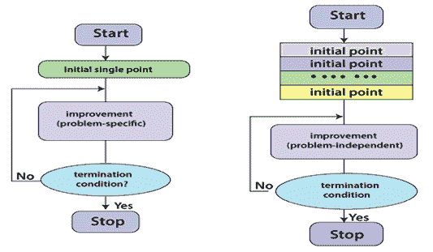
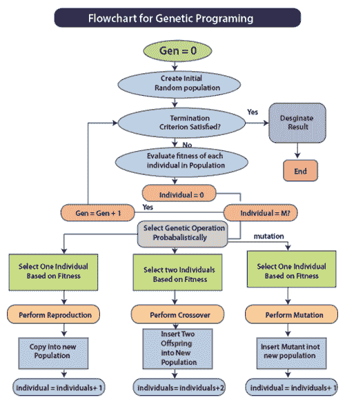

# 遗传算法

> 原文：<https://www.javatpoint.com/artificial-neural-network-genetic-algorithm>

遗传算法是一类基于自然进化过程设计的搜索算法。遗传算法基于**优胜劣汰**的原则。

一种受生物学界特别是查尔斯·达尔文的进化论启发的遗传算法方法被作为其工作的基础。**霍兰德**在 **1975** 中引入了遗传算法。遗传算法通过复制物种的进化行为来解决优化问题。从一个初始的随机解群体，这个群体是通过选择，变异和交叉算子，在自然进化的启发下前进的。通过实现给定的一组操作，种群经历了一个迭代过程，在这个过程中，种群达到各种状态，每个状态被称为**代**。作为这一程序的结果，人口预计将达到一代，其中它包含一个体面的解决问题的办法。在遗传算法中，问题的解被编码为一串**位**或**实数**。

实践证明，它们在功能优化方面非常有效。它用于寻找巨大而复杂的空间。遗传算法(GAs)是基于生物进化的各种特征用于优化和机器学习的算法。

## 他们需要给定的组件:

*   对解决染色体问题的解决方案进行编码的过程。
*   一种评估功能，可恢复赋予它的每条染色体的等级。
*   当父母繁殖以改变他们的基因组成时，可以对他们实施的操作。标准的操作符是变异和交叉。
*   当父母繁殖时，可以对他们实施的操作，以改变他们的基因组成。标准的操作符是变异和交叉。

**用进化计算开发ANN:**

ANN的发展是一个被广泛应用于不同技术的课题。进化算法的世界也不例外，这方面的证据是已经发表的关于该领域各种技术的令人难以置信的大量作品，甚至包括遗传算法或 GP。一般来说，使用进化算法生成ANN的领域分为三个主要领域:**权重进化**、**架构**、**学习规则**。

最初，权重演化从具有预先确定的拓扑的ANN开始。要解决的问题是训练关联权重，试图限制网络误差。利用进化算法，权重可以表示为二进制或实数的连接。

第二，建筑的进化包含了拓扑结构的生成。为了利用进化算法创建ANN体系结构，需要选择如何加密给定网络的基因型，以供遗传算子使用。

第一种选择是直接编码，所有的基因和它们产生的表型之间有一个平衡的类比。最典型的编码技术包括一个矩阵，该矩阵表示一种体系结构，其中每个组件揭示两个节点之间是否存在关联。

在编码方案中，遗传算法被用来同时创建结构和关联权重，无论是前馈还是递归神经网络，其结构都没有限制。这种新的编码方案也允许获得具有最少数量神经元和关联的基本网络，并且所公布的结果是有利的。除了直接编码，还有一些间接编码技术。在这些技术中，只有架构的一些特征被编码在染色体中。这些技术有各种类型的表示。首先，参数表示将网络描述为一组参数。例如，每层的节点数量、两层之间的关联数量、隐藏层的数量等。另一种没有直接表示的类型取决于语法规则。在这个系统中，网络由一组规则来表示，这些规则被构建为生产规则，形成一个代表网络的矩阵。关于学习规则的演化，有各种各样的方法，然而，大多数方法仅仅基于学习如何改变或管理演化，以及体系结构和关联权重之间的关系。

## ANN的工作原理:

标准遗传算法的工作原理如图所示。涉及的重要步骤是生成解决方案的群体，确定目标函数和适应度函数，以及应用遗传算子。这些方面在基本遗传算法的帮助下描述如下。

**开始:**

它产生了 n 条染色体的随机群体。

**体能:**

它计算群体中每个 x 染色体的适应度 f(x)。

**新增人口:**

它通过重复以下步骤生成新的群体，直到新群体完成。

**选择:**

它根据适合度从群体中选择两条父染色体。适合度越好，被选中的概率越高。

**交叉:**

在交叉概率中，跨越父母形成新的后代(孩子)。如果没有进行杂交，后代就是父母的精确拷贝。

**突变:**

在突变概率中，在每个位点突变新的后代。

**接受:**

它将新的后代放入新的种群中。

**替换:**

它使用新生成的人口进一步运行算法。

**测试:**

如果满足结束条件，则停止并返回当前群体中的最佳解。

**循环:**

在这一步中，你需要进入第二步进行体能评估。

遗传算法背后的基本原理是，它们生成并维护一个由染色体代表的个体群体。染色体是一个字符串，实际上相当于出现在脱氧核糖核酸中的染色体。这些染色体通常是问题的编码解决方案。按照选择、繁殖和变异的规则，它经历了一个进化的过程。环境中的每一个个体(由染色体代表)都获得了它在环境中的适应性的度量。繁殖选择种群中适应值高的个体。通过这些个体的交叉和变异，一个新的群体被确定，其中的个体可能更适合他们的环境。交叉的过程包括两条染色体交换大量数据，类似于繁殖的过程。突变给一点现存的种群带来了微小的变化，它代表了进化的一步。

## 传统方法和遗传方法的区别:

算法是解决问题的一系列步骤。遗传算法是一种使用遗传学作为问题解决模型的问题解决技术。这是一种寻找优化和搜索问题的近似解的搜索方法。人们很容易区分传统算法和遗传算法。

| 传统算法 | 遗传算法 |
| 它通过确定性计算选择序列中的下一个点。 | 它利用随机数生成器通过计算选择下一个种群。 |
| 它在每次迭代中创建一个单独的点。点的序列接近最优解。 | 它会在每次迭代时创建一个点群。种群中的最佳点接近最优解。 |
| 每次迭代的进展都是特定于问题的。 | 每次迭代中的并发是一个独立的问题。 |

## 遗传算法的优势:

遗传算法的概念很容易理解。

遗传算法支持多目标优化。

遗传算法适用于噪声环境。

遗传算法对于局部最小值/最大值是鲁棒的。

遗传算法利用概率转移规则。

遗传算法利用收益(目标函数)信息，而不是导数。

遗传算法适用于混合离散函数。

## 遗传算法的局限性:

尽管遗传算法已被证明是一种快速而强大的解决问题的方法，但它也存在一些局限性。下面给出了其中一些限制:

制作遗传算法的第一个也是最重要的考虑因素是问题的表征。用于确定候选解决方案的语言必须是健壮的。它必须能够忍受随机的变化，这样致命的错误就不会出错。

遗传算法的一个显著障碍是适应度(评估)函数的编码，从而可以实现更高的适应度，并产生问题的更好的解决方案。适应度函数的错误决定可能会导致重大后果。例如，它无法找到问题的解决方案，并返回问题的错误解决方案。

除了适当选择适应度函数外，还必须有效选择遗传算法的不同参数，如种群规模、变异和交叉率。小的种群规模不会给遗传算法足够的解来产生精确的结果。基因改变的频率或不良的选择方案将导致有益模式的破坏。

不建议将遗传算法用于分析问题。虽然遗传算法可以找到这类问题的精确解，但传统的分析技术可以在很短的时间内用很少的计算数据找到相同的解。

## 遗传算法的应用；

**机器人学中的遗传算法:**

机器人是当今计算机行业讨论最多的领域之一。它用于各种行业，以提高盈利效率和准确性。随着机器人工作的环境随着时间的变化，开发人员很难找出机器人的每一种可能行为来应对这些变化。这是遗传算法发挥重要作用的地方。因此，需要一种合适的方法来引导机器人达到目标，并使其在遇到新情况时能够适应新情况。遗传算法是用于学习高性能知识结构的自适应搜索技术。

**财务规划中的遗传算法:**

随着 Gas 的使用，**战术资产分配**和**国际权益方法论**的模型得到了增强。遗传算法对于金融建模应用非常有效，因为它们是由调整驱动的，这些调整可以用来提高预测的效率和超过基准集的回报。此外，这些方法是健壮的，允许更大范围的扩展和约束，这在传统技术中可能无法适应。

* * *