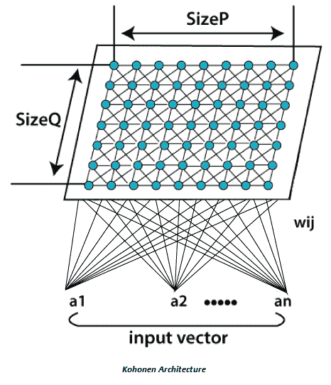
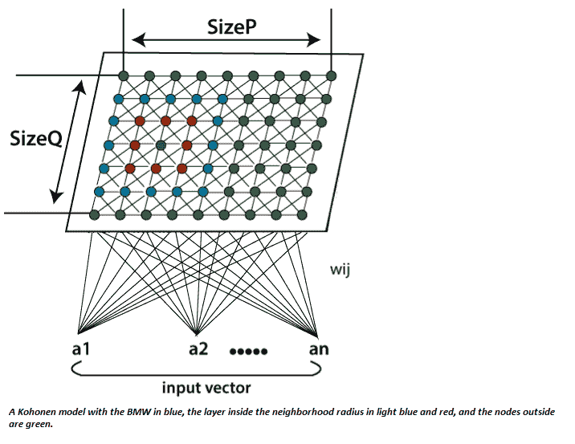

# 科霍宁自组织特征图

> 原文：<https://www.javatpoint.com/artificial-neural-network-kohonen-self-rganizing-feature-map>

Kohonen 自组织特征映射(SOM)指的是一个神经网络，它是使用竞争学习来训练的。基本竞争学习意味着竞争过程发生在学习周期之前。竞争过程表明，一些标准选择了获胜的处理元素。在选择了获胜的处理元素之后，根据所使用的学习定律来调整其权重向量(Hecht Nielsen 1990)。

自组织地图在输入数据和地图的处理元素之间进行拓扑有序的映射。拓扑有序意味着，如果两个输入具有相似的特征，则最活跃的处理元素会响应地图上彼此靠近的输入。处理元素的权重向量按升序到降序排列。W i < W i+1 适用于 I 的所有值或 W i+1 适用于 I 的所有值(此定义仅对一维自组织映射有效)。

自组织图通常被表示为处理元件的二维薄片，如下图所示。每个处理元素都有自己的权重向量，自组织映射的学习依赖于这些向量的自适应。网络的处理元素在自组织过程中具有竞争性，特定的标准挑选权重被更新的获胜处理元素。通常，这些标准用于限制输入向量和权重向量之间的欧几里德距离。SOM(自组织映射)不同于基本的竞争学习，因此不是只调整获胜处理元素的权重向量，而是调整相邻处理元素的权重向量。首先，邻域的大小很大程度上决定了 SOM 的大致顺序，并且随着时间的推移，大小会减小。最后，只调整一个获胜的处理元素，使得 SOM 的微调成为可能。邻域的使用使得拓扑排序过程成为可能，并且与竞争学习一起使得过程非线性。

它是由芬兰教授和研究员 Teuvo Kohonen 博士于 1982 年发现的。自组织映射指的是为维护输入和输出空间之间的拓扑结构的应用提出的无监督学习模型。该算法的显著特点是，高维空间中相似的输入向量也通过 2D 空间中的节点映射到相似的输入向量。它基本上是一种降维方法，因为它将高维输入映射到低维离散化表示，并保留其输入空间的基本结构。

所有的整个学习过程都是在没有监督的情况下进行的，因为节点是自组织的。它们也被称为特征图，因为它们基本上是对输入数据的特征进行再训练，并简单地根据彼此之间的相似性对它们进行分组。它对于可视化复杂或海量的高维数据，并将它们之间的关系显示到一个低的、通常是二维的字段中，以检查给定的未标记数据是否有任何结构，具有实用价值。

自组织映射在体系结构和算法特性上都不同于典型的人工神经网络。它的结构由单层线性 2D 神经元网格组成，而不是一系列层。这个格上的所有节点都直接与输入向量相关联，而不是彼此相关联。这意味着节点不知道其邻居的值，并且只根据给定的输入更新其关联的权重。网格本身是一个映射，它在每次迭代中根据输入数据来协调自身。因此，在聚类之后，每个节点都有自己的坐标(i.j)，这使得人们能够通过毕达哥拉斯定理来计算两个节点之间的欧几里得距离。

自组织映射利用竞争学习而不是纠错学习来修改其权重。这意味着，在输入向量出现的特征被引入神经网络的每个周期中，只有一个单独的节点被激活，因为所有节点都在争夺响应输入的特权。

根据当前输入值和网络中所有其他节点之间的相似性，选择所选节点-最佳匹配单元(BMU)。选择输入向量、所有节点及其相邻节点之间具有分数欧几里德差的节点，并在特定半径内，稍微调整它们的位置以协调输入向量。通过体验网格上存在的所有节点，整个网格最终匹配整个输入数据集，连接的节点聚集到一个区域，不同的节点被隔离。

## 算法:

第一步

每个节点权重 w_ij 初始化为一个随机值。

第二步

选择一个随机输入向量 x_k。

第三步

对地图上的所有节点重复步骤 4 和 5。

第四步

计算权重向量 w ij 与第一个节点连接的输入向量 x(t)之间的欧氏距离，其中 t，I，j =0。

第五步

跟踪生成最小距离 t 的节点。

第六步

计算整体最佳匹配单位(BMU)。它表示与所有计算节点的距离最小的节点。

第七步

在科霍宁地图中发现 BMU 的拓扑邻域 *βij(t)及其半径σ(t)* 。

第八步

对 BMU 邻域中的所有节点重复:通过包含输入向量 x(t)和神经元权重 w(t)之间差值的一部分，更新 BMU 邻域中第一个节点的权重向量 w_ij。

第九步

重复整个迭代，直到达到选定的迭代极限 t=n。

这里，步骤 1 代表初始化阶段，而步骤 2 至 9 代表训练阶段。

哪里；

t =当前迭代。

i =节点网格的行坐标。

J =节点网格的列坐标。

W=权重向量

w_ij =网格中节点 I、j 之间的关联权重。

X =输入向量

X(t)=迭代 t 时的输入向量实例

β_ij =邻域函数，减少并表示节点 I，j 与 BMU 的距离。

σ(t) =邻域函数的半径，它计算更新向量时在 2D 网格中检查邻居节点的距离。它会随着时间逐渐减少。

* * *