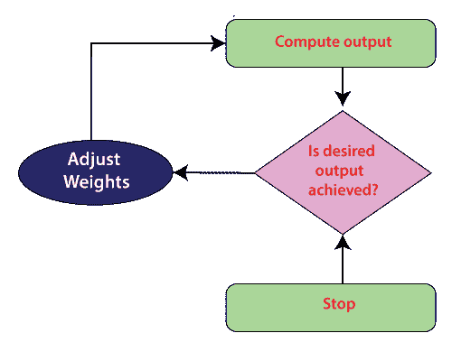
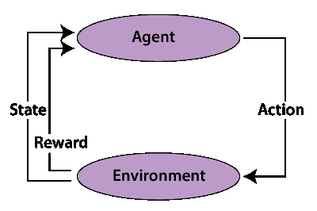

# 无监督人工神经网络

> 原文：<https://www.javatpoint.com/unsupervised-artificial-neural-networks>

学习是每个人创造智力所需要的基本组成部分。人类的智力来自大脑从经验中学习的能力，并在面对现有和新的环境时利用这种能力进行适应。在机器和计算机中复制人类智能是人工智能技术的目标，其中之一是人工神经网络。人工神经网络是模拟人脑学习能力的模型。像人类一样，验证、训练和测试是制作这种计算模型的重要组成部分。人工神经网络通过获取一些数据集(可能是标记的或未标记的)并通过仿真计算改变网络的自由参数来获取信息。基于学习规则和训练过程，人工神经网络的学习可以分为有监督学习、强化学习和无监督学习。

## 监督学习:

在**监督学习**中，人工神经网络处于教育者(比如系统设计者)的监督之下，教育者利用他或她对系统的知识来准备带有标记数据集的网络。因此，人工神经网络通过接收输入进行学习，并从标记的数据集中选择几组观察值作为目标。它是将输入和输出与目标进行比较，并计算输出和目标之间的误差的过程。它通过反向传播的思想利用误差信号来改变连接网络神经元的权重，以限制误差并优化性能。网络的微调一直持续到限制输出和目标输出之间差异的一组权重。监督学习过程用于解决分类和回归问题。监督学习算法的输出可以是分类器或预测器。当主管对系统的了解足以为培训提供网络的输入和目标输出对时，该过程的应用受到限制。

## 无监督学习:

当用类标识(标签)扩充训练数据集是荒谬的时候，使用无监督学习。这种困难发生在没有系统知识的情况下，或者获得这种知识的成本太高。顾名思义，在无监督学习中，人工神经网络不在“老师”的指导下相反，它被提供了未标记的数据集(只包含输入数据)，并被留下来发现数据中的模式并从中构建新的模型。在这种情况下，人工神经网络通过利用集群之间的分离来找出如何排列数据。

## 强化学习:

强化学习是另一种无监督学习。它包括与系统的合作，获得这样一个系统的条件，选择一个活动来改变这种状态，将动作发送到系统，并以反馈的形式接受数字奖励或惩罚，反馈可以是积极的，也可以是消极的，目标是学习一个策略。提高奖励的活动是通过反复试验选择的。该图说明了描述强化学习概念的框图。强化学习和无监督学习在很多方面是不同的。强化学习包括通过最大化一些奖励的学习策略。无监督学习的目的是利用输入数据中的相似性和差异性，用于以后的分类。

当监督学习提示回归和分类时，无监督学习执行模式识别、数据降维和聚类的任务。无监督学习旨在发现输入数据中的一些模式。未标记数据集中的模式识别提示聚类。识别系统的重要阶段之一是模式识别。模式识别在数据挖掘、文档分类、疾病诊断、人脸识别等方面都有应用。数据挖掘，顾名思义，包括从庞大的数据集中提取有用信息、模式的自动或半自动挖掘。自组织映射是用于数据挖掘的人工神经网络算法。

巨大的数据可以通过自组织地图进行熟练的分析和可视化。基于自组织图的无监督神经网络被用于对医学数据进行聚类，其中三个子空间被命名为患者的药物、身体位置和生理异常。自组织图被用于分析和可视化酵母基因表达，并被认为是一种优秀、快速和有利的程序，用于组织和解释像酵母基因表达这样的庞大数据集。无监督学习还完成了减少高维数据中变量数量的任务，这一过程被称为降维。数据降维任务可以被另外分割成特征提取和特征选择。特征选择包括从原始数据集中选择重要变量的子集。

将高维空间中的数据集转换到低维空间被认为是特征提取。主成分分析是提取线性特征的最佳策略之一。在带权重的自动编码中，有效初始化被证明是比主成分分析更好的数据降维工具。数据降维通常在其他任务的预处理阶段执行，以最小化计算复杂度并提高机器学习模型的性能。在性能成分分析中，采用无监督学习算法在分类前对数据进行降维，以提高执行效率和计算速度。

* * *