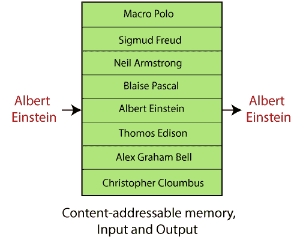
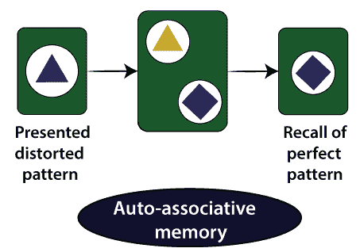
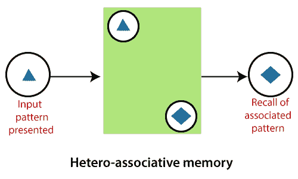
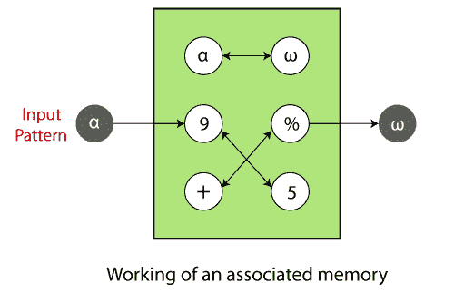
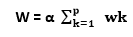
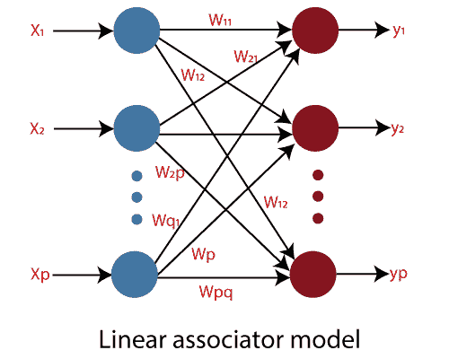

# 关联内存网络

> 原文：<https://www.javatpoint.com/associate-memory-network>

关联存储器网络指的是将输入模式集合和输出模式之间的关系关联起来的内容可寻址存储器结构。内容可寻址存储器结构是一种存储器结构，它能够根据输入模式和存储在存储器中的模式之间的相似程度来回忆数据。

让我们用一个例子来理解这个概念:

下图显示了包含不同人的名字的记忆。如果给定的内存是内容可寻址的，则不正确的字符串“**阿尔伯特·爱因斯坦**”作为密钥足以恢复正确的名称“**阿尔伯特·爱因斯坦**”

在这种情况下，由于这种类型的内存模型和某种形式的纠错能力，这种类型的内存是健壮和容错的。

#### 注意:关联内存是通过其内容获得的，与传统计算机内存系统中的显式地址相邻。记忆使人们能够基于对信息内容的不完全了解来回忆信息。

联想记忆有两种——自动联想记忆和异联想记忆。

### 自动联想记忆:

自动关联存储器恢复与当前模式最密切相关的先前存储的模式。它也被称为**自动关联相关器**。

考虑 **x[1]，x[2]，x[3]，…..x[M]** ，是存储的模式向量的数量，让 **x[m]** 是这些向量的元素，显示从模式获得的特征。当放入一个有噪声或不完整的 x[m]版本时，自动联想记忆将产生一个模式向量 **x[m]** 。

### 异联想记忆；

在异质关联存储器中，恢复的模式通常不仅在类型和格式上不同于输入模式，而且在内容上也不同。它也被称为**异联想**相关器。

假设我们有许多关键响应对 **{a(1)，x(1)}，{a(2)，x(2)}，…..，{a(M)，x(M)}** 。当给出一个嘈杂或不完整版本的 **a(m)** 时，异联想记忆会给出一个模式向量 **x(m)** 。

神经网络通常用于实现这些被称为**神经联想记忆(NAM)** 的联想记忆模型。线性联想是最简单的人工神经联想记忆。

这些模型遵循独特的神经网络架构来记忆数据。

## 联想记忆的工作:

联想记忆是某种形式的关联模式的储存库。如果某个模式触发了存放，相关的模式对会出现在输出中。输入可以是存储模式的精确或部分表示。

如果记忆是用输入模式产生的，可以说 **α，**关联模式 **ω** 自动恢复。

这些是与联想记忆网络相关的术语:

### 编码或记忆:

编码或记忆是指建立联想记忆。这意味着构建一个关联权重矩阵 **w** ，使得当给定一个输入模式时，与输入模式相关联的存储模式被恢复。

**(Wij)k=(pI)k(qj)kT13】**

哪里，

**(P i ) k** 代表图案 **p k** 的 **i th** 分量

**(q j ) k** 代表图案 **q k** 的**jthT9】分量**

哪里，

strong>i = 1，2，…，m 和 **j** = 1，2，…，n。

构建关联权重矩阵 **w** 是通过将个体相关矩阵**wkT5】相加完成的，即，**

其中 **α** =构造常数。

### 误差和噪声:

输入模式可能包含错误和噪声，或者可能包含某个先前编码模式的不完整版本。如果出现损坏的输入模式，网络将恢复与实际输入模式相邻的存储模式。噪声或误差的存在只会导致网络效率的绝对下降，而不是完全下降。因此，因为许多处理单元执行高度并行和分布式计算，所以关联存储器是健壮的和无错误的。

### 业绩计量:

为正确恢复关联存储器性能而采取的措施是存储器容量和内容寻址能力。**内存容量**可以定义为可以存储和正确恢复的关联模式对的最大数量。**内容寻址能力**是指网络恢复正确存储模式的能力。

如果输入模式相互正交，则完全恢复是可能的。如果存储的输入模式不相互正交，由于模式之间的交叉，可能会发生非完美恢复。

## 联想记忆模型:

线性联想器是最简单、应用最广泛的联想记忆模型。它是具有相当复杂的集体计算能力和行为的简单处理单元的集合。霍普菲尔德模型计算其输出，该输出及时返回，直到系统变得稳定。Hopfield 网络是使用双极单位和学习过程构建的。**霍普菲尔德模型**是由**约翰·霍普菲尔德**在 **1982** 中提出的**自动联想记忆**。**双向联想记忆(BAM)** 和霍普菲尔德模型是用作联想记忆的其他一些流行的ANN模型。

## 关联内存模型的网络架构:

神经联想记忆模型追求各种神经网络结构来记忆数据。网络包括单层或两层。线性联想模型指的是前馈型网络，由两层不同的处理单元组成——第一层作为输入层，而另一层作为输出层。霍普菲尔德模型指的是单层处理单元，其中每个单元与给定网络中的其他每个单元相关联。**双向联想记忆(BAM)** 模型与线性联想器相同，但联想是双向的。

描绘了这些给定模型的神经网络体系结构和关联存储器的相应关联权重矩阵 **w** 的结构。

### 线性联想模型(两层):

线性联想器模型是前馈型网络，其中产生的输出是单前馈计算的形式。该模型由两层处理单元组成，一层作为输入层，另一层作为输出层。输入通过一系列权重与输出直接相关联。承载权重的连接将每个输入连接到每个输出。权重和输入的乘积的相加在每个神经元节点中确定。线性联想的架构如下。

所有 p 个输入单元通过相关的权重矩阵与所有 q 个输出单元相关联

**W =【Wijp * q**其中 **w ij** 描述了**IthT11】输入单元到**jthT15】输出单元单向关联的强度。****

连接权重矩阵存储 **z** 个不同的关联模式对 **{(X k ，Yk)；k= 1，2，3，…，z}** 。构建关联存储器是构建连接权重矩阵 **w** ，使得如果呈现输入模式，则恢复与输入模式相关联的存储模式。

* * *