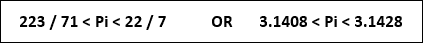
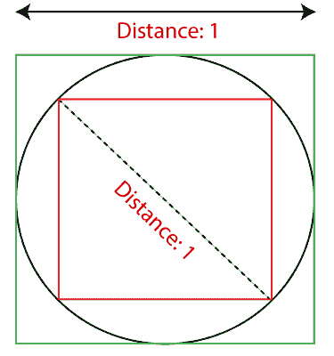
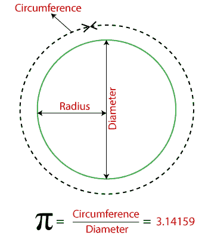
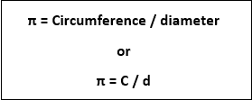
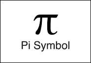
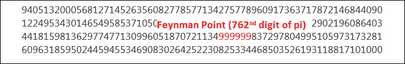
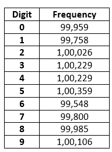
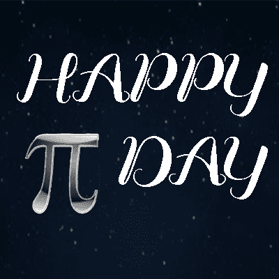
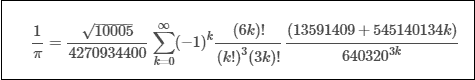

# 圆周率

> 原文：<https://www.javatpoint.com/pi>

**Pi** 是一个数学常数。小写希腊字母 **π** 代表符号 pi。这是**周边**的首字母缩写。圆周率这个词来源于希腊单词“周长”的第一个字母。周长在英语中的意思是**周长**。圆周率这个词发音为**派或 Py** 。通常情况下，我们使用**值 3.14** 。每年的**3 月 14 日，世界各地都会庆祝π日**。

## 圆周率的历史

圆周率的重要性产生于大约 4000 年前。巴比伦人和埃及人已经意识到常数 **π** 的存在和意义。他们证明了圆的周长与直径的比值相同。

巴比伦人建议值 25/8。与此同时，古代中国人使用整数 3。

1665 年，科学家伊萨克·牛顿爵士计算出的圆周率值达到了小数点后 16 位。1719 年，法国数学家托马斯**芬特·德·拉格尼**计算出了圆周率的值，精确到小数点后 127 位。

圆周率的值是由许多其他学者计算的。在下表中，我们总结了不同学者提出的圆周率古代值。

| 计算方式 | 年 | 计算值 |
| **埃及人** | 公元前 1650 年 | 19 / 6 = 3.16666 |
| **巴比伦人** | 公元前 2000 年 | 25 / 8 = 3.125 |
| **阿基米德** | 公元前 287-212 年 | 3.14084 < p < 3.14285 |
| **阿波罗尼奥斯** | 公元前 250-175 年 | 3.1416 |
| **卡卢迪乌斯·托勒密** | 公元 100-178 年 | 377 / 120 = 3.14166…. |
| **小说** | - | 25 / 8 = 3.125 |
| **印度教** | 公元 500 年 | √10 = 3.1416 |
| **阿拉伯语** | 公元 833 年 | 62,832 / 20,000 = 3.1416 |
| **中文** | 公元前 100 年 | 3.1415926 < p < 3.1415927 |

1767 年，瑞士数学家约翰·海因里希·朗伯证明了圆周率是一个无理数。1882 年，德国数学家**费迪南·冯·林德曼**证明了圆周率是一个**超越**数。这意味着 pi 不能是关系系数多项式的解。

希腊数学家阿基米德曾用一种算法计算出高达 16 位数的圆周率。此后，圆周率又被称为**阿基米德的** **常数。**为了计算圆周率的值，他画了两个多边形，一个在圆内，一个在圆外。他重复了这个过程，发现多边形的边越来越接近圆形。当他完成 96 边多边形时，他证明了:

在古代圆周率的计算是基于测量。比如埃及人计算圆周率 **(16 / 9) 2** 的数值，大概就是。 **3.16** 。同样，巴比伦绳索拉伸机在标记建筑物的位置和边界时，计算出 pi **25 / 8 = 3.125** 的值。

圆周率是一个**无理数**，因为圆周率的值既不结束也不重复。所以，我们无法计算圆周率的准确值。十进制形式的圆周率值约为 **3.14** 。有时圆周率也以分数形式表示，即 22/7。

## 圆周率的定义

圆的周长除以直径。这意味着对于任何大小的圆，圆周率的值都将保持不变。

周长和直径之比是常数(π)。

## Pi 符号

圆周率符号是由数学家威廉姆·琼斯(英国威尔士语言学家)在 1706 年提出的。30 年后，它成为标准的数学符号。但是它被数学家**莱昂哈德·欧拉推广开来。**流行时，被数学家用来表示圆的周长与直径之比。

**小写表示:** π

**大写表示:**π

在大多数情况下，使用小写表示。

## 关于皮的事实

在以下几点中，我们总结了圆周率最有趣的事实。

*   圆周率一词源于**埃及语**
*   它是一个**无理数**(所有没有理性的实数)。
*   找不到 pi 的确切值。
*   它不遵循任何模式(如 3.14155556666)。
*   我们永远无法计算出一个圆的准确面积或周长。
*   每年 3 月 14 日**或 **3/14** (其中 3 代表月，14 代表日)下午 1:59**(1 代表小时，59 代表分钟)庆祝**圆周率日**。将这些数字组合起来，我们得到的圆周率值高达六位数，即 **14159** 。
*   在**762ndT5【地点】处有六个 **9** 排成一行，被称为**费曼点，**如下图所示。

    **
*   在圆周率的前一百万位，序列 **123456** 不出现。
*   在埃及，金字塔的结构是基于圆周率的原理。吉萨著名金字塔这个词就是最好的例子。
*   高达 **50 万亿**位数，圆周率的数值还没有算出来。
*   圆周率日，著名科学家阿尔伯特·爱因斯坦诞生了。
*   圆周率又称**卢道夫数、圆形常数、**和**阿基米德常数**。
*   记住圆周率数字的技术叫做
*   圆周率记忆冠军是**后藤弘之，**他记忆圆周率值高达 42000 位数。
*   圆周率的第一个**百万位**小数由:
    组成

## Pi 日

圆周率日是由物理学家拉里·肖于 1988 年 3 月 14 日在 T2 旧金山探索科学博物馆创立的。他也被称为π的价格。

这是一年一度的圆周率庆祝日。选择 3 月 14 日是因为它代表圆周率的前三位数(3.14)。这就是我们在 3 月 14 日庆祝圆周率日的原因。

今天的目标是激励数学爱好者背诵圆周率的无穷位数。

## 圆周率近似值日

圆周率逼近日每年在**7 月 22 日**庆祝，因为圆周率的分数值是 **22/7** (其中 22 代表日，7 代表七月)。圆周率逼近日又称**休闲圆周率日**。

## 圆周率的用途

圆周率用于计算圆的面积、周长、圆柱的面积等不同的数学公式中。在宇宙学、土木工程等不同领域也有应用。我们列出了一些使用 pi 的常见领域:

*   统计学家使用常数来追踪人口动态。
*   在医学领域，它用于研究眼睛的结构。
*   它也用于导航(全球定位系统)。
*   在航空领域，它用于测量飞机的蒙皮面积。
*   它也用于频谱分析和信号处理。
*   在数学领域，它被广泛用于计算圆、圆柱等的面积。

以下公式使用圆周率:

*   圆的面积(A) = πr 2
*   圆的周长(C) = 2πr
*   球体表面积(A) = 4πr 2
*   球体体积(V) = 4/3πr 3
*   锥体表面积(A) = πrl + πr 2
*   锥体体积(V) = 1/3 πr 2 h
*   圆柱体表面积(A) = 2πr 2 +h(2πr)
*   气缸容积(V) = πr 2 h

## 皮创造的世界纪录

2020 年 1 月由**蒂莫西·穆利灿**创造的最新世界纪录，通过使用 **y-cruncher** 程序计算圆周率最精确值达到 **50 万亿**位数。他打破了 2019 年 3 月由艾玛·相户爱·伊沃创造的 31.4 万亿(31，415，926，535，897)位数的世界纪录。

2015 年 3 月 21 日，**拉杰维尔·米娜**创造了另一项记忆圆周率 **70，000** 位数的世界纪录。他打破了 2005 年记忆圆周率 67890 位数的**鲁超**记录。

**y-cruncher 程序**

y-cruncher 是由**Alexander J . Yee 开发的多线程程序。**它可以计算圆周率和其他常数超过一个**万亿**位数。它是唯一一个多线程的程序，并且可以被多核系统访问。它也是一个用于测试硬件的压力测试应用程序。程序使用**楚德诺夫斯基算法**计算圆周率值。**楚德诺夫斯基**公式如下:

算法用 **O(n log (n) 3 )** 时间计算圆周率的值。

它被许多爱好者用来创造圆周率计算的世界纪录。在下表中，我们介绍了过去的五项世界纪录。

| 日期 | 计算者 | 十进制数字 | 计算时间(天) |
| 2020 年 1 月 29 日 | 蒂莫西·穆利肯 | 50,000,000,000,000 | Three hundred and three |
| 2019 年 3 月 14 日 | 艾玛·岩波 | 31,415,926,535,897 | One hundred and twenty-one |
| 2016 年 11 月 15 日 | 彼得·伊布 | 22,459,157,718,361 | One hundred and five |
| 2014 年 10 月 8 日 | 桑顿·凡尼斯 | 13,300,000,000,000 | Two hundred and eight |
| 2013 年 12 月 28 日 | 近藤茂树先生 | 12,100,000,000,050 | Ninety-four |

**y-Cruncher 程序的特性**

*   它可以计算圆周率和其他常数，如**黄金分割比、Log (2)的值、e、2 的平方根、**
*   它使用**两个**算法来计算大部分常数。第一种算法用于计算，第二种用于验证。
*   它允许我们使用多个硬盘来加快磁盘交换速度。
*   其**多线程**功能采用现代多核处理器。

如果你对圆周率的计算感兴趣，你可以使用 y-cruncher 程序。可以从[http://www.numberworld.org/y-cruncher](http://www.numberworld.org/y-cruncher)下载。

* * *