# 梯形面积

> 原文：<https://www.javatpoint.com/area-of-trapezoid>

**梯形**为凸四边形。意思是有四条边和一对平行边的封闭形状。

在这一节中，我们将学习**如何求梯形的面积。**

### 梯形

梯形是一种有四条边的双面形状，其中一对相对的边必须平行，称为**梯形**。平行边称为**基，**，非平行边称为**腿**。平行的边可以是水平的、垂直的或倾斜的(对角的)。又称**梯形**。

下图中，**基地1****基地 2** 垂直于虚线，代表**海拔高度**(高度)。高度垂直于两个基地之间的距离。

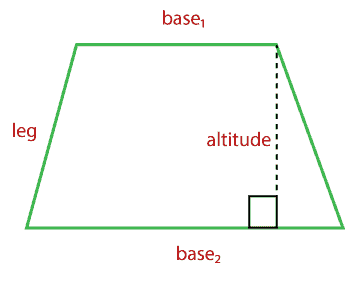

### 梯形的性质

*   如果梯形的两对对边都是平行的，它就是平行四边形。
*   如果梯形的两对对边都是平行的，它就是正方形；它的所有边都等长并且互相成直角。
*   如果梯形的两对对边都是平行的，它就可以是矩形；它的相对两侧长度相等，并且彼此成直角。
*   每个底部必须垂直于高度。

### 梯形的类型

梯形有三种类型:

*   **直角梯形:**包含一对直角。
    T3】
*   **等腰梯形:**不等边长的梯形。下图中**公元**和**公元前**的边长相同。
    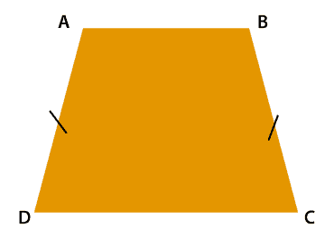
*   **不等边梯形:**边长不等角的梯形。
    T3】

梯形的不同形状有:

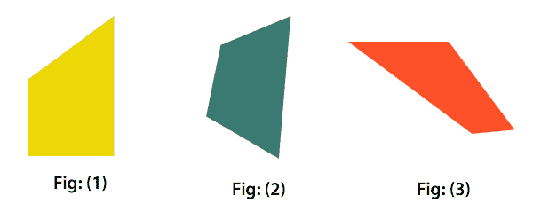

要找到梯形的面积，请执行以下步骤:

*   添加底座
*   将总和乘以高度
*   将结果除以 2

### 梯形公式的面积

梯形的面积是平均宽度乘以高度。在公式中实现时:

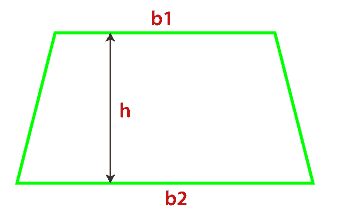**Area of trapezoid (A) = ½ (b1 + b2) * h**

**或**

**Area of trapezoid (A) = h/2 * (b1 + b2)**

**或**

**Area of trapezoid (A) = h * (b1 + b2/2)**

其中**B1****B2**为各基地长度， **h** 为海拔高度。

### 梯形公式的推导

让我们用两个全等梯形的平行四边形来推导公式。

*   画一个**梯形**，其底长为 **b1** 和 **b2** ，高度为 **h** 。
*   创建它的**副本**。
*   将梯形的副本旋转**。**
*   将梯形的副本添加到原始梯形中。

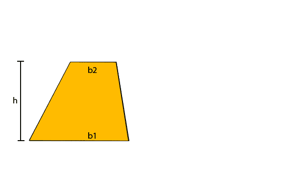

当我们组合两个梯形(如上)时，它形成一个平行四边形。新形成的形状有两对相对的全等边。

我们知道:

**平行四边形的面积(A) = b * h**

意思是平行四边形的面积是高度乘以任一底边的长度。从上图看，两个碱基的长度都等于 b1 + b2。

根据平行四边形的公式，我们得到

A = (b1 + b2) * h

上面的区域是两个梯形的区域。所以，我们需要除以 2，得到一个梯形的面积。

**梯形面积(A) = (b1 + b2) * h / 2**

整理上述公式，我们得到:

**Area of trapezoid (A) = ½ * h * (b1 + b2)**

另一种计算梯形面积的方法是将梯形分成两个三角形。

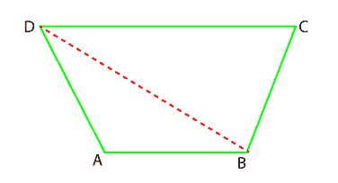

现在我们有两个三角形 ABD 和 BCD。我们将分别计算三角形的面积。三角形的总面积就是梯形的面积。

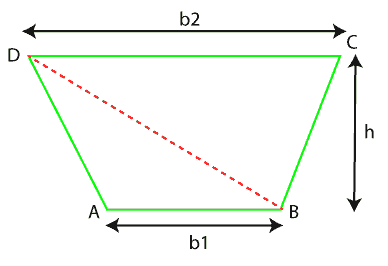

∏的面积

A = b1 * h

∏的面积

A = b2 * h

加上面积，我们得到:

A + A = (b1 * h) + (b2 * h)

2A = (b1 + b2) * h

**A = 1/2 (b1 + b2) * h**

### 例子

**例 1:如果梯形的底边是 30 英寸和 20 英寸。梯形的高度是 4 英寸。求梯形的面积。**

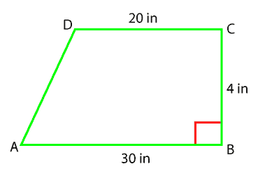

**解决方案:**

给定 b1 = 30 英寸，b2 = 20 英寸，高度= 4 英寸

**梯形面积(A) =** **1/2 (b1 + b2) * h**

**A = (30 + 20) * 4**

A = (50) * 4

A = 200/2

A = 100 in 2

**梯形的面积在 2 中为 100。**

**例 2:求给定梯形的面积。**

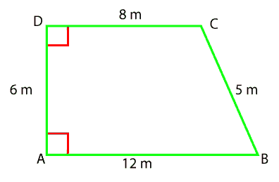

**解决方案:**

从上图中，我们将只考虑平行边 AB 和 CD，因为它与平行边成直角。

给定 b1=12 厘米，b2=8 厘米，h=6 厘米

我们知道，

**A = h/2 (b1 + b2)**

将这些值放在上面的公式中，我们得到:

A = 6/2(12 + 8)
A = 6/2 (20)
A = 60 cm2

**梯形的面积为 60 厘米 2 。**

**例 3:求底分别为 10 m 和 7 m 的梯形的面积。梯形的高度是 5 m，求面积。**

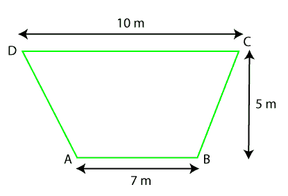

**解决方案:**

首先，我们将梯形分成两个三角形，如下图所示。

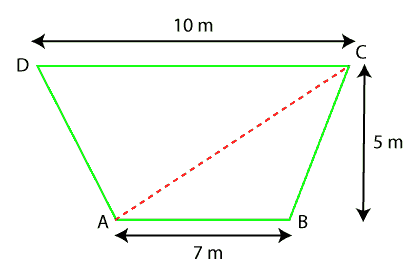

现在分别求出三角形的面积。我们知道:

**三角形面积(A) = 1/2 b * h**

面积∏ABC =(7 * 5)

A = 35/2

A = 17.5 米 2

同样的 CDA 的面积= (10 * 5)

A = 50/2

A = 25 米 2

将 ABC 和 CDA 的面积相加，得到梯形的总面积。

**梯形面积= ABC 面积 CDA 面积**

梯形面积(A) = 17.5 + 25

A = 42.5 米 2

**梯形面积为 42.5 米 2 。**

* * *