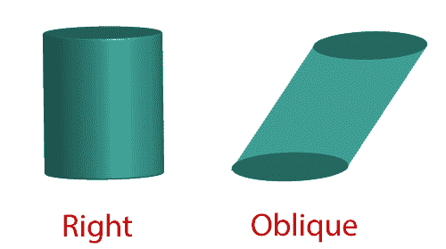
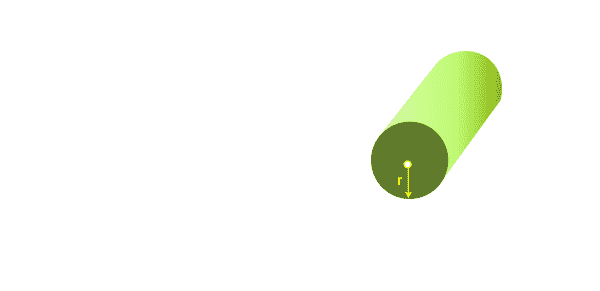
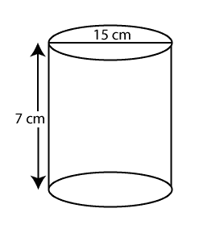
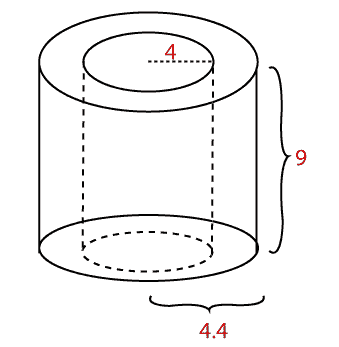

# 圆柱体的面积

> 原文：<https://www.javatpoint.com/area-of-a-cylinder>

在这一节中，我们将学习圆柱体的定义，公式推导，圆柱体公式的面积以及详细的例子。

### 圆筒

圆柱体是三维立体形状。它有两个平行的面，有全等的圆。它有一个曲面。两个底座之间的垂直距离是圆柱体的高度。

### 圆柱体面积公式

**Area of cylinder (A) = 2πr2 + 2πrh**

运筹学

**Area of cylinder (A) = 2πr (r + h)**

**其中:**

π是一个常数，其值为 3.14。

r 是半径。

h 是圆柱体的高度

### 气缸的类型

气缸有两种类型:

*   **右圆柱:**如果圆柱的基座在准确的位置，并且轴线与基座成直角，称为右圆柱。
*   **斜圆柱体:**如果圆柱体的底座不在该位置，且轴线与底座不是直角，则称为斜圆柱体。

### 衍生物

圆柱体由两个圆和一个矩形组成。如果要导出圆柱体面积的公式，请按照下面给出的步骤操作:

*   将圆柱体分成三部分:**两个圆**和一个**矩形**。
*   展开形成矩形的边。

分别计算每个圆的面积。我们知道圆的面积是 **πr 2 。**将两个圆的面积相加得到**(πr2+πr2= 2πr2)**。

计算矩形的宽度乘以高度的面积。其中 h 是高度，圆柱体的长度是绕圆的距离。意思是圆的周长是 **2πr** 。因此矩形的面积将是**2πr * h**

现在加上圆的面积**2πr2T3】和矩形的面积 **2πrh。****

**气缸面积(A) = 2πr 2 + 2πrh**

**或**

**圆柱体面积(A) = 2πr (r + h)**

**其中:**

π是常数

r 是半径

h 是圆柱体的高度

### 例子

**例 1:如果圆柱体的直径为 15 厘米，高度为 7 厘米。求圆柱体的表面积。**

**解决方案:**

我们已经给出，直径(d) = 15 厘米

高度(h) =7 厘米

我们知道，半径是直径的一半。

**r = d/2**

r = 15 / 2 = 7.5 厘米

我们知道，

**圆柱体面积(A) = 2πr (r + h)**

A = 2 * 3.14 * 7.5 (7.5 + 7)

A = 682.95 cm 2

**圆柱体面积 682.95 cm 2 。**

**空心圆柱体的表面积**

**例 2:下图为管道。管道的内外半径分别为 4 厘米和 4.4 厘米。这根管子有 9 厘米长。求管道的总表面积。**

**解决方案:**

在这个问题中，我们给出了两个半径，内半径和外半径。 **r** 代表内半径， **R** 代表外半径。

我们已经付出了，

r = 4 厘米，R = 4.4 厘米，h = 9 厘米

管道总表面积(A) =内圆面积+外圆面积+两个圆的面积

**a = 2rh+2rh+2(r2—r2)**

A = 2π.4.9 + 2π。(4.4)9+(2)个。(π)上。(4.4)2-π.42

A = 72p + 79.2p +（2.（19.36p - 16p））

A = 72p + 79.2p +（2.（3.36 页）

A = 72p + 79.2p + 6.72p

A = 157.92π

A = 157.92 * 3.14

A = 495.86 cm 2

**圆柱体面积 495.86 cm 2 。**

* * *