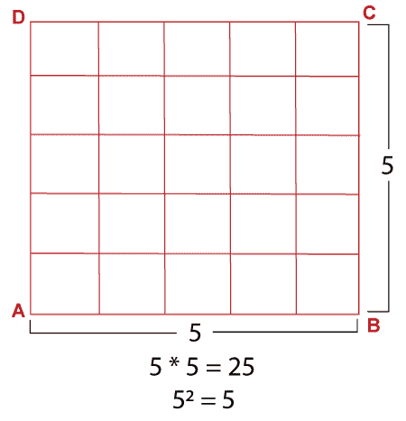
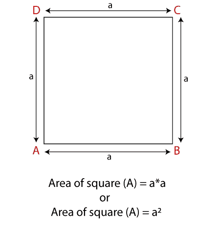
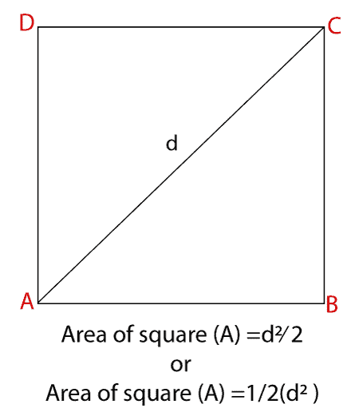
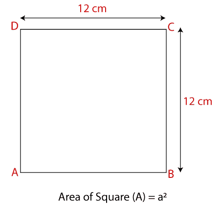
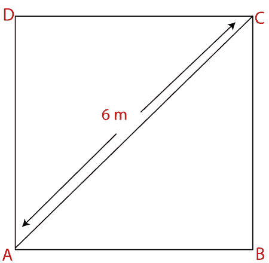

# 正方形面积

> 原文：<https://www.javatpoint.com/area-of-square>

正方形是 2D 平面上有四条平行边的封闭图形。正方形的性质是所有的边(宽和长)必须有相等的长度。在正方形中，每个角度都是 90 度。

在这一节中，我们将学习面积平方公式，以及如何寻找面积平方。

### 正方形面积

该区域是由四边覆盖的区域。换句话说，完全填满一个正方形所需的平方单位数。

在下图中，我们将一个正方形分成了五行五列。它使多个小方块完全填满方块。因此，25 个小正方形代表正方形的面积。

### 平方公式的面积

要计算一个正方形的面积，把基数乘以它自己。简而言之，边的平方就是正方形的面积。

其中 a 是长度为 a 的正方形的边。

#### 当给定对角线时

如果给定对角线的长度，我们也可以计算正方形的面积。面积是对角线乘积的一半。两条对角线长度相等。

其中 d 是任一对角线的长度。

### 衍生物

把一个正方形看成一个长为 l，宽为 b 的矩形，根据矩形的面积公式:

**A = l*b**

哪里，

*   a 是面积
*   l 是长度
*   b 是宽度

假设正方形的一边是 a，那么正方形的面积将是:

A = a*b

我们知道正方形的所有边都是等长的。然后，

A = a*a

**A = A2T3】**

### 例子

**例 1:求边长为 12 cm 的正方形的面积。**

**解决方案:**

我们已经给出了正方形的一边是 12 厘米。

我们知道

**正方形面积(A)= A2T3】**

A = 12 2 = 144 cm 2

**广场面积 144 cm 2 。**

**例 2:周长如果一个正方形是 24 yd，计算正方形的面积。**

**解决方案:**

给定，周长= 24 码

我们知道

**正方形周长(P) = 4a**

其中 a 是边的长度。

把 P 的值放在上面的公式中，我们得到:

24 = 4a
a = 24/4
a = 6 yd

我们知道，

**正方形面积(A)= A2T3】**

替代价值和简化，我们得到:

A = 6*6 = 36 yd 2

**广场面积 36 码 2 。**

**例 3:求给定正方形的面积。**

**解决方案:**

给定，对角线长度(d) = 6 m

我们知道，

**正方形面积(A) = d 2 /2**

将 d 的值放在上面的公式中，我们得到:

A = (6) 2 /2

A = 36/2

A = 18 米 2

**广场面积 18 米 2 。**

* * *