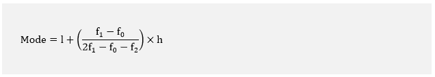
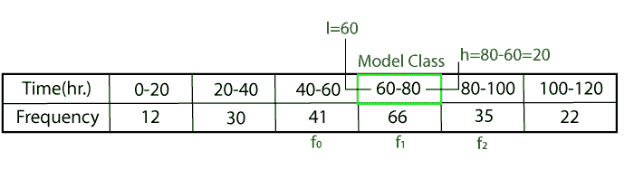
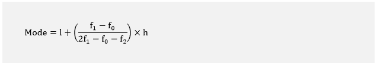
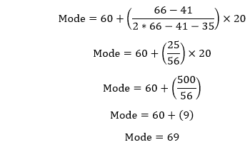

# 方式

> 原文：<https://www.javatpoint.com/mode-in-math>

数学中的**模式**也是衡量中枢倾向的一个指标。在本节中，我们将尝试理解**对模式的定义，如何找到模式**，以及模式的**示例。**

### 模式定义

**模式**可以定义为出现次数最多的数字。换句话说，在集合中出现次数最多的数字。数字中具有最高频率**的数字**(数字的重复)，称为**模式**。

如果列表或观察中没有**重复编号**，则列表中有**无模式**。

### 如何找到模式

找到**模式或模式值**非常容易。我们可以按照以下步骤找到模式:

*   首先，按照升序或降序排列给定的数字。这是一个可选步骤。数数字很容易。它减少了错误计数的机会。
*   统计每个数字的**频率**。
*   **最高频率**号为模式。

#### 注意:一个集合可能有多个模式。

*   如果一个列表没有**重复号码**，则该列表没有**模式**。
*   如果一个列表有**两个**模式，则称之为**双峰**。
*   如果一个列表有**三个**模式，则称之为**三模态**。
*   如果一个列表有**四个或更多**模式，它被称为**多模式**。

### 分组数据模式

当所有数字的频率相同时，该模式可能没有用。我们可以通过以下两种**方法找到分组数据的模式:**

*   **快速法**
*   **使用公式**

### 快速方法

寻找分组数据的模式是一种快速简便的方法。在这种方法中，我们**将数值**分组，看哪一组的数字比其他组多。拥有比其他人更多的**号码**的群组包含模式。可以选择该组的**中间**值作为模式。方法**没有给出准确的模式值**。我们将在本节的最后通过一个例子来理解这个概念。

### 使用公式

在分组频率分布中，不可能通过查看频率来确定模式。在这里，我们可以找到一个频率最高的类，叫做模型类。

我们可以使用下面的公式来找到分组数据的模式。

哪里，

**l:** 模型类的下限。

**f 0 :** 模型类之前(之前)的类的频率。

**f 1 :** 模型类的频率。

**f 2 :** 模型类之后的类的频率。

**h:** 类区间的大小。

通过下面的例子，让我们了解分组数据中的这些变量是什么。

#### 注:上述公式给出了分组数据的最准确模式值。

### 模式的属性

*   它可以在所有级别的数据(标称、序数、区间和比率)中找到。
*   一个数据集可以有多个模式。
*   在未分组的数据中很容易识别。
*   它与平均值和中位数相同
*   模式并不总是唯一的。
*   它可能不存在。
*   它不受极端大小值的影响。
*   这是平均值的快速近似值。
*   它可以用定性和定量数据来定义。
*   它可以用图形定位。
*   该模式在平均值和中值之间存在关系，即:

Mean - Mode = 3 [Mean - Median]

*   正态分布中模式的值与平均值和中值相同。但在偏斜分布上可能有所不同。

让我们看一些例子。

**例 1:一个测试由 5 名学生完成。计算模式？**

**3.7 小时，5.3 小时，2.5 小时，4.1 小时，1.9 小时**

**解决方案:**

首先，按照学生的顺序安排时间。

1.9 小时、2.5 小时、3.7 小时、4.1 小时、5.3 小时

计算每个数字出现的频率，我们得到每个数字只出现一次。

**因此，给定时间没有模式。**

**例 2:一个城市的温度在不同的日子里都是以摄氏度来记录的。找到温度模式。**

**-5，0，-3，4，-12，0，5，1，0**

**解决方案:**

首先，按照学生的顺序安排时间。

-12，-5，-3， **0，0，0，** 1，4，5

统计每个数字的出现频率。

我们看到温度 **0** 出现了三次。

**因此，模式为 0。**

#### 注意:不要混淆无模式和 0 模式。正如我们在上面两个例子中所展示的，两者是不同的。

**例 3:找到以下列表的模式:**

**12、34、56、12、22、90、75、12、45、55**

**解决方案:**

首先，按顺序排列上述列表。

**12、12、12、** 22、34、45、55、56、75、90

统计每个数字的出现频率。

我们看到数字 **12** 出现**三次**其他数字出现一次。

**因此，给定列表的模式是 12。**

**例 4:在下面的列表中，给出了一个测试的观测值。找到观察的模式。**

**32、6、96、6、23、120、45、12、45、6、12、7、3、12**

**解决方案:**

首先，按顺序排列上述列表。

3、 **6、6、6、** 7、 **12、12、12、** 23、32、45、45、96、120

统计每个数字的出现频率。

我们看到数字**6****12**出现**三次**，其余数字只出现一次。所以，名单是**双峰**。

**因此，给定观测值的模式是 6 和 12。**

**例 5:找到给定列表的模式:**

**99、76、45、55、23、45、55、12、2、55、12、44、88、12、2、6、2**

**解决方案:**

首先，按顺序排列上述列表。

**2、2、2、** 6、 **12、12、12、** 23、44、45、45、 **55、55、55、** 76、88、99

统计每个数字的出现频率。

在上表中，三个数字 **2、12、**、 **55** 出现**三次**，其余数字只出现一次。所以，列表是**三模态。**

**因此，给定列表的模式是 2、12 和 55。**

**例 6:计算给定系列的模式:**

**4、9、10、20、22、25、27、31、44、42、15、2**

**解决方案:**

在上面的系列中，每个数字出现一次。所以，让我们把它们分组(间隔 10 个)。

| 间隔 | 价值观是谎言 | 群频率 |
| 0-9 | 2, 4, 9 | three |
| 10-19 | 10, 15 | Two |
| 20-29 | 20, 22, 25,29 | **4** |
| 30-39 | Thirty-one | one |
| 40-49 | 44, 42 | Two |

区间 **20-29** 包含**四个**号，所以这个组的频率是 **4** ，是其他组中频率最高的。从区间 20-29，我们会选择 **25** (组的中间值)作为模式。这是数据的近似模式。

**例 7:考虑下面给出的分组数据，找到模式。**

| **时间(小时)** | **0-20** | **20-40** | **40-60** | **60-80** | **80-100** | **100-120** |
| **频率** | **12** | **30** | **41** | **66** | **35** | **22** |

**解决方案:**

在上面的数据中，我们可以看到 60-80(模型类)的间隔频率最高。我们上面学到的公式是:

l = 60

h = 80 - 60 = 20

f 0 = 41

f 1 = 66

f 2 = 35

将这些值放在上面的公式中，我们得到:

**分组数据的模式为 69。**

* * *