# 添加

> 原文：<https://www.javatpoint.com/addition>

在算术中，**加法**是一种基本的**数学运算**。在小学教育中，学生们被教导用十进制加上数字，从一位数开始，逐步解决更难的问题。在这一节中，我们将学习两个或多个数字的相加。

### 添加

加法是一个用来描述将两个或多个数字相加的术语。换句话说，它**将两个或多个数字**加在一起。加号左右的数字称为**加数，**，等号后的数字称为**加法**或**求和**。

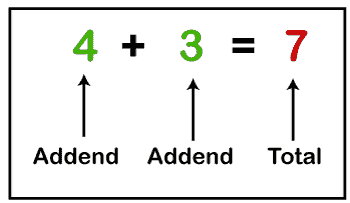

### 注释

一个**加符号(+)** 用来表示加法。它出现在两个被称为**中缀符号**的数字之间。加法的另一个同义词是**加、和、加、**和**合计。**有时也用符号 **∑ (sigma)** 表示。当我们必须添加一个大数字时，就要用到它。

通过使用加号，我们可以在不同的数字之间执行加法，例如**整数、实数、十进制数、复数、**等。除此之外，它还用于代数中添加**向量**和**矩阵**。

比如第一个篮子里有 5 个苹果，第二个篮子里有 4 个苹果。如果我们数一下两个篮子里的苹果，我们会得到 9 个苹果。

在算术中，我们可以用数学表达式表示为:

**5+4=9**

### 附加事实

*   另外，加法的顺序也不重要。它总是给出同样的答案。
    **2+4+6+8=20 或 8+6+4+2=20 或 6+2+8+4=20**
*   将 0 加到任何数字上，反之亦然，得到的结果是相同的数字。
    **7+0=7 或 0+7=7**
*   如果我们把任何一个数加 2 次，就等于把一个数乘以 2。
    **8+8=16**
    同:
    **8×2=16**
*   重复加 1 和计数是一样的。
    1+1=2，1+1+1=3

### 加法表

下表帮助孩子们记住两个数的和。你可以找到 0 到 10 之间的两个数的和。

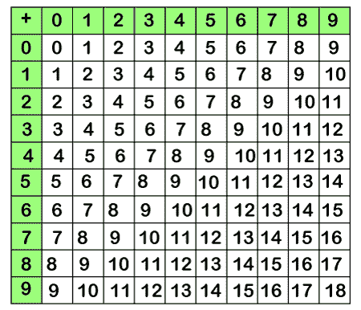

在进行加法之前，我们必须了解术语**进位。**

在算术中，进位是从右列转移到左列并添加到转移列的数字。

### 一位数的加法

借助上表，我们可以找到一位数的加法。假设我们想把 2 和 3 加在一起。在**最左边的**列搜索 **2** ，在**最上面的**行搜索 **3** 。在当前行中，向下移动，直到到达选定列的前面。正方形包含数字 2 和 3 的相加，即 **5** 。

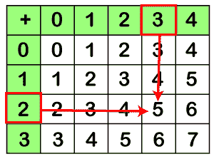

同样，我们可以找到任何一位数的总和。

### 两位数的加法

*   将给定的数字排列在一栏中，以便于理解。
*   将**位的**位的数字加在一起，如果有的话，将**进位**转移。它给出答案的单位位置。
*   加上**十进制位**位，并携带上一步的数字(如有)。
*   写下答案。

让我们在一个示例中实现上述步骤。

**例:加 24 和 32。**

**解决方案:**

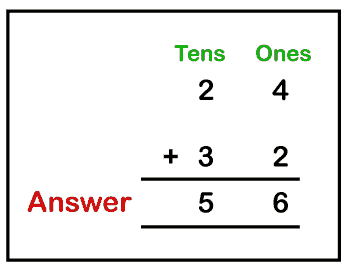

**例:加 98 和 22。**

**解决方案:**

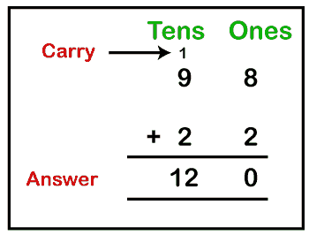

### 三位数的加法

*   将给定的数字排列在一栏中，以便于理解。
*   将**个数字加在一起，如果有的话，转移进位。它给出答案的单位位置。**
*   加上**十位**位数字，上一步进位(如有)，转移进位(如有)。它给出了答案的十位。
*   将**几百位**数字相加，从上一步开始进位(如有)。它给出了答案的数百或数千或两者(取决于总数)。
*   写下答案。

让我们在一个示例中实现上述步骤。

**例:加 367 和 492。**

**解决方案:**

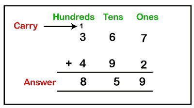

**例:加 847 和 564。**

**解决方案:**

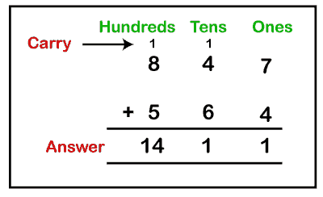

同样，我们也可以添加四位数。

### 整数的加法

整数包括所有正数和负数，包括 0。一个数字可以有一个正号或负号。带有符号的整数相加遵循规则。一般来说，我们不代表带+号的正数。在下表中，我们总结了正数和负数的附加规则。

我们取了两个数字 **a** 和 **b** 作为加数， **z** 作为和数。

| 符号 | 评论 | 例子 |
| (+) + (+) = + | 总是给出**肯定的**结果 | a + b = z |
| (+) + (-) = - | 如果 **a > b** ，结果将是**+五**否则**-五** | a + (-b) = z 或-z |
| (-) + (+) = - | 如果 **a < b** ，结果将是**-五**否则**+五** | (-a) + b = -z 或 z |
| (-) + (-) = - | 总是给出**否定的**结果 | (-b) + (-b) = -z |

### 例子

10+20 = 30
25+(-20)= 25-20 = 5
20+(-25)= 20-25 =-5
(-22)+(10)= 10-22 =-12
(-10)+(22)= 22-10 = 12
(-40)+(-20)=-40-20 =-60

### 十进制数的加法

要添加两个或更多十进制数，请遵循以下规则:

*   把数字写在表格中，但要记住小数点必须对齐。
*   如果长度不相等，则使数量相等。
*   把这些栏加在一起，在答案中加上一个小数点。

**例:加 56.3457 和 2.4。**

**解决方案:**

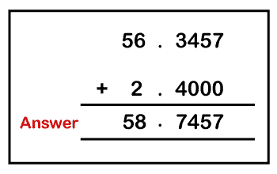

**例:加 12.02 和 45.11。**

**解决方案:**

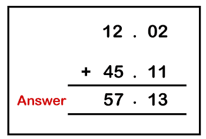

**例:加 33.89、0.0073、6。**

**解决方案:**

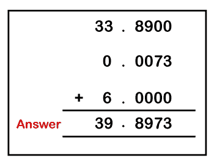

### 有理数的加法

有理数是分数形式的数。让我们看看如何添加有理数。

**当每个分数的分母相同时:**

*   把记数器加起来，把结果放在答案里。
*   如果需要，简化分数。

一般来说，我们可以说如果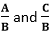是两个分数，分数的相加将是:

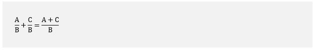

**记住:**要简化一个分数，分子和分母必须能被同一个数整除。

**例:求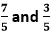的和。**

**解决方案:**

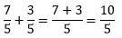

在简化分数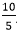时，我们得到 2。

**因此的和为 2。**

**当每个分数的分母不同时(不相似):**

*   求分母的 LCM，因为我们需要使分母相同。
*   将 LCM 除以分母。
*   分别在记数器中相乘，然后简化。
*   加上记数器，就得到答案。

一般来说，我们可以说如果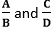是两个分数，分数的相加将是:

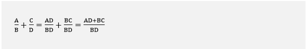

**例: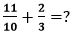**

**解决方案:**

让我们按照上面的步骤来解决这个问题。

**求分母的 LCM。**

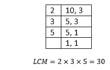

**将 LCM 除以分母。**

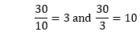

**在记数器中分别乘以(上一步的)结果，并简化。**

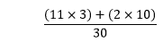

**添加记数器。**

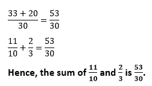

### 复数的加法

复数是通过分别加上实部和虚部来相加的。一般来说，我们可以说如果 **a+bi** 和 **c+di** 是两个复数，那么这两个数的和就是:

(a+bi)+(c+di)=(a+c)+(b+d)i

**例:加(6+4i)和(5+3i)。**

**解决方案:**

在上面的例子中，6 和 5 是实部，4i 和 3i 是虚部。所以，我们将把实部和虚部加在一起。

(6+4i)+(5+3i)=(6+5)+(4i+3i)
(6+4i)+(5+3i)=(11+7i)

**(6+4i)和(5+3i)之和为(11+7i)。**

**例:加(12+10i)和(7-9i)。**

**解决方案:**

(12+10i)+(7-9i)=(12+7)+(10i-9i)
(6+4i)+(5+3i)=(19+I)

**(12+10i)和(7+9i)之和为(19+i)**

* * *