# 如何相乘分数

> 原文：<https://www.javatpoint.com/how-to-multiply-fractions>

在算术中，乘法是两个或多个数或分数的乘积。在这一节中，我们将学习**如何相乘分数。**

### 如何相乘分数

要找到两个或多个分数的乘积，我们必须遵循下面给出的步骤:

**第一步:**将分数的记数器相乘得到分子。

**第二步:**将分数的分母相乘得到分母。

**步骤 3:** 如果需要，简化分数。

#### 注意:为了简化分数，总是用同一个数来除分子和分母。

假设，和是两个分数，我们想相乘，那么:

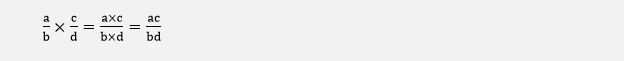

简而言之，我们可以说分数的乘法是:

让我们看一些例子。

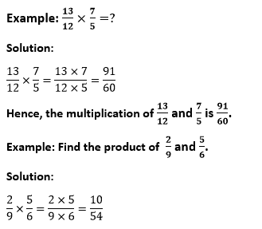

现在我们看到分子和分母都可以被 2 整除。所以，我们将简化分数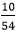。关于简化，我们得到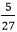。

**因此和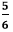的乘积就是。**

### 混合分数的乘法

混合分数是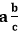形式的分数。在处理混合分数时，首先将混合分数转换为**不适当分数**，然后应用上述步骤。要将混合馏分转化为不适当的馏分，请按照下列步骤操作:

*   将整数 **(a)** 乘以分母 **(c)** 。结果我们得到(a×c)。
*   在上述结果(a×c)中，加上分子 **(b)** 。将分子相加后，我们得到不适当分数的**分子**。
*   不当分数的分母将是混合分数的分母。
    

总的来说，我们可以说:

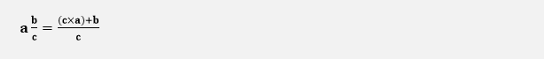

**例:找到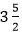和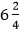的乘积。**

**解决方案:**

首先，我们将混合分数转换成不适当的分数。

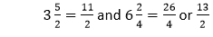

我们可以在乘法之前简化分数，或者最后简化分数。在这个例子中，我们将最后简化分数。

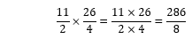

将分数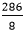除以 8，我们得到混合分数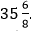。我们看到分数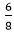也可以被 2 整除。所以，我们会更加简化，得到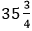或者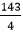。

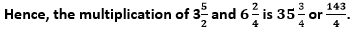

### 整数和分数的乘法

**例:分数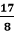乘以 9。**

**解决方案:**

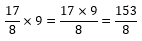

**因此，和 9 的乘积就是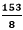。**

**例:26 乘以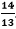。**

**解决方案:**

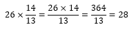

或者首先，26 除以 13。它给出 2 作为结果，乘以分子，我们得到:
2×14=28

**因此，26 和的乘积是 28。**

### 两个以上分数的乘法

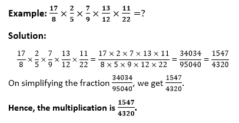

让我们看一些其他的例子。

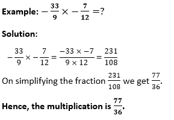
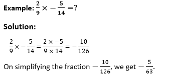

另一种求乘法的方法是:

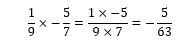

**因此，乘法为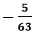。**

* * *