# 如何找到百分比

> 原文：<https://www.javatpoint.com/how-to-find-percentage>

在算术中，**百分比**是最重要的题目。如果你有乘法、除法和十进制的知识，计算百分比是非常容易的。它帮助我们计算利率、打折、测量数量等。在本节中，我们将学习**如何找到百分比**。在开始计算百分比之前，我们先了解一下**什么是百分比**。

### 百分率

百分比这个词起源于**百分比**这个词。当我们拆分百分比这个词时，我们得到两个词一个是 **Per** ，另一个是 **Cent** 。分是法语单词，意思是**百**。因此，百分比这个词的意思是每一百个中的**或者每一百个**中的**。**

在数学中，它是表示为 100 的分数的数字或比率。换句话说，百分比定义为每 100 个中的**份或每 100 个**中的**。用符号 **%** 表示。这是一种表示分母为 100 的分数的快速方法。**

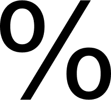

假设一个班总共有 **100** 个学生，到场的只有 40 个。那么我们可以说**有 40%** 的学生出席，**有 60%** 的学生缺席。

以十进制格式计算百分比或从百分比转换更容易。我们想要转换成百分比的数字可能有两种不同的格式，**小数**和**分数**。

请看下图。我们看到一杯水是半满半空的。所以，我们可以用三种不同的形式来表示**百分比**、**小数**和**分数**。

百分比为: **50%满**或 **50%空**

小数部分为: **0.5 满**或 **0.5 空**

分数为:**满**或**空**

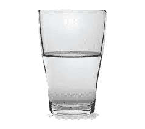

*   要将分数或十进制数转换为百分比，**将其乘以 100** 。我们可以通过将小数点向右移动两位来将十进制数表示成百分比。例如:
    **0.76×100=76%**
*   要将百分比转换为分数，**将百分比除以 100** ，如果需要，将其简化。例如:
    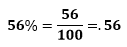

### 百分比问题

基本上有三种类型的百分比问题。如果 X 和 Y 是数字，P 是百分比，那么问题可能有以下形式:

*   求 x 的 P %
*   X 的百分之几是 Y？
*   如果百分之 P 是 y，求 X

让我们通过例子来看看问题的上述形式。

### 求 X 的百分比

为了解决这类问题，我们使用以下公式:

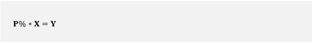

**例:250 的 20%是多少？**

**解决方案:**

本问题中 **P 为 20%****X 为 250** 。将这些值放在上面的公式中，我们得到:

20%*250=Y

现在，把 20%转换成十进制。我们去掉%符号**将 20 除以 100** ，我们得到:

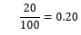

0.20 是 20%的替代值。所以，我们将把十进制值放在公式中。

0.20*250=Y

50.00=Y

**因此，250 的 20%就是 50。**

### X 的百分之几是 Y？

为了解决这类问题，我们使用以下公式:

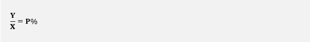

**例:找出 90 的百分之几是 23？**

**解决方案:**

本问题中 **X 为 90****Y 为 23** 。将这些值放在上面的公式中，我们得到:

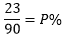

通过简化分数，我们得到:

0.25=P%

请记住，结果总是以十进制形式，而不是百分比形式。为了得到百分比的结果，我们需要将结果乘以 100。

0.25×100=25%

**因此，90 的 25%是 23。**

### 如果百分之几是 Y，求 X

为了解决这类问题，我们使用以下公式:

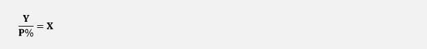

**例:95 是什么数的 20%？**

**解决方案:**

本问题中 **P 为 20%****Y 为 95** 。将这些值放在上面的公式中，我们得到:

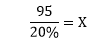

现在，把 20%转换成十进制。我们去掉%符号**将 20 除以 100** ，我们得到:

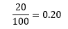

0.20 是 20%的替代值。所以，我们将把十进制值放在公式中。

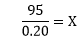

在求解上述分数时，我们得到:

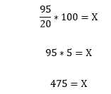

**因此，95 是 475 的 20%。**

* * *