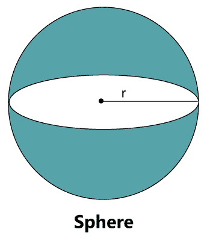
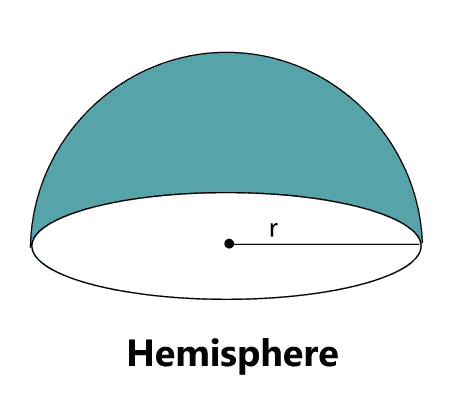
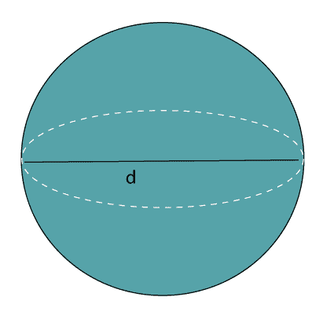
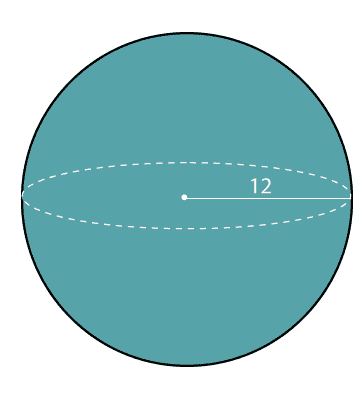
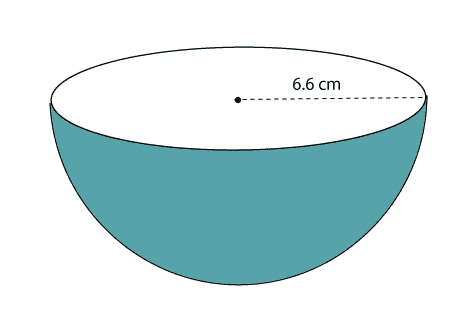
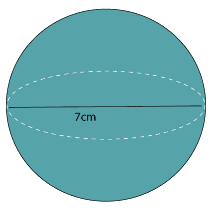

# 球体的表面积

> 原文：<https://www.javatpoint.com/surface-area-of-a-sphere>

在这一节中，我们将学习球体的定义、属性和球体公式的面积以及详细的例子。

### 范围

球体是三维空间中的圆形实体。它可以定义为距离给定点(中心)相同距离的一组点。球体的完美例子是**球体**和**球体**。

球体和圆有一点区别，圆是二维形状，而球是三维形状。

### 半球

它是球体的一半。

### 球体的性质

*   它是对称的。
*   它不是多面体形状(具有平坦多边形面、尖角的三维形状)。
*   中心与曲面上的所有点等距。
*   它的中心没有表面。
*   它的宽度和周长是恒定的。
*   它没有平坦的表面。

### 球体的表面积

球体表面覆盖的区域称为球体表面积。球体的表面积与圆柱体的表面积相同，圆柱体的半径和高度与球体相同。

我们也可以说它是圆面积的四倍。

Surface Area of a Sphere (A) = 4πr2

用直径表示的球体表面积:

Surface Area of a Sphere (A) = πd2

其中 d 是直径。

三维形状的面积可以分为三类:

*   **曲面面积:**是立体形状所有曲面区域的面积。
*   **侧表面积:**是指除基部顶部和底部以外的所有区域的面积。
*   **总表面积:**是所有边(顶部、底部和实体)的面积。

从以上几点，我们可以得出结论:

Total surface area of a sphere = Curved Surface area of a Sphere

### 半球的表面积

Surface Area of a hemisphere (A) = 2πr2

### 例子

**例 1:球体的半径为 4.7 厘米。求球体的表面积。**

**解决方案:**

给定，半径(r) = 4.7 厘米

我们知道，

Surface Area of a Sphere (A) = 4πr2

将 r 的值放在上面的公式中，我们得到:

A = 4 * 3.14* (4.7) 2

A = 4 * 3.14 * 22.09

A = 277.4504 平方。厘米。

**球体表面积为 277.4504 平方。厘米。**

**例 2:求半径为 12 cm 的地球仪的表面积。将答案四舍五入到最接近的百分之一。**

**解决方案:**

给定，地球半径(r) = 12 厘米

我们知道，

Surface Area of a Sphere (A) = 4πr2

将 r 的值放在上面的公式中，我们得到:

A = 4 * 3.14* (12) 2

A = 4 * 3.14 * 144

A = 1808.64 平方。厘米。

**球体的表面积为 1808.64 平方。厘米。**

**例 3:一个半球的半径是 6.6 厘米。求没有底的半球的表面积。**

**解决方案:**

给定，半球半径(r) = 6.6 厘米。

我们知道，

Surface Area of a hemisphere (A) = 2πr2

将 r 的值放在上面的公式中，我们得到:

A = 2 * 3.14 * (6.6) 2

A = 2 * 3.14 * 43.56

A = 273.5568 cm 2

**半球表面积 273.5568 厘米 2 。**

**例 4:求直径为 7 cm 的球体的表面积。**

**解决方案:**

已知球体的直径(d) = 7 厘米。

我们知道，

Surface Area of a Sphere (A) = πd2

将 d 的值放在上面的公式中，我们得到:

A = 3.14 * (7) 2

A = 3.14 *49

A = 153.86 cm 2

**球体表面积为 153.86 厘米 2 。**

* * *