# 如何找到标准差

> 原文：<https://www.javatpoint.com/how-to-find-standard-deviation>

**标准差**是研究变异(离差)最重要和最广泛使用的度量。它显示了数据的变化。标准差的计算有点复杂。犯错误的风险很高，所以我们需要高度重视和准确计算。在这一节中，我们将学习**如何找到标准差。**

### 标准偏差定义

标准差(SD)是一种量化方法，用于衡量数据集相对于其平均值的分布(离差)。它被计算为方差的平方根。用小写希腊字母 **σ (sigma)** 表示。如果偏差较大，则分散性较大，如果偏差较小，则均匀性较大。

其他一些定义是:

*   标准偏差是所有值与平均值的偏差的**度量。**
*   标准偏差是平均值的平方偏差之和除以观测值数量的平方根。
*   它是**方差**的平方根。

### 变化

它定义了随机变量与其期望值之间的差异。它是期望值和个体值之间差异的平方的平均值。它永远不能有负值。用σ 2 表示。方差公式为:

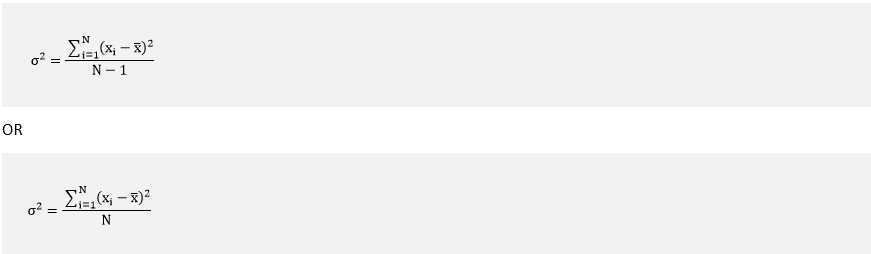

### 如何找到标准差

通过确定每个数据点相对于平均值的变化，将其计算为方差的平方根。标准差越高，每个数据集之间的方差和均值就越高。

### 标准差公式

计算标准差有两个公式。这两个公式都衡量变化。但是它们之间有区别。

*   总体标准差
*   样品标准偏差

### 总体标准差

这是一个从人口中的每个个体计算固定值的参数。总体标准差的公式为:

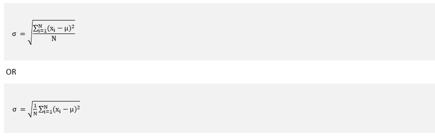

其中:

**σ** :人口标准差。

**x i** :数据中的每个元素

set. Where i = 1, 2, 3, ...., N.

**μ** :数据集中所有元素的平均值。

**N** :元素个数。

### 样品标准偏差

这是一个统计数字。在这个标准偏差中，只有人口中的一些个体被用于计算。它具有更大的可变性，因为它取决于样本。因此，样本的标准偏差大于总体标准偏差。

样本标准差的公式为:

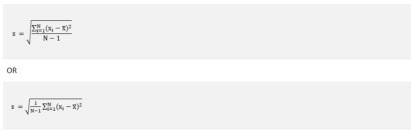

其中:

**s** :样本标准差。

**x i** :数据集中的每个元素。其中 i = 1，2，3，....，n。

**×T2】**:数据集中所有元素的平均值。

**N** :元素个数。

现在，我们将看到这些标准差是如何相互不同的。考虑样本和总体标准差公式；我们看到两个公式几乎完全相同。

**第一步:**首先计算**的平均值**。将所有值相加，除以元素数。

**第二步:**计算**与平均值的偏差**。为了达到同样的效果，从每个值中减去平均值。

**步骤 3:** 对偏差进行平方。

**第 4 步:**将偏差平方并相加。

**第五步:**用方差除以观测值的个数。这一步主要区别于总体标准偏差和样本标准偏差。

*   使用**总体标准偏差**时，将平方偏差之和除以 **N** (元素或观测值的数量)。
*   使用**样本标准偏差**时，将平方偏差之和除以 **N-1** (比元素或观测值的数量少一个)。

**第六步:**求上一步得到的商的平方根。

总体和样本标准差的值取决于 **N** 。N 值越大，总体和样本标准差越大。

### 标准差的性质

*   标准差的值从来不是负数。
*   低偏差表明数据点倾向于非常接近平均值。
*   高偏差表示数据点分布在很大的值范围内。
*   如果我们给所有的数据集加一个常数，它不会影响标准差。
*   如果我们将一个常数乘以所有的数据集，它会影响标准差。
*   当且仅当所有观察值都相同时，标准偏差才可以为零。

### 标准差的用途

*   它被广泛应用于生物研究、统计和金融领域。
*   它用于拟合频率分布的正态曲线。
*   它用于测量色散。
*   金融领域也用它来计算金融风险。

### 标准差方法

### 直接教学法

我们也可以用直接法求出标准差。当偏离实际平均值时使用。直接法的公式为:

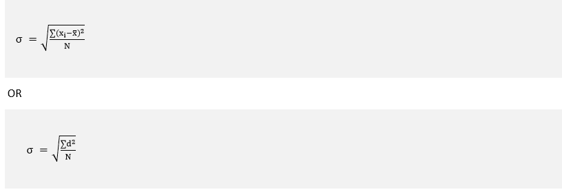

其中:

**d=(x i - x )**

**σ** :标准差

**x i** :数据集中的每个元素。其中 i = 1，2，3，....，n。

**×T2】**:数据集中所有元素的平均值。

**N** :元素个数。

### 假设平均法

在这种方法中，我们不计算实际平均值。相反，我们选择一个随机值来计算偏差。假设值必须在中间值附近。又称**快捷法**。假设平均法的公式为:

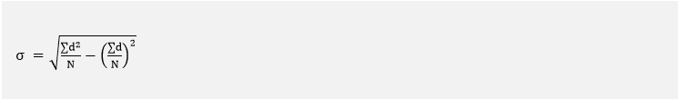

哪里，

**f** :对应频率

**d=x-A** (A 为假设平均值)

**N** :数据集中的元素个数。

### 步长偏差法

它是快捷方法的扩展形式。它简化了计算。假设平均法的公式为:

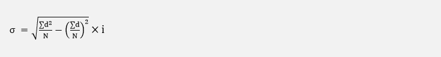

哪里，

**f** :对应频率

**d= 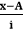 ** (A 为假设均值)

**N** :数据集中的元素个数。

**i** :普通班间隔

### 分布类型

在转向示例之前，我们必须了解三种类型的分布。

*   **个别系列:**个别系列为单列观察。例如:

| **标记(x)** | Fifty-five | Thirty-four | seventy-eight | Fifty-eight | Ninety | Sixty-seven | Eighty-one |

*   **离散系列:**在离散系列中，有两列。第一列由观测值组成，第二列由频率组成。例如:

| **标记(x)** | **65** | **86** | **58** | **45** | **88** | **90** | **35** |
| **学生人数( *f* )** | **5** | **7** | **12** | **8** | **4** | **2** | **1** |

*   **频率分布:**频率分布也有两列。第一列由观测值组成，第二列由频率组成。观察结果被进一步划分为称为类的区间。例如:

| **标记(x)** | **20-30** | **30-40** | **40-50** | **50-60** | **60-70** | **70-80** | **80-90** |
| **学生人数( *f* )** | **6** | **8** | **14** | **7** | **3** | **9** | **2** |

| 标准偏差公式 |
| **分布** | **直接法** | **假设平均值或捷径法** | **步距偏差法** |
| **单个系列** | 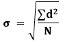 | 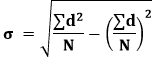 | - |
| **离散系列** | 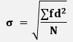 | 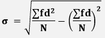 | - |
| **频率分布** | - | - | 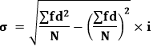 |

### 单个系列示例

**例:用直接法和假设平均法求下列数据的标准差。**

| **标记** | Twenty-five | Thirty-four | Twenty-one | Twenty-eight | Sixty | Thirty-three | seventy-two | Fifty-five |

**解决方案:**

**使用直接法**

首先，我们将计算平均值。

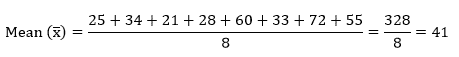

现在我们来计算方差 **(σ 2 )** 。

方差公式为: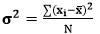

| 标记(x) | d=(x i - x ) | d2=(xI-x)2 |
| Twenty-five | -16 | Two hundred and fifty-six |
| Thirty-four | -7 | forty-nine |
| Twenty-one | -20 | four hundred |
| Twenty-eight | minus thirteen | One hundred and sixty-nine |
| Sixty | Nineteen | Three hundred and sixty-one |
| Thirty-three | -8 | Sixty-four |
| seventy-two | Thirty-one | Nine hundred and sixty-one |
| Fifty-five | Fifteen | Two hundred and twenty-five |
|  | **(x【I】-x)= 1** | **(x【I】-【x】)【2】= 2485** |

将这些值放在方差公式中，我们得到:

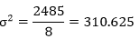

标准差公式为:σ=√σ2T3

φ=√t0]310，625 =17，624
**φ= 17，624**

**使用假设平均值或捷径法**

我们知道单个数列的假设平均法公式:

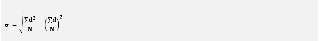

在上式中， **d=x-A** 。其中 A 是假设平均值。所以，我们假设 **A = 38** 。

| 标记(x) | d=(x i -A) | d2=(xI-A)2 |
| Twenty-five | minus thirteen | One hundred and sixty-nine |
| Thirty-four | -4 | Sixteen |
| Twenty-one | -17 | Two hundred and eighty-nine |
| Twenty-eight | -10 | One hundred |
| Sixty | Twenty-two | Four hundred and eighty-four |
| Thirty-three | -6 | Thirty-six |
| seventy-two | Thirty-four | One thousand one hundred and fifty-six |
| Fifty-five | Seventeen | Two hundred and eighty-nine |
|  | **∑(x i -A)=23** | **∑(xI-A)2= 2539** |

将这些值放在上面的公式中，我们得到:

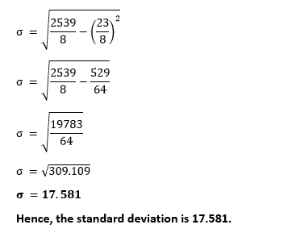

### 离散系列示例

**例:用直接、快捷的方法求出下面给出数据的标准差。**

| **标记(x)** | **3.5** | **4.5** | **5.5** | **6.5** | **7.5** | **8.5** | **9.5** |
| **学生人数( *f* )** | **3** | **7** | **22** | **60** | **85** | **32** | **8** |

**解决方案:**

**使用直接法**

首先，我们将计算平均值。

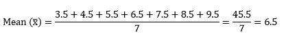

我们知道离散级数直接法的公式:

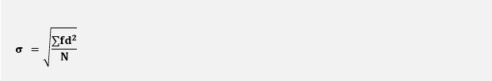

| 标记(x) | f | d=(x i - x ) | d2=(xI-x)2 | 软驱 | fd 2 |
| Three point five | three | -3 | nine | -9 | Twenty-seven |
| Four point five | seven | -2 | four | -14 | Twenty-eight |
| Five point five | Twenty-two | -1 | one | -22 | Twenty-two |
| Six point five | Sixty | Zero | Zero | Zero | Zero |
| Seven point five | eighty-five | one | one | eighty-five | eighty-five |
| Eight point five | Thirty-two | Two | four | Sixty-four | One hundred and twenty-eight |
| Nine point five | eight | three | nine | Twenty-four | seventy-two |
|  | **f = 217** |  |  |  | **【FD】【2】= 362** |

将这些值放入公式中，我们得到:

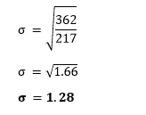

**使用捷径法**

我们知道离散级数的捷径法公式:

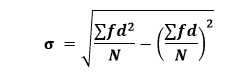

在上式中， **d=x-A** 。其中 A 是假设平均值。所以，我们假设 **A = 6.5** 。

| 标记(x) | f | d=(x i -A) | d2=(xI-A)2 | 软驱 | fd 2 |
| Three point five | three | -3 | nine | -9 | Twenty-seven |
| Four point five | seven | -2 | four | -14 | Twenty-eight |
| Five point five | Twenty-two | -1 | one | -22 | Twenty-two |
| Six point five | Sixty | Zero | Zero | Zero | Zero |
| Seven point five | eighty-five | one | one | eighty-five | eighty-five |
| Eight point five | Thirty-two | Two | four | Sixty-four | One hundred and twenty-eight |
| Nine point five | eight | three | nine | Twenty-four | seventy-two |
|  | **f = 217** |  |  | FD = 128 | **【FD】【2】= 362** |

将这些值放入公式中，我们得到:

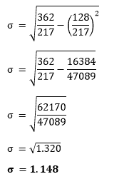

**因此，标准偏差为 1.148。**

### 频率分布示例(分组数据或连续序列)

**例:用直接和快捷的方法计算下面给出数据的标准差。**

| **标记(x)** | **0-10** | **10-20** | **20-30** | **30-40** | **40-50** | **50-60** | **60-70** | **70-80** |
| **学生人数( *f* )** | **15** | **15** | **23** | **22** | **25** | **10** | **5** | **10** |

**解决方案:**

**使用步距偏差法**

我们知道连续级数的步长偏差法公式:

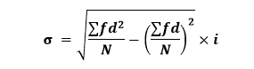

在上式中，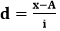。其中 A 是假设平均值。所以，首先，我们将计算平均值(m)。在下表中，我们计算了每个类间隔的平均值。其中，我们假设了一个平均值，即 **35** 。

| 标记(x) | f | 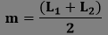 | 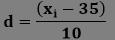 | d 2 | 软驱 | fd 2 |
| 0-10 | Fifteen | five | -3 | nine | -45 | One hundred and thirty-five |
| 10-20 | Fifteen | Fifteen | -2 | four | -30 | Sixty |
| 20-30 | Twenty-three | Twenty-five | -1 | one | -23 | Twenty-three |
| 30-40 | Twenty-two | **35 (A)** | Zero | Zero | Zero | Zero |
| 40-50 | Twenty-five | Forty-five | one | one | Twenty-five | Twenty-five |
| 50-60 | Ten | Fifty-five | Two | four | Twenty | Forty |
| 60-70 | five | Sixty-five | three | nine | Fifteen | Forty-five |
| 70-80 | Ten | Seventy-five | four | Sixteen | Forty | One hundred and sixty |
|  | **f = n = 125** |  |  |  | FD = 2 | **【FD】【2】= 488** |

将这些值放入公式中，我们得到:

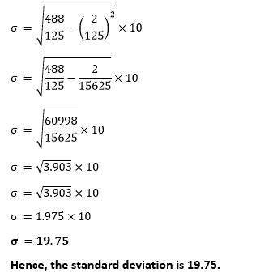

### 总体标准偏差示例

**例:利用总体标准差求标准差。**

**12、2、45、23、55、8、11、19、57、3**

**解决方案:**

在上面的问题中，给出了十个学生的分数。问题说应用样本标准差。在这种情况下，我们不会把所有学生的分数都计算在内。我们将取几个学生的分数作为计算样本。

我们只取了**六个**标记计算如下:

**12、45、23、11、19、3**

我们知道样本标准差的公式:

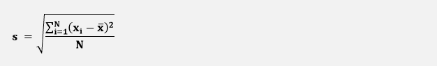

现在，我们将找到公式中使用的值。

**第一步:**计算样本均值 **( x )** 。

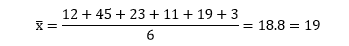

**步骤 2:** 对于每个数据元素，减去平均值并对结果进行平方。

| x | (x i - x | (x i - x ) 2 |
| Twelve | -7 | forty-nine |
| Forty-five | Twenty-six | Six hundred and seventy-six |
| Twenty-three | four | Sixteen |
| Eleven | -7 | forty-nine |
| Nineteen | Zero | Zero |
| three | -16 | Two hundred and fifty-six |
|  |  | **(x【I】-【x】)【2】= 1046** |

**第三步:**将**∑(xI-x)2**除以 **N-1** 。这里，总共有 6 个元素，所以将总和除以 6-1=5，我们得到:

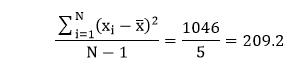

**第四步:**取上述结果的平方根。

s =√ 209.2 =14.46

**因此，样本标准偏差为 14.46。**

### 样本标准偏差示例

**例:利用总体标准差求标准差。**

**12、2、45、23、55、8、11、19、57、3**

**解决方案:**

在上面的问题中，给出了十个学生的分数。问题说应用人口标准差。在这种情况下，我们将取所有学生的分数进行计算。

我们知道样本标准差的公式:

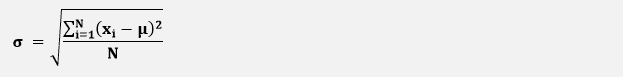

现在，我们将找到公式中使用的值。

**第 1 步:**计算总体平均值(μ)。

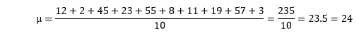

**步骤 2:** 对于每个数据元素，减去平均值并对结果进行平方。

| x | (x)和 -μ | (x)和【t1-μ】和 |
| Twelve | -12 | One hundred and forty-four |
| Two | -22 | Four hundred and eighty-four |
| Forty-five | Twenty-one | Four hundred and forty-one |
| Twenty-three | -1 | one |
| Fifty-five | Thirty-one | Nine hundred and sixty-one |
| eight | -16 | Two hundred and fifty-six |
| Eleven | minus thirteen | One hundred and sixty-nine |
| Nineteen | -5 | Twenty-five |
| Fifty-seven | Thirty-three | One thousand and eighty-nine |
| three | -21 | Four hundred and forty-one |
|  |  | **【x【I】【μ】【2】= 4011** |

**第三步:**将 **∑(x i -μ) 2** 除以 **N** 。这里，总共有 10 个元素，所以将总和除以 10，我们得到:

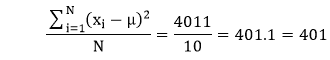

**第四步:**取上述结果的平方根。

φ=√t0〖401〗t1〖20.02 = 20

**因此，总体标准偏差为 20。**

* * *