# 小数到十进制

> 原文：<https://www.javatpoint.com/fraction-to-decimal>

在这一节中，我们将学习如何**将分数转换为小数**。在进行转换之前，让我们快速查看一下**分数**和**小数**。

### 分数

分数以**分子**和**分母**的形式表示小数，即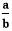。这是表示十进制数的一种方法。分数的另一个名字是**有理数**。分数有两种类型:

*   假分数
*   带分数

### 假分数

分数是一个形式为**的数，分子大于分母**称为不当分数。比如。

### 带分数

混合分数是一个形式为的数，其中 a 是整数，是小数部分。在处理混合分数时，首先将其转换为**不当分数。**如果要将混合馏分转化为不适当的馏分，请按照以下步骤操作:

*   将整数 **(a)** 乘以分母 **(c)** 。结果我们得到(a×c)。
*   在上述结果(a×c)中，加上分子 **(b)** 。将分子相加后，我们得到不适当分数的**分子**。
*   不当分数的分母将是混合分数的分母。

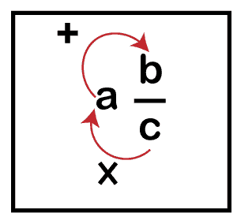

总的来说，我们可以说:

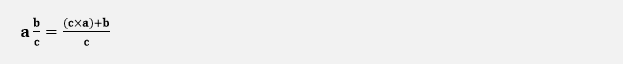

### 小数

一个**小数**是一个有**小数点**(。).小数部分将整数和小数部分分开。这是表示分数的另一种方法。它不是一个整数。例如， **22.96，1.657，987.09877，**等。

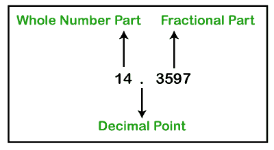

如果一个十进制数在小数点后有任意数量的零，就把它看作一个整数。因为小数点后的零不影响数值。例如 **56.0000** 与 **56** 相同。但是 **56.00001** 和 **56** 不一样。

我们来看看下面的小数位数值图。

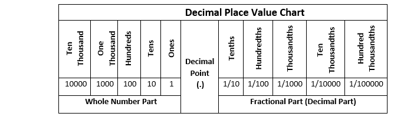

在上表中，我们观察到当我们移动到小数点左边时，数值会变大**十倍**，移动到小数点右边时，数值会变小**十倍。**

让我们取一个十进制数，并理解它的含义。

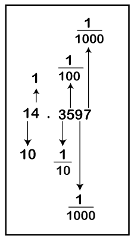

### 分数到十进制的转换

有三种方法可以将分数转换成小数。

*   使用计算器
*   扩展分母法
*   长除法

### 使用计算器

将分数转换成小数是最简单的方法。分子除以分母，得到十进制的答案。

**例 1:将分数改为小数。**

**解决方案:**

在计算器中，分别按下 **9、/、**和 **7** 键。之后，按下**等于**按钮得到答案。

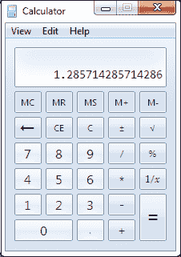

### 扩展分母法

**第一步:**找到能把分母转换成 10 的**次方的数。意思是可以将分母转换为 **10，100，**或 **1000** 的数字。简而言之， **1 后跟 0。****

**第二步:**将分子和分母乘以我们上面得到的相同数字。

**第三步:**计算**分母**中的 **0s** ，在**右侧**的相同数字后，在**分子**中放一个**小数点。**

让我们通过例子来理解它。

**例 2:的十进制值会是多少？**

**解决方案:**

在给定的分数中，9 是分子，5 是分母。

**第一步:**我们可以将分母乘以 **2** ，将分母转换为 10 的幂。

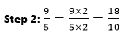

**第三步:**分母只有一个 0，所以我们从右边数一位数后会在分子中放一个小数点。那是 1.8。

**因此分数是 1.8 的小数。**

**例 3:求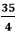的十进制值。**

**解决方案:**

在给定的分数中，35 是分子，4 是分母。

**第一步:**我们可以将分母乘以 **25** ，将分母转换为 10 的幂。

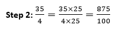

**第三步:**分母有两个 0，所以我们从右边数完两位数后会在分子中放一个小数点。那是 8.75。

**因此分数的小数部分为 8.75。**

**例 4:求的小数值。**

**解决方案:**

在给定的分数中，99 是分子，8 是分母。

**第一步:**我们可以将分母乘以 **125** ，将分母转换为 10 的幂。

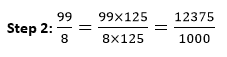

**第三步:**分母有三个 0，所以我们从右边数完三位数后会在分子中放一个小数点。那是 12.375 英镑。

**因此分数是十进制的 12.375。**

**例 5:求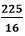的十进制值。**

**解决方案:**

在给定的分数中，225 是分子，16 是分母。

**第一步:**我们可以将分母乘以 **625** ，将分母转换为 10 的幂。

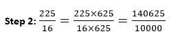

**第三步:**分母有四个 0，所以我们从右边数完四位数后会在分子中放一个小数点。那是 14.0625 英镑。

**因此，分数是十进制的 14.0625。**

### 长除法

这是将分数转换成小数的另一种方法。这和我们除以两个数是一样的，但是由于 0 的增量，这有点棘手。我们可以用这种方法找到小数位数的答案。

**例 6:求的十进制值。**

**解决方案:**

**第一步:** 5 进 8，因为 1 乘以 5 等于 5。从 8 中减去 5，我们得到 3 作为余数。

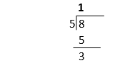

**第二步:** 5 太大了，不能分成 3，所以我们唯一能去掉余数的方法就是在十分之一处用一个 0，让我们要分的数字看起来有点像 80。现在，我们可以将额外的 0 降低，使余数看起来像 30。

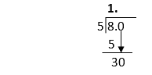

**第三步:** 5 进 30 六次，因为 5 乘 6 等于 30，不留余数。

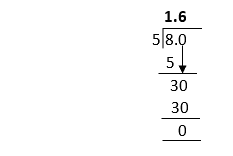

**因此分数是 1.6 的小数。**

**例 7: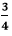的十进制值会是多少？**

**解决方案:**

4 太大了，进不去 3。

**第一步:**我们先在 3 后面放一个小数点，在十分之一处放一个零，使之成为 3.0。现在类似于 30 除以 4。

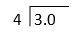

**第二步:** 4 进 30，因为 7 乘 4 等于 28。30 减去 28，我们得到 2 作为余数。

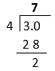

**第三步:** 4 太大了，不能分成 2，所以我们唯一能去掉余数的方法就是在百分之一处再用一个 0，让我们要划分的数字看起来有点像 300。现在，我们可以将额外的 0 降低，使余数看起来像 20。

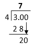

**第四步:** 4 五进 20，因为五乘四等于 20，不留余数。

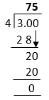

**第五步:**答案中包含小数点。如果你像我们一样把你的列排成一行，你会看到小数点就在这里。它使我们的答案**为 0.75。**

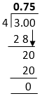

**因此，分数是十进制的 0.75。**

**例 8:将分数改为小数。**

**解决方案:**

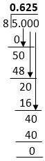

**因此分数是 0.625(十进制)。**

**例 9:求的十进制值。**

**解决方案:**

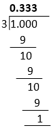

在上面的例子中，我们已经看到它一次又一次地留下余数 1。看起来它可能会永远持续下去。所以，有些分数可能是这种类型的。如果我们把它们分开，我们会看到一个不断重复的数字模式。

所以的十进制值是**0.3333**……3 一直持续到永远。但是我们不能一遍又一遍地写 3。我们可以阻止他们，把数字四舍五入。意思是我们可以写 **0.33** 。

另一种表示重复数字的方法是在重复数字上方使用一个**条**，如下图所示。

 =0.3333…..=0. 3

**因此分数为 0。 3 十进制。**

* * *