# [数]矩阵

> 原文：<https://www.javatpoint.com/matrix>

**矩阵**在工程计算中非常有用。涉及矩阵的几个数学运算很重要。在本节中，我们将了解**矩阵**，其**符号**，类型，操作和应用。

### 矩阵是什么？

**矩阵**是一组排列在水平和垂直条目行中的数字。横向条目称为**行**，纵向条目称为**列**。这些数字被称为矩阵的**元素**或**条目**。写在一对**方括号[]** 里面。换句话说，它是一个数字的**数组**。它是以数组形式的数字的矩形表示。

### 矩阵符号

矩阵通常用大写的**字母表示，其元素用小的**字母以及**行**和**列**的**下标**表示。行和列分别用小写字母 **m** 和 **n** 表示。矩阵的大小由其包含的行数和列数来定义。具有 **m** 行和 **n** 列的矩阵称为 **m × n** 矩阵。它总共包含 **m × n** 元素。例如:****

**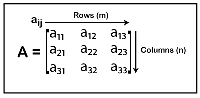

在上面的矩阵中，a i j (i 代表行号，j 代表列号)是矩阵的元素。有三行三列，所以矩阵中总共有**九个**元素。

矩阵可以包含任意数量的行和列。例如:

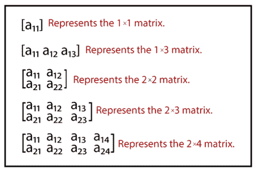

### 矩阵的类型

有以下类型的矩阵:

**空矩阵:**无**行**列**列**的矩阵称为**空矩阵。**例如:

**[ ]**

**行矩阵:**只有**一个**行的矩阵称为**行矩阵**。也称为**行向量**。例如:

**【4 3 6】**

**列矩阵:**只有**一个**列的矩阵称为**列矩阵**。它也被称为**列向量**。例如:

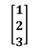

**零矩阵:**所有元素都是**零**的矩阵称为**零矩阵**。它也被称为**零矩阵**。例如:

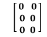

**方形矩阵:**行列尺寸**相等** (m=n)的矩阵称为**方形矩阵**。例如:

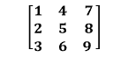

**对角矩阵:**所有非对角元素都为零并且在其主对角线上至少包含一个非零元素的方阵称为**对角矩阵。**例如:

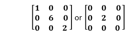

**标量矩阵:**所有对角元素相等的对角矩阵称为**标量矩阵**。标量矩阵不能是单位矩阵，而单位矩阵可以是标量矩阵。例如:

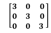

**单位矩阵:**主对角元素为 1，所有非对角元素为零的标量矩阵称为**单位矩阵**。它也被称为**身份矩阵**。用字母 **I** 表示。它也是一个标量矩阵。

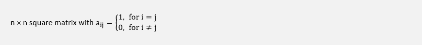

例如:

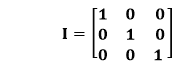

**三角矩阵:**它是一种特殊的正方形矩阵，在其主对角线上或下形成一个**三角形**。三角形矩阵有两种类型:

*   **上三角矩阵:**前导对角线以下所有元素为零的正方形矩阵。换句话说，正方形矩阵**A =【Aij**如果满足以下条件，则为上三角形:

aij=0 for i<j

例如:

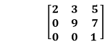

*   **下三角矩阵:**主对角线以上所有元素为零的方阵。换句话说，正方形矩阵**A =【Aij**如果满足以下条件，则为下三角形:

aij=0 for<ij

例如:

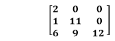

**子矩阵:**矩阵的子矩阵是通过删除任何行或列或两者来确定的。例如，考虑以下矩阵:

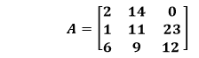

从上面的矩阵 A，我们可以生成一个子矩阵。我们删除第 **2 第行**和第 **3 第列**。删除后，我们得到如下子矩阵:

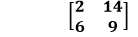

### 矩阵的应用

*   **图论:**有限图的邻接矩阵是图论的基本符号。
*   **计算机图形学:**在计算机图形学中，矩阵在三维图像在 2D 屏幕上的投影中起着至关重要的作用。图形软件使用矩阵数学处理线性变换来渲染图像。
*   **解线性方程组:**使用行约简，克莱姆法则(行列式)，使用逆矩阵。
*   **机器人学:**在机器人学和自动化中，矩阵是机器人运动的基本元素。
*   **记录实验:**很多组织都用它来记录自己实验的数据。
*   **地质学:**用于地震勘测。
*   密码学。

### 矩阵运算

我们可以对矩阵执行以下操作:

*   添加
*   减法
*   增加
*   分开
*   纯量乘法
*   相反的
*   移项
*   矩阵的负数

### 矩阵的加法

两个矩阵的和 om 可以通过添加与位置匹配的元素来完成。请记住，两个矩阵必须大小相同。得到的矩阵也是相同的大小。

(A+B)ij = Aij + Bij

假设有两个矩阵 A 和 B，每个矩阵大小为 3×3。

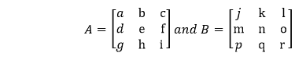

A + B 的总和将为:

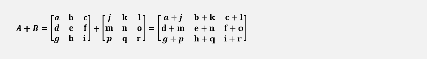

### 加法的性质

*   **交换律:** A + B = B + A
*   **结合律:** A + (B + C) = (A + B) + C
*   **加性恒等式:** A + 0 = 0 + A = A
*   **加法逆:** A + (-A) = (-A) + A = 0

**示例:添加以下矩阵 A 和 b。**

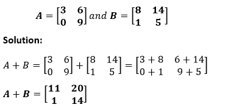

### 矩阵的减法

两个矩阵的减法可以通过减去与位置匹配的元素来完成。换句话说，它是负矩阵的加法。请记住，两个矩阵必须大小相同。得到的矩阵也是相同的大小。

(A-B)ij = Aij - Bij

假设有两个矩阵 A 和 B，每个矩阵的大小为 3×3。

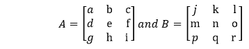

A - B 的减法将是:

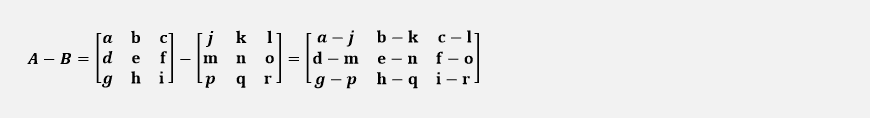

**示例:减去以下矩阵 A 和 b**

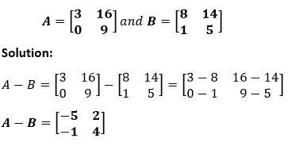

### 矩阵的乘法

**矩阵乘法**是行和列的**点积**。点积是两个数字序列的匹配条目的乘积之和。

First matrix's number of columns = Second matrix's number of rows

### 乘法的性质

*   **非交换:** AB ≠ BA
*   **联想性:** A(BC) = (AB)C
*   **左分布:** A(B + C) = AB + AC
*   **右分配:** (A + B)C = AC + BC
*   **标量:** k(AB)=(kA)B(其中 k 为标量)
*   **身份:** IA=AI=A
*   **转置:**(AB)T= ATBT

**示例:将下列矩阵相乘。**

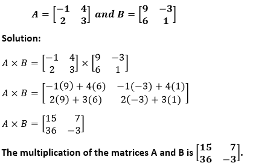

### 矩阵的划分

矩阵的划分是一个棘手的过程。为了划分这两个矩阵，我们执行以下步骤:

*   求**除数**的**逆**
*   将被除数矩阵乘以逆矩阵。

假设 A 和 B 是两个矩阵，那么:

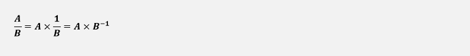

其中 B -1 代表 B 的倒数。

**示例:划分以下矩阵 A 和 b**

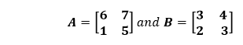

**解决方案:**

a 是分子，B 是分母。

首先，我们会找到 b 的倒数。

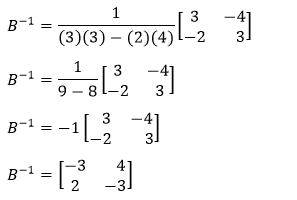

现在把被除数矩阵乘以逆矩阵。

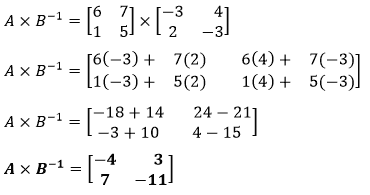

### 纯量乘法

当一个矩阵乘以一个**标量**(常数)称为**标量乘法**。在标量乘法中，我们将矩阵的每个元素乘以标量。

假设给出一个 3×3 大小的矩阵 A。

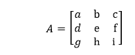

将其乘以常数 **k** ，则标量乘法 **k × A** 将为:

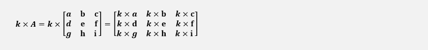

### 标量乘法的性质

设，A 和 B 是两个 m × n 大小的矩阵，A 和 B 是两个标量。然后:

*   **关联属性:** a (b A) = (a b) A
*   **交换性质:** aA = Aa
*   **分配性质:** (a + b) A = aA + b A 和 a (A + B) = aA + a B
*   **身份属性:** 1 A = A
*   **乘法性质:**O A = 0(其中 0 是零矩阵)

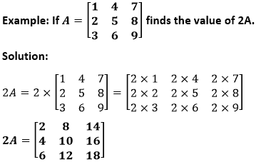

### 矩阵的逆

假设我们有一个方阵 A，它的行列式不等于零，那么存在一个 m×n 矩阵 **A -1** 叫做 A 的逆这样:**AA-1= A-1A = I**，其中 **I** 是恒等式矩阵。

与 3×3 或 4×4 矩阵相比，很容易找到 2×2 矩阵的逆。按照步骤找到 2×2 矩阵的逆。

*   **交换**元素的位置 **a** 和 **d** 。
*   在 **b** 和 **c** 前面放一个**负号**
*   将矩阵的每个元素除以**行列式**。

例如，A 是 2×2 矩阵。

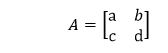

它的行列式是 **(ad-bc)** 不等于零，那么矩阵的逆将是:

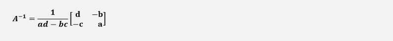

求大矩阵的逆有三种方法。

*   高斯-乔丹方法
*   使用调整
*   使用矩阵计算器

### 逆矩阵的性质

*   A × A -1 = I
*   A -1 × A = I
*   (甲 -1 ) -1 =甲
*   (A-1)T=(AT)-1

### 转置矩阵

当我们将行转换为列，将列转换为行，并通过这种转换生成新的矩阵时，称为**转置**矩阵。用**ATT5】或**A′、**或 **A tr 、**或**ATT15】表示。例如，考虑以下矩阵:****

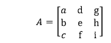

上述矩阵的转置为:

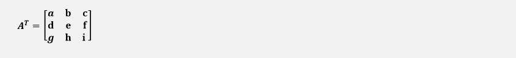

### 转置矩阵的性质

假设 A 和 B 是两个矩阵，k 是一个实数，那么:

*   (A T ) T = A
*   (A+B)T= AT+BT
*   (AB)T= BTAT
*   (kA) T = kA T

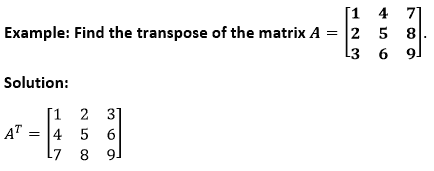

### 矩阵的负数

设，A=a ij 为 m×n 矩阵。矩阵 A 的负数是 m×n 矩阵 B=b ij 这样 b ij =-a ij 对于所有 I，j，矩阵 A 的负数写成 **-A** 。

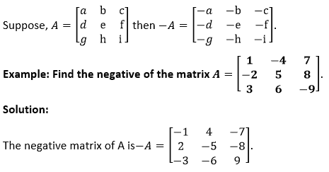

* * ***