# 矩阵乘法

> 原文：<https://www.javatpoint.com/matrix-multiplication>

在数学中，**矩阵乘法**一般与我们执行的乘法不同。它是在两个矩阵之间执行的二进制运算，并产生一个新的矩阵。在这一节中，我们将学习**矩阵乘法**，它的性质，以及它的例子。

当我们做矩阵的加法或减法时，我们增加或减少与位置匹配的元素。但是在矩阵乘法中，我们不这样做。相反，我们执行行和列的**点积**。

**点积:**是两个数字序列的匹配条目的乘积之和。

#### 注意:在处理矩阵乘法时，请记住第一个矩阵的列数必须等于第二个矩阵的行数。如果条件不满足，矩阵乘法是不可能的。

在矩阵乘法中，不必像加法和减法一样，两个矩阵都必须是方阵。

假设我们有一个 **m×n** 维的矩阵 A 和一个 **n×k** 维的矩阵 B，那么得到的矩阵将是 **m×k** 维。

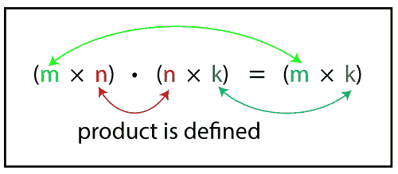

让我们通过一个例子来理解它。

假设我们有两个矩阵 A 和 B，它们的维数分别是 2×3 和 3×2。结果矩阵将是 2×2 矩阵。

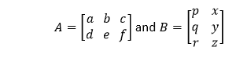

求结果矩阵的**第一个元素**，将矩阵 A 的第一行乘以矩阵 B 的第一列，并对乘积求和。

(a、b、c)。(p，q，r)=a×p+b×q+c×r

求结果矩阵的**第二个元素**，将矩阵 A 的第一行乘以矩阵 B 的第二列，并对乘积求和。

(a、b、c)。(x，y，z)=a×x+b×y+c×z

求结果矩阵的**第三个元素**，将矩阵 A 的第二行乘以矩阵 B 的第一列，并对乘积求和。

(d、e、f)。(p，q，r)=d×p+e×q+f×r

求结果矩阵的**第四个元素**，将矩阵 A 的第二行乘以矩阵 B 的第二列，并对乘积求和。

(d、e、f)。(x，y，z)=d×x+e×y+f×z

所得矩阵为:

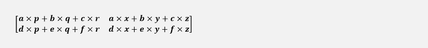

### 2×2 矩阵和 2×1 矩阵的乘法

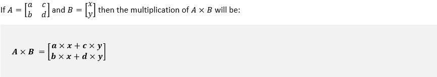

### 两个 2×2 矩阵的乘法

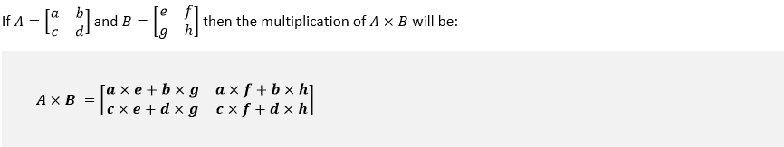

### 3×3 矩阵的乘法

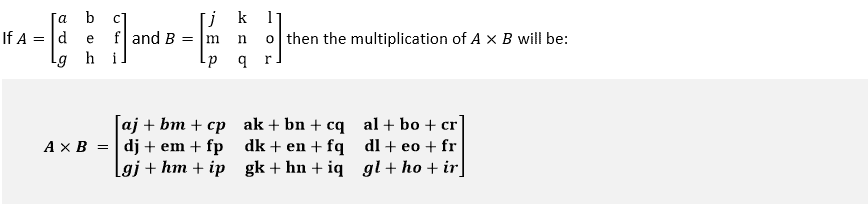

同样，我们可以找到不同维数矩阵的乘法。

**乘法的性质**

*   **非交换:** AB ≠ BA
*   **联想性:** A(BC) = (AB)C
*   **左分布:** A(B + C) = AB + AC
*   **右分配:** (A + B)C = AC + BC
*   **标量:** k(AB)=(kA)B(其中 k 为标量)
*   **身份:** IA=AI=A
*   **转置:**(AB)T= ATBT

**例 1:将下列矩阵相乘。**

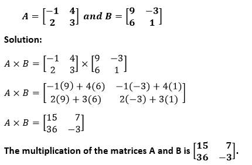
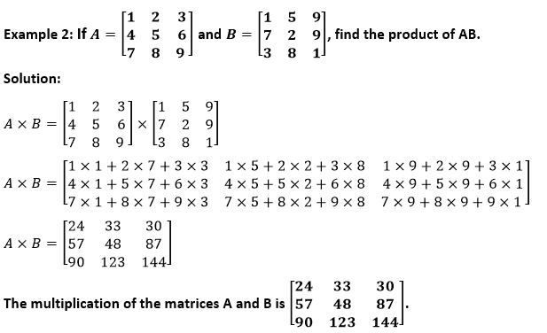
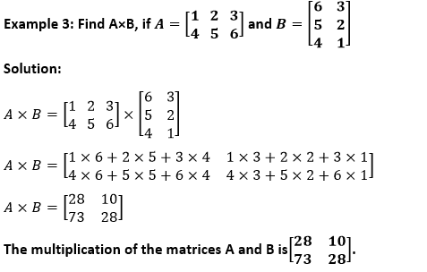

**例 4:**

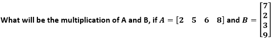

**解决方案:**

矩阵 A 和 B 的维数分别为 1×4 和 4×1，因此所得矩阵的维数为 1×1。

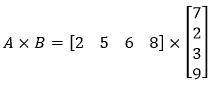

A×B=[2×7+5×2+6×3+8×9]

A×B=[114]

**矩阵 A 和 B 的乘积为[114]。**

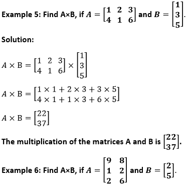

**解决方案:**

矩阵 A 和 B 的维数分别为 3×2 和 2×1，因此所得矩阵的维数为 3×1。

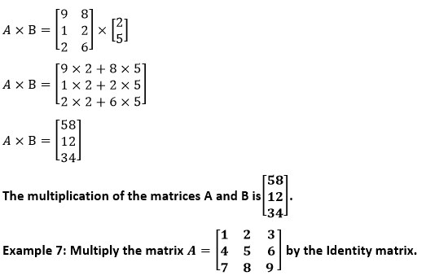

**解决方案:**

我们知道恒等式矩阵是主对角线元素为 1，其他元素为零的矩阵，称为**恒等式**矩阵。

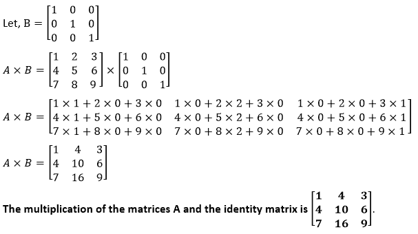

**例 8:将矩阵 A 乘以其负矩阵。**

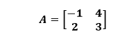

**解决方案:**

我们必须找到 A×(-A)或-A 2 。

矩阵 A 的负矩阵是-A，意思是把矩阵 A 的每个元素乘以负号。

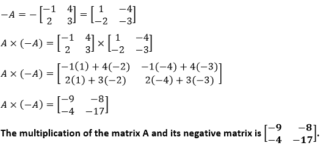

* * *