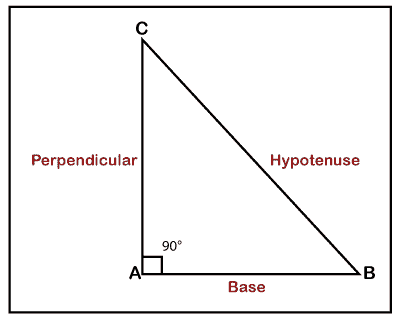
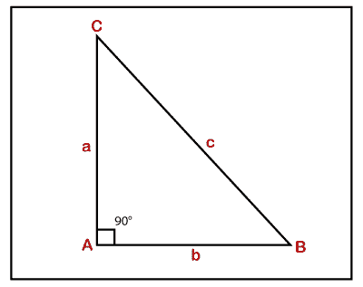
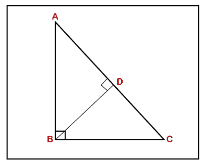
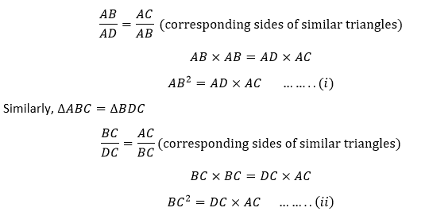
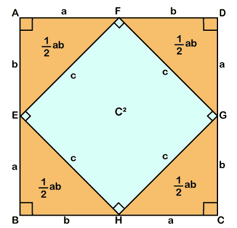
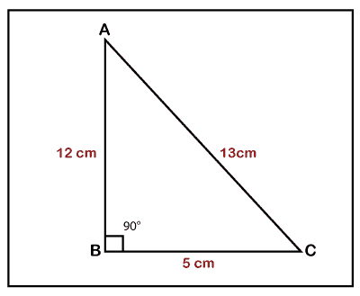
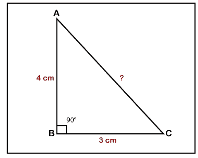
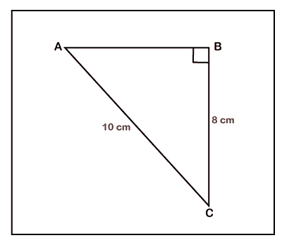
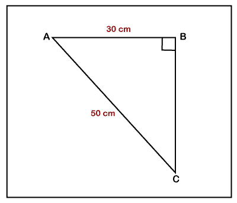
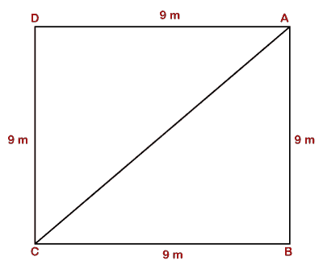

# 毕达哥拉斯

> 原文：<https://www.javatpoint.com/pythagoras>

**毕达哥拉斯**是古希腊哲学家。他出生于公元前 570 年的萨摩斯(希腊)，死于公元前 495 年的梅塔蓬图姆(意大利)。他的全名是萨摩斯的毕达哥拉斯 T2。

他被认为在科学、数学、音乐、天文学和医学领域有许多发现。他完成的发现有，**毕达哥拉斯或毕达哥拉斯定理**、毕达哥拉斯调优、比例理论、地球的球形度、金星的恒等式和五个规则立体。他还将地球划分为五个气候带。他对发现和证明**毕达哥拉斯定理**功不可没。

### 毕达哥拉斯或毕达哥拉斯定理

毕达哥拉斯定理仅基于直角三角形或直角三角形。定理说明**在直角三角形中，底边和垂线的平方和等于斜边的平方**。

换句话说**，在直角三角形中，斜边的平方等于两条腿的平方之和**。腿(底部和垂直)是形成直角的三角形的边。

### 直角三角形的组成部分

下图表示直角三角形 ABC。

*   **底边:**是直角三角形的一条边，与垂线和斜边相邻。在 ABC， **AB** 是基地。
*   **垂线:**是直角三角形的一条边，与底边和斜边相邻。它被称为三角形的高度。在 ABC 中， **AC** 是垂直的。
*   **斜边:**与直角相反的一侧称为斜边。换句话说，直角三角形最长的边叫做斜边。在 ABC 中， **BC** 是斜边。
*   **直角:**在几何学中，直角是一个成 90°角的角。在 ABC 中， **∠A** 为直角。

### 毕达哥拉斯三元组

毕达哥拉斯或毕达哥拉斯三元组是满足毕达哥拉斯定理的三个正整数的集合。毕达哥拉斯最少的三重是 **(3，4，5)** 。

在 ABC 中， **(a，b，c)** 是表示正整数值且满足定理的毕达哥拉斯三元组。

a2+b2=c2

下表列出了一些毕达哥拉斯三元组。

| (3, 4, 5) | (5, 12, 13) | (7, 24, 25) | (8, 15, 17) |
| (9, 40, 41) | (11, 60, 61) | (12, 35, 37) | (13, 84, 85) |
| (16, 63, 65) | (20, 21, 29) | (28, 45, 53) | (33, 56, 65) |
| (36, 77, 85) | (39, 80, 89) | (48, 55, 73) | (65, 72, 97) |

**关于毕达哥拉斯三元组的事实**

*   它在一个三元组中总是有一个偶数。
*   c 的值总是奇数。
*   它可能有两个质数。

### 毕达哥拉斯定理公式

请看下图。

在 ABC 中，AC 是垂线或高度，AB 是底边，BC 是斜边。垂线、底边和斜边的长度分别是 a、b 和 c。根据毕达哥拉斯定理，毕达哥拉斯定理公式可以写成:

Perpendicular2 + Base2 = Hypotenuse2

或者

AC2+ AB2 = BC2

或者

a2+ b2 = c2

### 勾股定理的证明

**证明:**AC2= AB2+BC2

**给定**:直角三角形 ABC。

### 证据 1:

在下图中，我们从在斜边上的 D 点相交的 B 点画了一条垂线。

垂线将三角形分成两个三角形，即 ADB 和 BDC。

**记住:**如果我们从直角的顶点画一条垂线，两边的三角形彼此相等，也等于整个三角形。

根据上面的说法，∮ABC =∮ADB

将等式(I)和(ii)相加，我们得到:

ab2+BC【ad×AC+DC×AC】
ab+BC= AC(ad+DC)
ab

AB2+BC2=AC2

于是，毕达哥拉斯定理被证明了。

让我们看看证明定理的第二种方法。

### 证据 2:

下图中，我们画了一个正方形 **ABCD** 。在正方形 ABCD 里面，我们又画了一个正方形 **EFGH** ，形成四个三角形**∮AEF、∮FDG、∮GCH**、**∮HBE**。

现在，我们将分别找到正方形和三角形的面积。

我们知道，正方形的**面积= a 2** (其中 a 是正方形的边)

正方形 ABCD 的面积=(a+b) 2

我们知道，**三角形的面积=  bh**

三角形的面积=  ab

总共有四个三角形，因此四个三角形的面积将为:

四个三角形的面积= 4×  ab= ** 2ab**

EFGH 广场的面积=c 2 (其中 c 是 EFGH 广场的边)

正方形 ABCD 的总面积为:

**ABCD 的面积=正方形 EFGH 的面积+四个三角形的面积**

将这些值放在一起，我们会得到:

(a+b)2= c2+2ab
(a+b)(a+b)= c2+2ab
a2+2ab+b2= c2+2ab

取消两边的 2ab，我们得到:

a2+b2=c2

**由此，定理被证明。**

### 毕达哥拉斯定理问题

**例 1:三角形的三条边分别是 5、12、13 厘米。使用毕达哥拉斯定理，检查三角形是否是直角三角形。**

**解决方案:**

给定，AB = 12 厘米，BC = 5 厘米，AC = 13 厘米

根据勾股定理，**AC2= BC2+AB2T7】**

132= 52+122
169 = 25+144
169 = 169

**因此，三角形是直角三角形。**

**例 2:如果底座的长度为 3 cm，三角形的高度为 4 cm，求 AC 的值。**

**解决方案:**

在 ABC 中，假设 BC = 3 cm，AB = 4 cm。

根据毕达哥拉斯定理，**公元前2+AB2= AC2T7】**

将 AB 和 BC 的值放在上面的公式中，我们得到:

32+42【AC】2
9+16 = AC2
25 = AC2

**因此，斜边的长度为 5 厘米。**

**例 3:求基数的值。如果斜边的长度是 10 厘米，三角形的高度是 8 厘米。**

**解决方案:**

在 ABC 中，假设 AC = 10 cm，BC = 8 cm。

根据毕达哥拉斯定理，**公元前2+AB2= AC2T7】**

将交流和交流的值放在上面的公式中，我们得到:

10、 2、=8、T3、+AB、+4、T5、
100=64+AB、T9、100-64 =亚瑟

**因此，基部的长度为 6 厘米。**

**例 4:底边和斜边的长度分别为 30 厘米和 50 厘米。求三角形的高度。**

**解决方案:**

在 ABC 中，假设 AC = 50 m，AB = 30 m

根据勾股定理，**AC2= BC2+AB2T7】**

将交流和交流的值放在上面的公式中，我们得到:

502BC2302T2
2500 = BC2900
2500-900 = BC2

**因此，三角形的高度为 40 米**

**例 5:如果方石的一边是 9 m，求对角线的长度。**

**解决方案:**

在上图中，我们看到有两个三角形 ABC 和 ADC。我们取三角形 ABC，求对角线。

根据勾股定理，**AC2= BC2+AB2T7】**

AC29292AC
22= 81+81
AC2162】

**因此对角线长度为 9 √2 米**

* * *