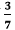
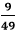
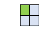
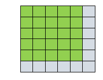

# 完美正方形

> 原文：<https://www.javatpoint.com/perfect-squares>

### 定义

在数学中，**完美平方**或**平方数**是整数的平方的正整数。换句话说，当我们将两个相同的数字相乘时，得到的乘积叫做**完美平方**。简而言之，它是两个相等正整数的乘积或一个整数与其自身的乘积。

### 完美正方形的符号

完美的正方形用**x2T3(发音为平方)表示，其中 **x** 称为基数， **2** 称为幂。意思是相乘两次，即 **x×x** 。**

比如我们 5 乘 5，得到 **25** 作为结果。它被称为完美广场。

### 完美方格表

| **02T3】** | Zero | **102T3】** | One hundred | **202T3】** | four hundred | **302T3】** | Nine hundred | **402T3】** | One thousand six hundred | **502T3】** | Two thousand five hundred |
| **12T3】** | one | **112T3】** | One hundred and twenty-one | **212T3】** | Four hundred and forty-one | **312T3】** | Nine hundred and sixty-one | **412T3】** | One thousand six hundred and eighty-one | **512T3】** | Two thousand six hundred and one |
| **22T3】** | four | **122T3】** | One hundred and forty-four | **222T3】** | Four hundred and eighty-four | **322T3】** | One thousand and twenty-four | **422T3】** | One thousand seven hundred and sixty-four | **522T3】** | Two thousand seven hundred and four |
| **32T3】** | nine | **132T3】** | One hundred and sixty-nine | **232T3】** | Five hundred and twenty-nine | **332T3】** | One thousand and eighty-nine | **432T3】** | One thousand eight hundred and forty-nine | **532T3】** | Two thousand eight hundred and nine |
| **42T3】** | Sixteen | **142T3】** | One hundred and ninety-six | **242T3】** | Five hundred and seventy-six | **342T3】** | One thousand one hundred and fifty-six | **442T3】** | One thousand nine hundred and thirty-six | **542T3】** | Two thousand nine hundred and sixteen |
| **52T3】** | Twenty-five | **152T3】** | Two hundred and twenty-five | **252T3】** | Six hundred and twenty-five | **352T3】** | One thousand two hundred and twenty-five | **452T3】** | Two thousand and twenty-five | **552T3】** | Three thousand and twenty-five |
| **62T3】** | Thirty-six | **162T3】** | Two hundred and fifty-six | **262T3】** | Six hundred and seventy-six | **362T3】** | One thousand two hundred and ninety-six | **462T3】** | Two thousand one hundred and sixteen | **562T3】** | Three thousand one hundred and thirty-six |
| **72T3】** | forty-nine | **172T3】** | Two hundred and eighty-nine | **272T3】** | Seven hundred and twenty-nine | **372T3】** | One thousand three hundred and sixty-nine | **472T3】** | Two thousand two hundred and nine | **572T3】** | Three thousand two hundred and forty-nine |
| **82T3】** | Sixty-four | **182T3】** | Three hundred and twenty-four | **282T3】** | Seven hundred and eighty-four | **382T3】** | One thousand four hundred and forty-four | **482T3】** | Two thousand three hundred and four | **582T3】** | Three thousand three hundred and sixty-four |
| **92T3】** | Eighty-one | **192T3】** | Three hundred and sixty-one | **292T3】** | Eight hundred and forty-one | **392T3】** | One thousand five hundred and twenty-one | **492T3】** | Two thousand four hundred and one | **592T3】** | Three thousand four hundred and eighty-one |

从上表我们可以得出结论:一个数的完美平方可以通过将**前一个数、当前数**(为其计算平方)和**前一个数**的平方相加来计算。假设，我们想找到广场 **x** ，那么:

x2= (x-1)2+(x-1)+x

### 负数的平方

我们还可以找到负数的平方。但请记住:

(-)×(-)=+

意思是负数的平方总是正数。比如**-72T3】的平方就是 **49** 。**

### 十进制数的平方

我们还可以找到十进制数的平方。为了达到同样的效果，暂时忽略小数，写下数字的平方。然后，从右边数出数字中的十进制数字。在结果中，从右边数相同数量的数字，并在那里放一个小数点。

比如 **2.5** 的一个平方就是 **6.25。**同样的， **1.1** 的一个平方就是 **1.21。**

### 分数的平方

求分数的平方很容易。在这种情况下，我们分别求出分子和分母的平方，并在必要时简化分数。比如的平方就是。

### 无理数的平方

不能用整数表示的数叫做无理数。无理数的例子有√ 7 ，√ 3 等。

无理数的平方就是没有根号的数本身。比如√ 2 的平方是 2。同理√ 15 的平方是 15。

### 正方形的性质

*   一个数字 **x** 将是完美的正方形，当且仅当正方形可以完美地排列成正方形。
    例如，2 的平方是 4。我们可以将四个点完美地排列成一个正方形，如下图所示。
    
    同样，6 的平方是 36。我们可以在一个正方形中完美地排列 36 个点，如下图所示。
    

在基数 10 中，正方形的单位位置是 0、1、4、5、6。

*   如果数字以 **0** 结束，其方块也以 **0** 结束。最后两位以 **00** 结尾。比如 **10** 的平方就是 **100** 。
*   如果数字以 **1** 或 **9** 结尾，其方块以 **1** 结尾。比如 **11** 的平方是 **121、**， **9** 的平方是 **81** 。
*   如果数字以 **2** 或 **8** 结尾，其方块以 **4** 结尾。比如 **12** 的正方形为 **144** ， **8** 的正方形为 **64** 。
*   如果数字以 **3** 或 **7** 结尾，其方块以 **9** 结尾。比如 **13** 的平方是 **169** ， **7** 的平方是 **49** 。
*   如果数字以 **4** 或 **6** 结尾，其方块以 **6** 结尾。比如 **4** 的平方是 **16** ，1 **6** 的平方是 **256** 。
*   如果数字以 **5** 结尾，其方块也以 **5** 结尾。最后两位以 **25** 结尾。比如 **5** 的正方形为 **25** ， **15** 的正方形为 **225** 。

在以 12 为基数的素数中，一个数的平方总是以平方数字(0，1，4，9)结尾。

*   如果这个数可以被 2 和 3 整除，那么这个数的平方在单位处将有 0。
*   如果该数不能被 2 和 3 整除，则该数的平方在单位处有 1。
*   如果这个数只能被 2 整除，那么它的平方在单位位置将有 4。
*   如果这个数只能被 3 整除，那么它的平方在单位位置就有 9。

其他一些属性包括:

*   偶数的平方是偶数，可以被 4 整除。因此，

(2x)2=4x2

*   在上面这一点上，我们看到偶数平方可以被 4 整除。但是偶数的形式 **4x+2** 不是一个完美的正方形。
*   奇数的平方是奇数。

(2x+1)2=4(x2+x)+1

*   所有奇数均为 **4x+1** 的形式。但是奇数的形式 **4x+3** 不是一个完美的正方形。

* * *