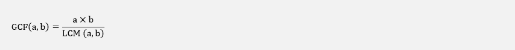
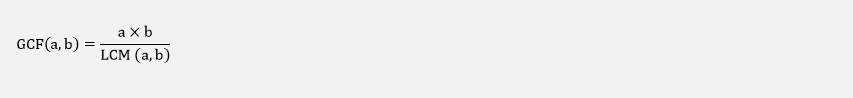
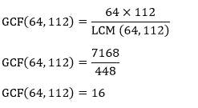
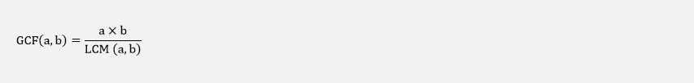
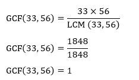

# 最大公因数

> 原文：<https://www.javatpoint.com/greatest-common-factor>

在数学中，两个或两个以上整数的**最大公因数**或**最大公约数**是将每个整数完全除的最大正整数。

在本节中，我们将了解**因素、共同因素、**和**最大共同因素**。在谈到最大公因数之前，首先我们来了解一下**因数**和**公因数**。

**因子:**因子是整数相乘得到另一个数。一个数字可能有两个以上的因素。例如 **5×3=15，1×15=15** 其中 5、3、1 和 15 是 15 的因子。同样，24 的因子有: **1×24=24，2×12=24，3×8=24，4×6=24** 。因此，24 的因子是 **1，2，3，4，6，8，12，24** 。

**共同因素:**在两个或多个数字中共同的因素称为共同因素。换句话说，公因数是可以相乘得到另一个数的数。数字应该精确地分成两个或更多的数字。必须至少有两个数字才能找到公因数。例如，我们必须找到 12 和 16 的因子。

**12 的因子:** 1，2，3，4，6，12

**16 的因子:** 1，2，4，8，16

我们看到 **1、2、**和 **4** 在两者中都很常见。这些是整数 12 和 16 的公因数。

在上面的例子中，我们观察到 1 和数字本身都出现在这两个因素中。所以，我们可以断定 **1** 和**数本身**是永远数的两个因素。

**最大公因数:**是两个或两个以上数完全除的最高数。简称 **GCF** 。也被称为**最大公约数** (GCD)和**最高公约数** (HCF)。它被用来简化分数。

### 如何找到最大公因数

按照下面给出的步骤找到最大的共同因素。

*   写出每个数字的所有因子。
*   选择常见因素。
*   选择最大的数字，作为 GCF。

我们也可以使用以下公式:

#### 注意:只对两个数字使用上述公式。

让我们通过例子来理解它。

**例 1:求 12 和 8 的 GCF。**

**解决方案:**

12 的因子:1，2，3，4，6，12

8 的因子:1，2，4，8

常见因素:1、2、4

最大共同因素:4

**因此，12 和 8 的 GCF 为 4。**

**例 2:求 24 和 36 的 GCF。**

**解决方案:**

24 的因子:1，2，3，4，6，8，12，24

36 的因子:1，2，3，4，6，9，12，18，36

常见因素:1、2、3、4、6、12

最大共同因素:12

**因此，24 和 36 的 GCF 为 12。**

**例 3:求 11、42、65 的 GCF。**

**解决方案:**

因素 11: 1，11

42 的因子:1，2，3，6，7，14，21，42

65 的因子:1，5，13，65

共同因素:1

最大共同因素:1

**因此，11、42 和 65 的 GCF 为 1。**

**例 4:求 126、172、298 的 GCF。**

**解决方案:**

126 的因子:1，2，3，6，7，9，14，18，21，42，63，126

172 的因子:1，2，4，43，86，172

298 的因子:1，2，149，298

常见因素:1、2

最大共同因素:2

**因此，126、172 和 298 的 GCF 为 2。**

**例 5:求 64 和 112 的 GCF。**

**解决方案:**

64 的因子:1，2，4，8，16，32，64

112 的因子:1，2，4，7，8，14，16，28，56，112

常见因素:1、2、4、7、8、16

最大共同因素:16

**使用 GCF 公式**

**因此，64 和 112 的 GCF 为 16。**

**例 6:求 33 和 56 的 GCF。**

**解决方案:**

33 的因子:1，3，11，33

56 的因子:1，2，4，7，8，14，28，56

共同因素:1

最大共同因素:1

**使用 GCF 公式**

**因此，33 和 56 的 GCF 为 1。**

* * *