# 圆

> 原文：<https://www.javatpoint.com/circle>

在几何中，**圆**是最需要学习的形状。一个**圈的理论重要性**应用在物理、天文、数学等诸多学科中。在早期教育中，我们引入了许多几何形状，这样我们就可以理解应用**圆**原理的其他学科。

在几何学中，一个圆形的图形被称为**圆**。在本节中，我们将学习**圆的定义、圆的直径、圆的周长、**以及圆的其他部分。除此之外，我们还将学习**类型的圆、属性、**和**公式**。

### 圆圈定义

与中心有相同距离并在起点处连接的曲线，称为**圆**。换句话说，它是与原点等距的所有点的轨迹。圆圈的例子有**轮、硬币、光盘**等。下图表示圆形的形状。

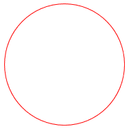

### 圆的一部分

圆有以下几个部分:

*   **直径:**通过圆心并触及圆两侧边界的线段，称为**直径**。它是圆最长的弦。它是直径长度的两倍。用 **d** 表示。下图中线段 **AB** 为直径。
    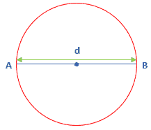
*   **半径:**从一侧接触中心，从另一侧接触边界的线段，称为**半径**。换句话说，中心和圆周之间的距离称为**半径**。它是直径长度的一半。用 **r** 表示。下图中线段 **OA** 为半径。
    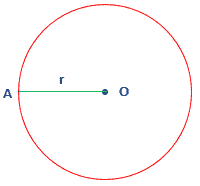
*   **周长:**圆周围的距离称为**周长**。换句话说，圆的弧长叫做周长。这是圆的周长。由下图表示，绿色虚线表示周长。
    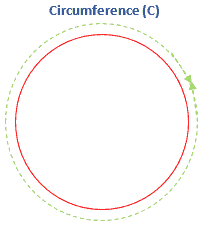
*   **原点或中心:**圆心中与圆上所有点等距的点称为**原点**。它也被称为**中心**。用 **O** 表示。下图中，O 表示圆的原点或圆心。
    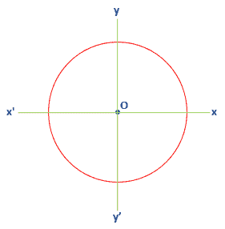
*   **切线:**在公共点接触圆的线段称为**切线**。它总是被画出圆圈。下图中 **AB** 线段为切线。
    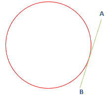
*   **切点:**切线接触圆的点称为**切点**。下图中线段 **AB** 在点 **P** 处接触圆。
    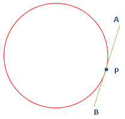
*   **弦:**端点位于圆上的线段称为**弦**。它还将圆分成两部分。下图中线段 **AB** 为和弦。
    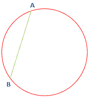
*   **弧:**圆周的一部分称为**弧**。弧线有两部分:
    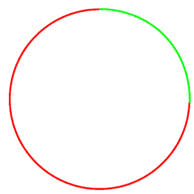
    *   **小弧:**弧的较小部分称为**小弧**。下图中，绿色弧线表示小弧线。
    *   **主弧:**弧的较大部分称为**主弧**。下图中，红色弧线表示主弧线。
*   **线段:**圆弧与弦之间的区域称为**线段**。线段有两部分:下图显示了圆的小段和大段。
    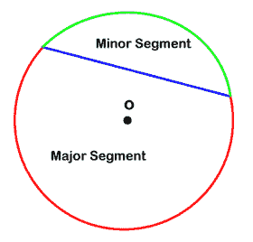
    *   **小段:**圆的小段称为**小段。**
    *   **主弧段:**圆的大部分被称为**主弧。**The following figure shows the minor and major segment of the circle.
*   **扇形:**两个等长半径之间的区域称为圆的**扇形**。下图显示了圆的小部分和大部分。
    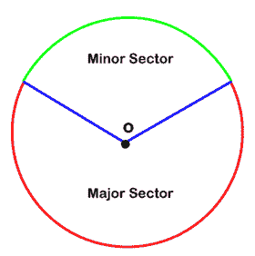
    *   **小扇形:**圆形扇形的较小部分称为**小扇形。**
    *   **主扇形:**圆圈扇形的较大部分被称为**主扇形。**The following figure shows the minor and major sector of the circle.
*   **割线:**与圆在两点相交的线段称为**割线**。下图中 **AB** 线段为割线。
    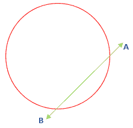

### 圆的类型

圆圈有以下三种类型:

*   **切圆:**在一个公共点上与两个以上圆相交的圆称为**切圆**。它不共享公共中心。下图为切圆。三个圆在公共点 **P** 相交。
    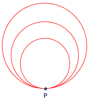
*   **同心圆:**两个或两个以上圆心相同的圆称为**同心圆。**这些圆的半径不同。下图中，有三个不同半径的圆具有相同的中心 **O** 。
    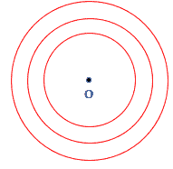
*   **全等圆:**半径相同但圆心不同的两个或两个以上的圆称为**全等圆**。在下图中，有两个半径相同但圆心不同的圆。
    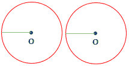

### 圆形公式

*   圆的面积(A)=πr 2
*   直径(d)= 2×半径(r)
*   半径(r)= 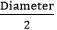
*   周长(C)=2πr

我们也可以用下面的公式求出半径。它适用于问题中给出周长的情况。

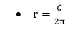

### 圆形属性

圆的一些重要性质如下:

*   半径相等的圆叫做全等圆。
*   圆的直径是圆最长的弦。
*   从中心垂下的垂线将一个弦分成两个相等的部分。
*   半径在接触圆的点总是垂直于切线。
*   同一圆弧在圆周上形成的角度总是相等的。
*   圆弧在中心形成的角度是同一圆弧形成的内切角的两倍。

* * *