# 文氏图

> 原文：<https://www.javatpoint.com/venn-diagram>

在数学中，**文氏图**是表示两个或多个集合之间关系的图。**约翰·维恩建议的。**他用被称为**文氏图**的绘画形式来表现不同事物组之间的关系。

在这一节中，我们将学习**什么是维恩图，它的类型、目的、用途，**用适当的例子表示它。在进入文氏图之前，让我们先来快速浏览一下这个场景。

一套是一个集合或一组东西。它可能包含数字、元音、动物、质数等。集合用大写字母表示，集合的元素用小写字母表示。集合的所有元素都包含在一对花括号{}中。

例如， **E** 是表示小于 10 的偶数的集合。我们可以用集合的形式来表示它，如下所示:

**E={2，4，6，8}**

其中 E 是集合名称，2、4、6、8 是集合的元素。我们也可以用一种固定的绘画形式来表现，这就是所谓的**维恩图**。

## 什么是文氏图？

代表不同集合(一组事物)之间的数学逻辑或关系的图表或图形称为**文氏图**。用于**说明设定关系**。我们通常用一个**圆形**或**椭圆形**来表示维恩图。它可能有多个圆；每个代表一个集合。

假设有两组 A 和 B 分别具有元素{1，2，3}和{8，5，9}。我们可以在文氏图中表示这两组，如下所示。

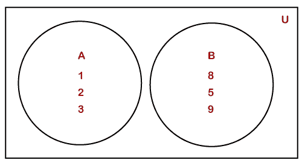

## 文氏图的优点

*   它用于比较和分类。
*   它将信息分成不同的部分。
*   它还突出了相同点和不同点。

## 文氏图的用途

文氏图在数学中用来理解集合论。我们也用它来理解对象集合之间的关系。它描绘了交集和并集。

## 如何绘制维恩图

*   首先，我们画一个矩形。
*   在矩形的左上角或右上角写下**并集**()符号。
*   在矩形内，写出不属于任何集合的元素。画出代表集合的圆。
*   在圆圈内或圆圈外，写下相应集合的名称。
*   在圆圈内，写出集合的元素。

假设有两个集合，A 和 B，有一些共同的元素。器械包的维恩图可绘制如下:

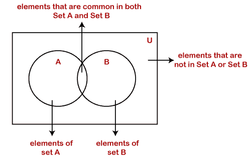

## 文氏图的类型

有以下类型的维恩图:

*   两组图表
*   两组欧拉图
*   三集图
*   三集欧拉图
*   四集图

**二集图:**当两个集合相互重叠时称为二集图。下图中有两套， **A** 和 **B** ，分别具有元素 **{a，e，I，o，u}** 和 **{a，B，c，d，e，f，g}，**。两个集合中有两个共同的元素，即 **{a，e}** 。让我们在文氏图中表示这种关系。

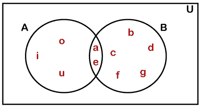

**两组欧拉图:**两组不重叠时称为两组欧拉图。下图中有两套， **A** 和 **B** ，分别有**{芒果、苹果、香蕉、番石榴、葡萄}** 和**{土豆、辣椒、生姜、番茄、胡萝卜、萝卜}，**。A 组代表水果组，B 组代表蔬菜组。蔬菜和水果不搭配，所以集合中没有共同的元素。让我们在文氏图中表示这两组。

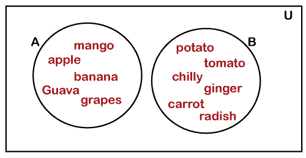

如果一个集合完全包含另一个集合，它就是欧拉图和文氏图。假设 A 集合代表动物的集合，B 集合代表食肉动物的集合。很明显，所有的动物不可能都是食肉的，但反之亦然。因此，所有的食肉动物也存在于动物集合中，即 a。我们可以在维恩图中表示它，如下所示。

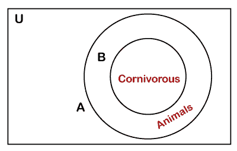

**三集图:**三集重叠时，彼此称为三集图。下图中有三组 **A、B、**和 **C** 分别具有元素**{安德鲁、彼得、山姆、汤姆、大卫}、{迈克尔、山姆、汤姆、罗伯特、杰克、史密斯}、**和**{大卫、玛利亚、汤姆、安吉丽娜、迈克尔}、**。集合 A、B 和 C 分别代表学习物理、化学和数学的学生的名字。在以上几套中，有的学生只学一门，有的学生学两门，有的学生三门都学。

*   **大卫**是同时学习**物理**和**数学**的学生。
*   迈克尔是同时学习**化学**和**数学**的学生。
*   萨姆是同时学习**化学**和**物理**的学生。
*   **汤姆**是学三科**化学、数学、**和**物理**的学生。

因此，我们可以在维恩图中表示它，如下所示。

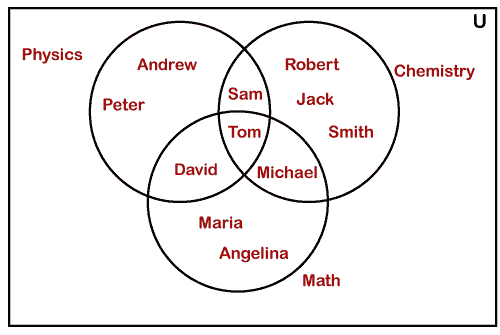

**三集欧拉图:**在三集图中，当一个集合不与另外两个集合重叠时，称为三集欧拉图。假设，集合 a 代表元音集合 **{a，e，I，o，u}，**集合 b 代表字母集合 **{a，b，c，d，e，f，g}，**集合 c 代表希腊字母集合 **{ρ,ω,φ,θ,ϵ}** 。我们可以用维恩图来表示它，如下所示。

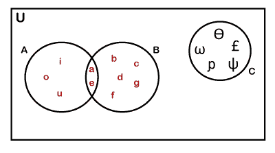

三集欧拉图可以有一个嵌套集。下图中，粉色的东西集合可能包含一组浅粉色的东西。

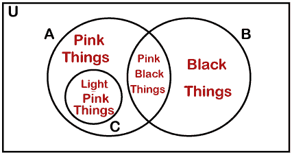

上面的图不是维恩图，因为两套(黑色的东西&浅粉色的东西)彼此不重叠。

**四集图:**我们用一个椭圆形来表示四集图，因为圆不再互相重叠。椭圆形可确保所有器械包相互重叠。这是表示四集图的唯一选项。

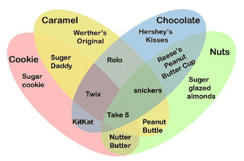

我们还使用一个带有曲线的三集图来表示四集图。当使用圆的四集图也是欧拉图时，圆不会显示每对集之间的并集。

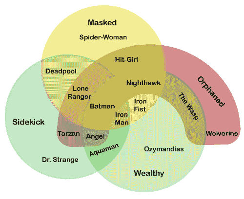

在进入示例之前，让我们快速浏览一下集合论中使用的符号。

| 标志 | 名字 | 例子 | 说明 |
| {} | 一组 | 

```
A={1,3}
B={2,3,9}
C={3,9}
```

 | 对象的集合。 |
| ∪ | 联盟 | 

```
A∪B={1,2,3,9}
```

 | 对象属于集合 A 或集合 B 或集合 c。 |
| ∩ | 交集 | 

```
A∩B={3}
```

 | 对象属于集合 A 和集合 B 以及集合 c。 |
| 你是谁 | 真子集 | 

```
{1}⊂A
C⊂B
```

 | 包含在另一个集合中的集合。 |
| ⊄ | 不是合适的子集 | 

```
{1,3}⊄A
```

 | 不包含在另一个集合中的集合。 |
| ⊆ | 子集 | 

```
{1}⊆A
{1,3}⊆A
```

 | 包含在或等于另一个集合的集合。 |
| -好的 | 超集 | 

```
B⊃C
```

 | 集合 B 包括集合 c。 |
| ∈ | 是成员 | 

```
3∈A
```

 | 3 是集合 a 中的元素。 |
| -是吗 | 不是成员 | 

```
4∉A
```

 | 4 不是集合 a 中的元素。 |

让我们根据文氏图解决一些例子。

**例 1:在一个办公室，随机抽取 200 名员工进行调查。在 200 名员工中，140 人喜欢茶，120 人喜欢绿茶，80 人既喜欢茶又喜欢绿茶。根据问答中给出的数据，回答以下问题。**

*   **喜欢只喝茶的员工人数？**
*   **只喜欢绿茶的员工人数？**
*   **不喜茶不喜绿茶的员工人数？**
*   **员工人数只喜欢茶或绿茶中的一种？**
*   **至少喜欢其中一种饮料的员工人数？**

**解决方案:**我们可以用下面的文氏图来表示给定的信息，其中 **T** 表示**茶**， **G** 表示**绿茶**。

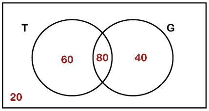

*   只喜欢喝茶的员工人数= **60**
*   只喜欢绿茶的员工人数= **40**
*   既不喜欢茶也不喜欢绿茶的员工人数= **20**
*   只喜欢茶或绿茶中一种的员工人数= 60 + 40 = **100**
*   喜欢茶或绿茶中至少一种的员工人数= n(仅 Tea) + n(仅绿茶)+n(Tea 和绿茶都喜欢)= 60 + 40 + 80 = **180**

**例 2:在对某学校 500 名学生的调查中，团队观察到:**

*   **49%的学生喜欢踢足球。**
*   **53%的学生喜欢打曲棍球。**
*   **62%的学生喜欢打篮球。**
*   **27%的学生既喜欢踢足球又喜欢打曲棍球。**
*   **29%的学生喜欢打篮球和曲棍球。**
*   **29%的学生喜欢踢足球和打篮球。**
*   **5%的学生不喜欢玩任何游戏。**

**根据以上数据，回答以下问题。**

*   **喜欢玩所有游戏的学生百分比？**
*   **求喜欢只踢足球的学生与喜欢只打曲棍球的学生的比例。**
*   **喜欢只玩一款游戏的学生比例。**
*   **喜欢至少玩两个游戏的学生比例。**

**解决方案:**

n(F) =喜欢踢足球的学生= 49%
n(H) =喜欢打曲棍球的学生= 53%
n(B)=喜欢打篮球的学生= 62%
n(F∪H)= 27%
n(B∪H)= 29%
n(F∪B)= 28%

因为，5%的人不喜欢玩给定的游戏，所以，n (F ∪ H ∪ B) = 95%。

现在应用基本公式，

95% = 49% + 53% + 62% -27% - 29% - 28% + n (F ∩ H ∩ B)

求解，我们得到 n(F∪H∪B)= 15%。

现在，我们将根据我们计算的信息绘制维恩图。请记住，图表中的所有值都是百分比。

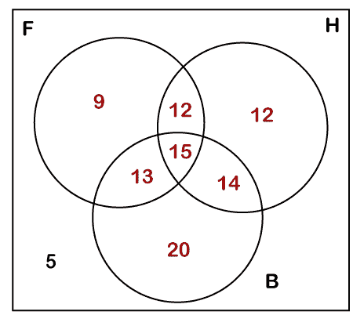

* * *