# 智能复利概念和公式

> 原文：<https://www.javatpoint.com/compound-interest>

## 需要记住的要点:

1) **复利:**每年或某个固定时间段本金和加上利息称为复利。复利就是利息的利息。每年或某个固定时期的利息加到本金总额中，新的金额成为下一年的本金，利息根据下一年增加的金额计算。

2)对于复利，当利息按年复利时，金额由下式给出:

金额(A)= P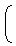1+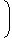T3】t

其中，P=本金

r =利率

t =时间/年数

复利=金额-本金

复利(C . I)= P1+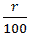t-P

= P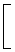T1【1+T3t _1T7】

并且，利率(r)=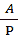1/t-1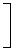% p . a

3)复利可以半年复利、季度复利等。因此，公式会有所不同；

*   当每半年复利一次时:

金额(A)= P1+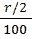T3】2t

复利(c . I .)= P1+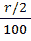2t-1

并且，利率(r)= 2∫100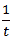∫2-1% p . a

4)当每季度复利时:

金额(A)= P1+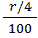T3】4t

复利(c . I .)= P1+4t-1

并且，利率(r)= 4∫100∫4-1% p . a

5)当利息按年复利但时间为分数，即 3 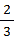年时，则；

金额= P1+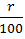3 *1+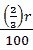T5】

所以，一般来说，如果利息一年复利 n 次；

金额(A)= P1+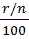T3】n * t

复利(CI):P1+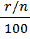n∫t-1

并且，利率(r)= n∫100∫n-1% p . a

6)当不同年份有不同的利率时，例如 1 年、2 年和 3 年分别有 r1%、r2%和 R3 %；

金额= P1+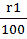T3【1+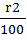T51+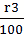T8】

* * *

## 一些更快的方法:

1)如果一个和在 t 年内变成 P 倍，复利利率 r = 100【(P)1/t-1】

2)如果给定了 C.I，我们可以通过公式求出 s . I；

单利=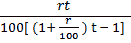*复利

3)如果问题中给出了 C.I .和 S.I，我们可以通过公式求出利率；

利率= 2∫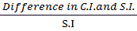∫100

4)如果在 2 年内某笔款项的利率为 r%时，C.I .和 S.I .之间的差额为 rs。x，总和由下式给出；

总和= X  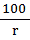   2

5)如果 C.I .和 S.I .在 3 年的某个金额上，r%的差额是 rs。x，总和由下式给出；

总和= 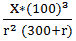

6)如果某笔钱增长到卢比。x 用 n 年和 rs 表示。y 在(n+1)年内，利率由下式给出；

利率: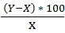

7)如果一笔钱 X 在 t 1 年按复利计算变成了 Y，那么在 t 2 年之后它就会变成；

卢比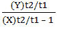

8)如果贷款为卢比。x 的利率为 r %, c . I .将分 n 年等额分期偿还，每期的价值由下式给出:

= 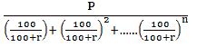

* * *

[Compound Interes Aptitude Test Paper 1](compound-interest-1)
[Compound Interes Aptitude Test Paper 2](compound-interest-2)

* * *