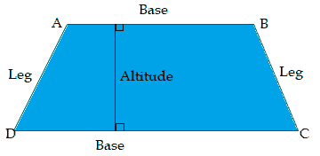
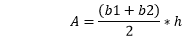
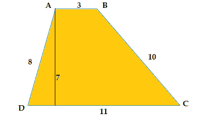
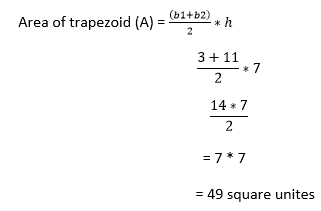
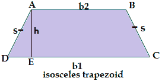
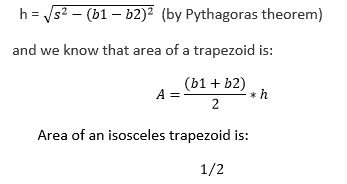
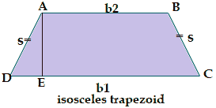
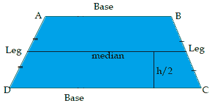
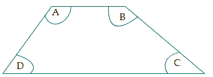

# 梯形平行边

> 原文：<https://www.javatpoint.com/trapezoid-parallel-sides>

一个**梯形**是一个扁平的四边 2D 闭合形状，带有**一对平行的边**(相对的边)。它有时也被称为 ***【梯形】*** (英国)。梯形的平行边称为**基**，非平行边称为**腿**。它可能有平行的腿。当平行边使两 ***等角时*** 或当两 ***非平行边相等时*** ，称为**等腰**梯形。

梯形的平行边可以是垂直的、水平的和倾斜的。两条平行边之间的垂直距离叫做它的高度。

## 梯形的性质

*   梯形的两个相对边(一对)是平行的。
*   它的两条对角线相交。
*   在中点连接非平行边的线总是平行于底边和平行边总和的一半。
*   在一条腿的同一侧形成的角称为*相邻角*，这些角是补充的。
*   如果梯形中所有相对的边都是平行的，称为*平行四边形*。
*   如果所有相对的边都是平行的，那么它的所有边的长度都是相等的，并且在称为*正方形*的每个点处形成直角。
*   如果所有相对的边都是平行的，那么它们的相对边只有相等的长度，并且在每个点形成一个直角，称为*矩形*。

## 梯形的类型

梯形分为三种不同的类型。这些是:

1.  **直角梯形:**当它的两个角都是直角时，称为直角梯形。
    T3】
2.  **等腰梯形:**当其两条不平行的边长度相等时称为等腰梯形。
    T3】
3.  **不等边梯形:**当它的任何一条边的长度都不相等或没有任何相等的角度时称为不等边梯形。
    T3】

### 梯形面积

其中 **A** 为面积， **b1** 和 **b2** 为两条平行边的长度， **h** 为梯形的垂直高度。

**例如:**

看下图，一个长度单位为 3，10，11，8 的梯形，有 7 个垂直高度单位。

### 等腰梯形的面积

假设 **b1** 和 **b2** 为梯形 ABCD 平行边的长度，如 **b1** 和 **b2** 为反平行于基面的长度 **b1** 。

其中， **b1** > **b2**

现在， **s** 是每个非平行边的长度， **h** 是一个等腰梯形的高度。其中:

CD = b1，AB = b2，AD = BC = s

当我们从 AB 画一条垂直线(h)到 E 处的 CD 时，它在 AED 和 AEC 处成直角。

那么垂直高度(h)为:

### 梯形的周长

梯形所有四条边的总和称为梯形的周长。梯形周长的计算公式如下:

梯形周长( **P** ) = a + b + c + d 单位

其中 a、b、c、d 是梯形的边。

例如:

计算下面给定梯形的周长:

P = a + b + c + d

= 3 + 10 + 11 + 8

= 32 单位

### 等腰梯形的周长

如果 **b1** 和 **b2** 是对应平行边的长度， **s** 是等腰梯形各非平行边的长度，那么其周长为:

**周长(P) = b1 + b2 + 2s**

例如:假设等腰梯形平行边的长度为 12 和 10 个单位，非平行边的长度各为 5 个单位。然后计算它的周长:

给定 b1 = 12，b2 = 10，s = 5

等腰梯形周长(P) = b1+ b2 + 2s

= 12 + 10 + 2(5)

= 12 + 10 + 10

= 32 单位

### 梯形的中值

A **中值**是在中点连接非平行边的线，总是平行于底边和平行边总和的一半。又称梯形的*或 ***中段*** 。*

*

中位数的长度(m) =

如果我们知道梯形的中线长度和高度，我们就可以计算出梯形的面积。它是身高的中位数乘以:

**A = m * h**

## 梯形的邻角

在一条腿(线)同一侧形成的角称为*，这些角为 ***补充*** 。在下面提到的梯形图中，角≈A 和≈D 是邻角和补充角。同理，≈B 和≈C 是补充。*

 *当两个角度之和变为**时，180 度**称为补充。

**问题 1:** 利用梯形的邻角性质，求 A = 125 时的 D。

根据梯形 A+D = 180°的邻角性质

125+√d = 180

√d = 180-125

≈D = 55 度

## 梯形对梯形

**梯形**和**梯形**是美国和英国互换的定义。根据美国的定义:梯形有一对平行边，根据英国的定义:梯形没有平行边。另一方面，根据美国的定义:斜方肌没有平行的边，根据英国的定义:斜方肌有一对平行的边。

|  | 梯形 | 四边形 |
| **美国** | 一对平行的边 | 没有平行边 |
| **英国** | 没有平行边 | 一对平行的边 |

* * ***