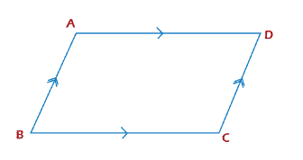
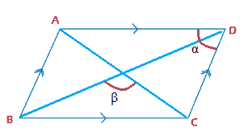
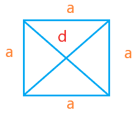
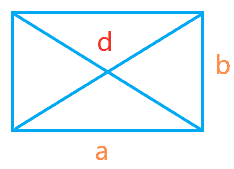
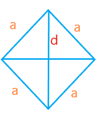
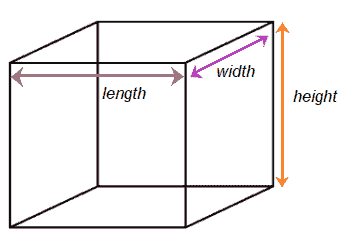

# 对角线公式

> 原文：<https://www.javatpoint.com/diagonal-formula>

对角线是与任何图形的相反角度相交的斜线。它连接一个**正方形、矩形、立方体、长方体、**或**多边形的两个相对的角。**用对角线公式求不同图形与其边相关的对角线长度。

例如，

求正方形长度的对角线公式是√ 2 a，如果正方形(a)的边已知，我们很容易求出它的对角线长度。

让我们讨论平行四边形、立方体、长方体和多边形的对角线公式。

## 平行四边形

对角线把平行四边形分成两个相等的三角形。它只有两条对角线在中心点相交。对角线也划分了平行四边形的两条相邻边之间形成的角度。

平行四边形 ABCD 如下所示:

平行四边形的性质如下:

*   两边相等
*   对角相等
*   所有内角之和，以 360 度为单位
*   对角线相互交叉

平行四边形的参数由下式给出:

长度= a

宽度= b

对角线= M 和 N

α=两个相邻边之间的角度

β(β)=两条相交对角线之间的角度

**情况 1:** 余弦β角的对角线公式

m =√(a2+b2-2bcosβ)

n =√(a2+b2+2bcosβ)

**情况 2:** 余弦α角的对角线公式

m =√2(a〖t0〗2〗t1〗b〖T2〗2〖T3〗2 ABCα

n =√a2+b2+2 脓毒症)

**情况 2:** 两边和其他对角线的对角线公式

m =√2(2a2+2b2-n2

n =√2(2a2+2b2-m2

## 平行四边形的类型

平行四边形有三种类型，**正方形，**长方形，**菱形。**

### 平方

正方形有四条等长的边。对角线将正方形分成两个相等的直角三角形。正方形的对角线可以应用直角三角形的毕达哥拉斯定理来计算。

让正方形的边和对角线分别为 a 和 d。

利用毕达哥拉斯定理计算正方形对角线的公式如下:

对角线的平方=长度的平方+宽度的平方

斜边 2 =底座 2 +高度 2

正方形的边相等，即长度=宽度= a

d2= a2+a2

d = √ 2 a 2

**d = a a2**

### 矩形

矩形有四条边，两条相对的边相等。它有两对相对的边。一对相对的边比另一对长。对角线将矩形分成两个相等的直角三角形。

假设矩形的尺寸为:

长度= l

宽度= b

对角线= d

利用毕达哥拉斯定理计算矩形对角线的公式如下:

对角线的平方=长度的平方+宽度的平方

斜边 2 =底座 2 +高度 2

d2= a2+b2

**d =【a【2】+b【2】)**

### 菱形

菱形也有四条边，所有边都相等。对角线将矩形分成两个相等的直角三角形。它有两条对角线在中心相交。

让菱形的边和对角线分别为 a 和 d。

利用毕达哥拉斯定理计算菱形对角线的公式如下:

对角线的平方=长度的平方+宽度的平方

斜边 2 =底座 2 +高度 2

菱形的边相等，即长度=宽度= a

d2= a2+a2

d = √ 2 a 2

**d = a a2**

## 立方

立方体是具有尺寸长度、宽度和高度的三维图形。立方体有 12 条边和 6 个面。立方体的每个面都有两条对角线。平行四边形是 2D 图形，因此只有一个面和两条对角线。立方体的所有边都是相等的。因此，立方体的所有对角线也相等。

让立方体的长度、宽度和高度为 a，对角线为 d。

长度=宽度=高度= a

对角线= d

立方体的对角线由下式给出:

d2= a2+a2+a2

d =√3a〖t0〗2〖t1〗

**d = aⅰ3**

## 长方体

长方体也有 12 条边、面和 12 条对角线。它有三个维度，长度，宽度和高度。立方体和长方体的区别是立方体的三个边相等，而长方体的三个边不相等。

假设立方体的维数为:

长度= l

宽度= w

高度= h

对角线= d

长方体的对角线由下式给出:

d2= l2+w2+h2

**d =【l2+w2+h)**

## 多边形

多边形是有三条或三条以上边的图形。

计算多边形对角线的公式如下:

D = n(n - 3)/2

哪里，

n =多边形的边

如果 n= 3

D = 0

它证明了三角形没有对角线。

上面的公式帮助我们找到任意边数的多边形的对角线数。

下表列出了不同多边形的对角线数量:

| S.No | 多边形的边数 | 对角线数量 |
| one | 4(四边形) | Two |
| Two | 5(五角大楼) | five |
| three | 6(六边形) | nine |
| four | 7(七边形) | Fourteen |
| five | 8(八角形) | Twenty |
| six | 9(非多边形) | Twenty-seven |
| seven | 10(十边形) | Thirty-five |
| eight | 11(亨德卡贡) | forty-four |

## 例子

让我们讨论一些基于对角线公式的例子。

**例 1:求边长为 4 cm 的正方形的对角线。**

解答:计算正方形对角线的公式如下:

d = a √ 2

哪里，

d 是对角线

a 是正方形的边

d = a √ 2

d = 4.2

d = 5.66 厘米

因此，边长为 4 厘米的正方形的对角线为 5.66 厘米。

**例 2:求边长 3m、4m 的矩形的对角线。**

解答:计算矩形对角线的公式如下:

d =√a2+b2

哪里，

a 和 b 是矩形的两条相邻边

d 是对角线

d =√③(32+42

d =√9+16

d =∞25

d = 5m

因此，边长为 3m 和 4m 的矩形的对角线为 5m。

**例 3:求边长为 2 m 的立方体的对角线**

解决方案:计算立方体对角线的公式如下:

d = a√3

哪里，

d 是对角线

a 是立方体的边

d = 2√3

d = 3.46 米

因此，边长为 2 米的立方体的对角线为 3.46 米。

**例 4:求边长 10 cm 的菱形对角线。**

菱形对角线的计算公式如下:

d = a √ 2

哪里，

d 是对角线

a 是菱形的边

d = a √ 2

d = 10π2

d = 14.14 厘米

因此，边长为 10 厘米的立方体菱形的对角线为 14.14 厘米。

**例 5:求边长 4m、3m、2m 的长方体的对角线。**

解:长方体对角线的计算公式如下:

d =√2(l+w+h【2】)

哪里，

l、w 和 h 是长方体的长度、宽度和高度

d 是对角线

d =∞42+32+22

d =√16+9+4

d = √29

d = 5.38 米

因此，边长为 4m、3m 和 2m 的长方体的对角线为 5.38 米

**例 6:求边长 12m，边长 500cm 的矩形的对角线。**

**解:**计算矩形对角线的公式如下:

d =√a2+b2

哪里，

a 和 b 是矩形的两条相邻边

d 是对角线

但是，矩形的边是以不同的单位给出的。我们需要把边转换成相同的单位。

a = 12m

b = 500 厘米= 5/100 = 5 米

(1 米= 100 厘米)

d =√122+52

d =√144+25

d = √169

d = 13 米

或者

a = 12m 米= 1200 厘米

b = 500 厘米

(1 米= 100 厘米)

d =√12002+5002

d =√1440000+250000

d = √1690000

d = 1300 厘米

* * *