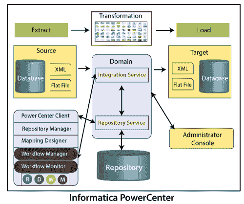
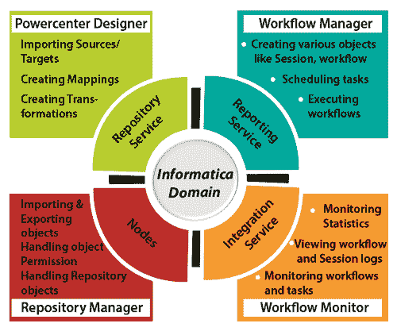
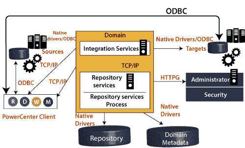

# 信息建筑

> 原文：<https://www.javatpoint.com/informatica-architecture>

信息架构是面向服务的架构。面向服务的体系结构被定义为一组相互通信的服务。它意味着在这种通信期间的简单数据传输，或者它可以是协调相同活动的两个或多个服务。

信息开发依赖于基于组件的开发技术。这种技术使用预定义的组件和功能单元及其功能来获得结果。

PowerCenter 基于基于组件的开发方法。为了构建从源到目标的数据流，它使用了不同的组件，这个过程被称为转换。

Informatica ETL 工具具有以下服务和组件，例如:

1.  **存储库服务:**它负责维护 Informatica 元数据，并向其他服务提供对元数据的访问。
2.  **集成服务:**该服务有助于将数据从源移动到目标。
3.  **报告服务:**该服务生成报告。
4.  **节点:**这是执行上述服务的计算平台。
5.  **Informatica Designer:** 它创建源和目标之间的映射。
6.  **工作流管理器:**用于创建工作流或其他任务及其执行。
7.  **工作流监控器:**用于监控工作流的执行情况。
8.  **存储库管理器:**用于管理存储库中的对象。

### 计算机域

*   信息领域是最基本的管理单位。
*   信息域由节点和服务组成。这些节点和服务根据管理需求和设计架构分类为文件夹或子文件夹。
*   Informatica 管理员的控制台网页创建了一个看起来像文件夹的域。在这个文件夹中，我们可以用服务创建一个节点。
*   在 Informatica 领域，节点是机器的逻辑表示。所有的服务和过程都在 Informatica 的域内运行。单个域中可以存在多个节点。网关节点从客户端接收请求，并将它们引导到各自的服务。
*   该域提供两种类型的服务，例如:
    1.  **服务管理器:**管理日志、认证、授权等域操作。它在节点上运行应用程序服务，并引导用户和组。
    2.  **应用服务:**它代表特定于服务器的服务，如存储库服务、报告服务和集成服务。应用服务可以根据配置在不同的节点上运行。

### 结节

Node 是对一个域中的机器的明智研究，一个域有不同的集线器。为了运行应用程序管理，我们可以设计中心，例如混合管理。

### 动力中心储存库

电源中心存储库是一个关系数据库，如 SQL Server、Oracle 和 Sybase。这些数据库由存储库服务维护。数据库表存储元数据。

Informatica 客户端工具有三种类型，例如:

1.  计算机设计师
2.  信息工作流管理器
3.  计算机工作流监视器

Informatica 提供存储库服务，用于管理存储库。存储库服务专门处理一个存储库的一个请求。但是我们可以在多个节点上执行它以获得更好的性能。

由于其版本控制机制，我们可以维护相同对象的不同版本。并且也忽略同时修改同一个对象的多个用户。

存储库中创建的对象具有这三种状态，例如:

*   **有效:**根据 Informatica，有效对象具有正确的语法。并用于工作流的执行。
*   **无效:**无效对象不遵循标准或规则。在 Informatica 中保存对象期间，这些对象检查了语法和属性是否有效。
*   **受影响:**受影响对象的子对象无效。

### 动力中心储存库服务

PowerCenter 存储库服务是一个不同的多串进程。它允许客户更改商店中的元数据。它接受对元数据运行工作流程的体贴好处的需求。
存储库服务维护从 PowerCenter 客户到 PowerCenter 存储库的关联。它将元数据插入到归档中并保持刷新。它能够保持归档元数据的一致性。

### 域配置

在 Informatica ETL 工具中，域是必要的基本管理控制。它是一个明显的实体，提供其他不同的服务，如存储库服务、集成服务和各种节点。

Informatica 管理控制台用于域配置。控制台是在网络浏览器的帮助下启动的。

### 动力中心客户端和服务器连接

PowerCenter 客户端工具安装在客户端计算机上。这些工具是开发工具，如工作流管理器、PowerCenter 设计器、存储库管理器和工作流监视器。

Informatica 存储库包含这些客户端工具中创建的所有映射和对象，它位于 Informatica 服务器上。这就是为什么客户端工具必须与服务器有网络连接。

此外，PowerCenter 客户端连接到源和目标，以导入元数据和结构定义。因此，它还保持与源或目标系统的连接。

*   PowerCenter 客户端使用 TCP/IP 协议与集成服务和存储库服务进行连接。
*   而且，PowerCenter 客户端使用 ODBC 驱动程序来连接源或目标。

### 存储库服务

存储库服务是一个多线程过程。它维护着电源中心客户端和电源中心存储库之间的连接。

存储库服务可以获取、插入和更新存储库中的元数据。它还维护了存储库元数据内部的一致性。

### 集成服务

集成服务在 Informatica 中用作执行引擎。它有助于执行在 Informatica 中创建的任务。集成服务以下列方式工作，例如:

*   用户执行工作流。
*   Informatica 指示集成服务执行工作流。
*   然后集成服务从存储库中读取工作流细节。
*   集成服务开始执行工作流中的任务。
*   执行后，任务状态会更新，例如“成功”、“失败”或“中止”。
*   然后授予会话日志和工作流日志。
*   该服务将数据加载到目标系统中。
*   集成服务组合来自不同来源的数据。

* * *