# 安装信息动力中心

> 原文：<https://www.javatpoint.com/installation-of-informatica-powercenter>

Informatica 是一个强大的 ETL 工具，用于所有类型的市场业务的数据集成，可以是小型的也可以是大型的。

### 信息版本

在 Informatica 中，最新的版本是 Informatica 10.1.1，较早的著名版本是 Informatica 9.6、9.5、9.1、9.0、8.6、8.1、8.0、7.1、6.0 和 5.0。

*   PowerCenter 4.1 计算
*   PowerCenter 5.1 计算
*   计算中心 6.1.2
*   PowerCenter 7.1.2 计算
*   PowerCenter 8.1 计算
*   PowerCenter 8.5 计算
*   PowerCenter 8.6 计算
*   PowerCenter 9.1 计算
*   PowerCenter 10 计算

随着新的云版本的 PowerCenter，上述所有版本都已过时。

### PowerCenter Express ETL

PowerCenter Express 是一款 ETL 工具，用于 Informatica 市场领先的数据集成。在小型项目中，它用于以合适的大小进行在线数据分析。

### 信息安装

要下载并安装信息中心，请单击给定的链接。

[https://edelivery.oracle.com/osdc/faces/Home.jspx](https://edelivery.oracle.com/osdc/faces/Home.jspx;jsessionid=ZVX9uOT7ljVemF5KOprx_DZjT2lJI91q8zhizNHrPwt_6HnCjbSd!-1520376907)

让我们看看如何逐步安装 Informatica PowerCenter，例如:

第一步:点击以上链接，下载 Informatica power center 8 . 6 . 1 版。

第二步:解压缩阶段目录(D:\INFRA)。

第三步:解压文件后，进入**服务器\窗口\桌面\下载\虚拟机。**

第四步:双击**install.exe**名称文件，会打开一个对话框。

第五步:点击**运行**按钮。

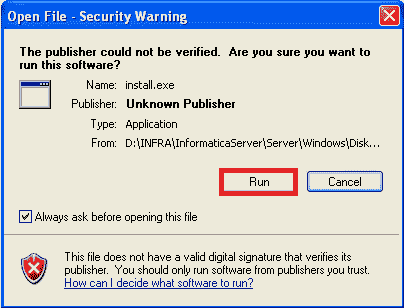

第六步:点击按钮后，开始安装 Informatica PowerCenter。

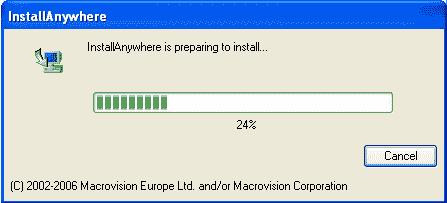

第七步:然后选择要安装的语言，点击**确定**按钮。

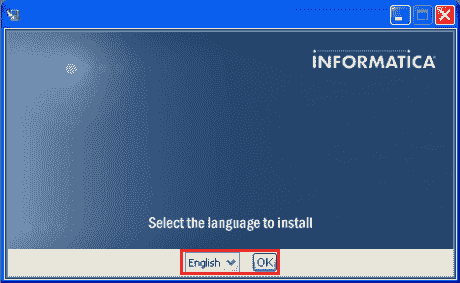

第八步:现在点击**下一步**按钮。

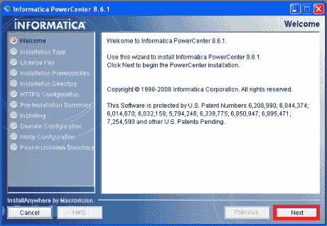

第九步:选择 Informatica 安装类型，点击**下一步**按钮。

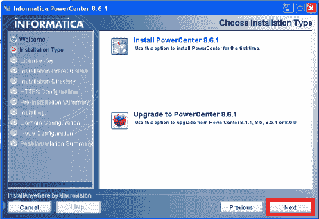

第十步:浏览许可证密钥文件，然后点击**下一步**按钮。

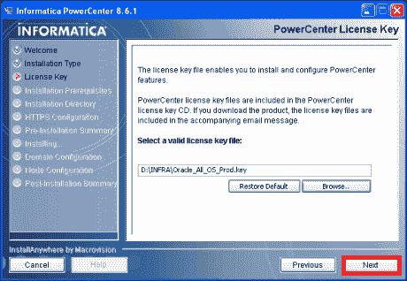

第十一步:浏览安装先决条件，点击**下一步**按钮。

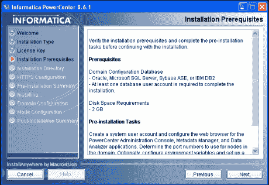

第十二步:浏览安装目录，选择安装目录。

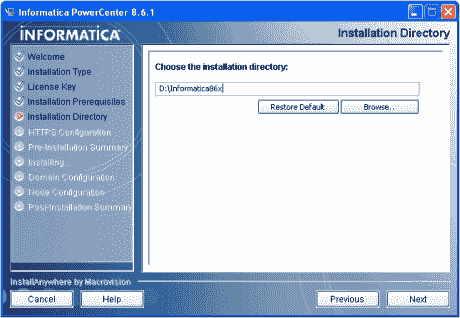

步骤 13:浏览 HTTPS 配置并设置默认值。

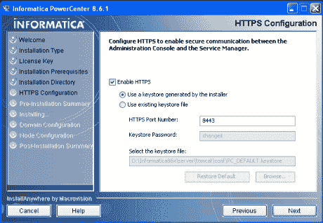

步骤 14:浏览预安装摘要，然后单击安装信息按钮。

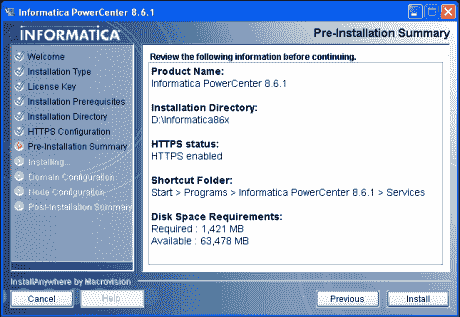

步骤 15:安装 PowerCenter 8.6.1。

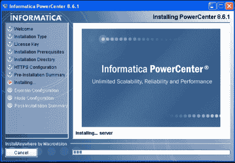

第十六步:选择创建新域，点击**下一步**按钮。

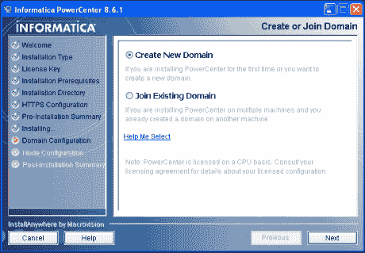

步骤 17:浏览配置域数据库信息并点击测试连接按钮。

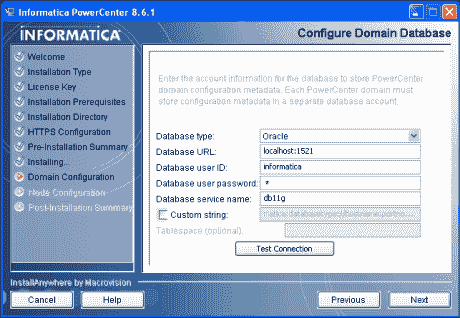

步骤 18:现在，测试连接通过。

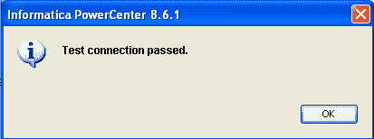

第 19 步:浏览域配置并点击下一步按钮。

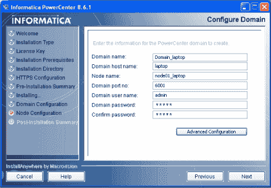

步骤 20:安装 Informatica PowerCenter 服务器并等待。

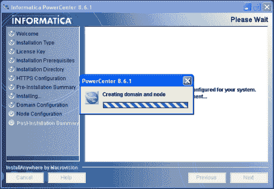

步骤 21:配置 Informatica 服务取消选中“在不同的用户帐户下运行 Informatica 服务”，然后单击“下一步”按钮。

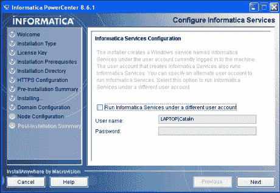

步骤 22:选择安装后摘要。

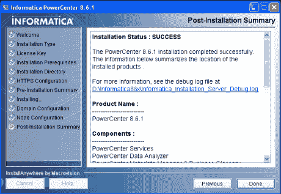

### 如何注册信息云力量快车

Informatica 提供 Informatica 云的 30 天免费试用。30 天免费试用，在给定的链接上注册。

[https://www . informatica . com/products/cloud-integration/cloud-data-integration . html](https://www.informatica.com/products/cloud-integration/cloud-data-integration.html)

让我们看看如何在 Informatica Cloud PowerExpress 上逐步注册，例如:

第一步:打开以下链接([点击](https://www.informatica.com/products/cloud-integration/cloud-data-integration.html))。

第二步:点击免费 30 天试用按钮。

第三步:填写以下表格或填写详细信息，点击**开始您的免费试用**按钮。

第四步:然后我们会得到一个确认页面如下。打开电子邮件账户，点击确认链接。

第五步:点击确认网址后，设置密码和一个安全问题。

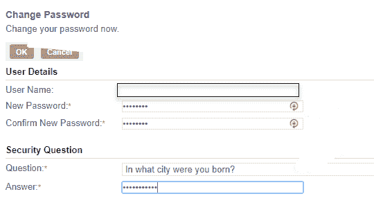

第六步:输入数据后点击确定按钮。

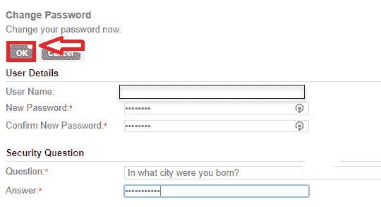

第七步:我们现在在 Informatica 云中，可以用于新项目。

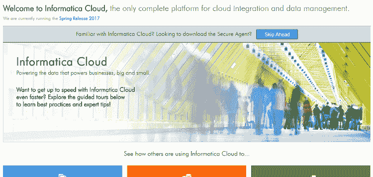

* * *