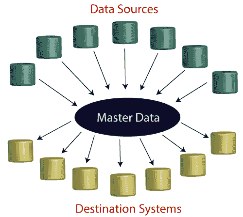

# MDM 计算

> 原文：<https://www.javatpoint.com/informatica-mdm>

MDM 代表主数据管理。这是一种将组织数据作为单个连贯系统进行管理的方法。MDM 用于确保数据的可靠性，并且该数据是从不同数据源收集的各种格式。它还负责数据分析决策、人工智能培训、数据计划和数字转型。

主数据管理可以将所有关键数据与主文件联系起来。MDM 在很好地实现之后，负责整个企业的数据共享。MDM 被用作数据集成的有效策略。

组织依赖数据来简化运营。商业智能、分析和人工智能结果的质量取决于数据的质量。主数据管理帮助:

*   消除数据的欺骗性。
*   整合来自不同数据源的数据。
*   因此，在标准化不相关的数据时，数据得到了有效的利用。
*   消除不准确的数据。
*   在中启用了一个称为“黄金记录”的单一参考源。

### 主数据管理流程

MDM 流程的全部范围是底层流程的混合。这些是 MDM 流程的关键，例如:

*   商业规则管理
*   数据聚合
*   数据分类
*   数据收集
*   数据整合
*   数据分布
*   数据丰富
*   数据治理
*   数据配置
*   数据匹配
*   数据标准化

主数据管理正在所有数据源和各种目标系统之间建立清晰的战略流程。

### 多媒体数据管理的好处

竞争业务战略需要清晰一致的数据管理。

MDM 的一些重要优势如下:

*   **控制**:知道数据在哪里，流向哪里，有多安全。
*   **数据准确性**:了解我们的指标跟踪与我们的因素有多密切。
*   **数据一致性**:了解我们的数据流跟踪底层模式的紧密程度。

### 主要特征

下面列出了 MDM 的一些关键特性，例如:

*   它提供了模块化设计。
*   它支持客户、产品、供应商和其他实体关系之间的 360 度视图。
*   它支持第三方数据集成。
*   它提供了 360 个解决方案和预构建的数据模型和加速器。
*   它具有很高的可扩展性。
*   它提供了智能搜索。
*   它支持智能匹配和合并属性。
*   它具有智能安全性。
*   数据即服务。

### 需求管理

MDM 解决方案涉及广泛的转换、数据清理和集成实践。当数据源被添加到系统中时，MDM 启动识别、收集、转换和修复数据的过程。

当数据达到质量阈值时，我们可以借助创建的模式和分类法来维护高质量的主引用。通过使用 MDM，组织对整个企业中数据的准确性、最新性和一致性感到轻松。

### 用例

实现一致性、控制和数据准确性非常重要，因为组织在所有必要的操作中都变得依赖数据。有效执行后，主数据管理可帮助组织:

*   更有效地竞争。
*   通过准确识别不同部门的特定客户来改善客户体验。
*   通过减少与数据相关的摩擦来提高运营效率。
*   理顺供应商与供应商管理模块的关系。
*   通过客户 MDM 了解客户的旅程。
*   通过产品 MDM 详细了解产品生命周期。

### 计量数据管理的挑战

需要主数据管理来消除企业中不良的数据质量。例如，在一个公司中，几个客户记录以不同的格式存储在不同的系统中。

组织可能会面临一些交付挑战，例如未知的前景、库存过多或不足的产品以及许多其他问题。常见的数据质量挑战包括:

*   重复记录
*   错误信息
*   不完全信息
*   不一致的记录
*   标签错误的数据

### 原因

以下是数据质量差的一些原因，例如:

*   该组织缺乏标准。
*   具有相同的实体
*   对于不同的账号。
*   冗余或重复数据。
*   不同应用程序中的不同字段结构，定义了要输入的特定数据格式，如约翰·史密斯或 j·史密斯

### 主数据管理的趋势

2018 年，许多组织与欧盟的《通用数据保护条例》(GDPR)捆绑在一起，该条例限制个人身份信息(PII)的使用。它还控制最终用户对这些信息的使用。

2020 年 1 月 1 日，《加州消费者隐私法》预计将生效，即使内容可能会根据 2018 年 11 月的选举而演变。但是这个法案可能会被一个联邦法案所取代。

许多国家和地区正在制定隐私法。这些法律影响到在这些地方的公司或企业。调查的结果取决于主数据管理解决方案。

元数据管理是多维数据管理的一个重要方面。元数据管理用于管理关于数据的数据。元数据管理帮助:

*   确保符合组织要求。
*   在组织中定位特定的数据资产。
*   管理组织中的风险。
*   理解组织中的数据。
*   对组织内外的多个数据源中的数据进行分析。

元数据管理始终很重要。但如今，它变得更加重要，因为随着数据量的不断增加，组织正在向 IIoT、IoT 和第三方数据源扩展。

### 主数据管理最佳实践

数据管理参考体系结构由解决方案提供商提供，解释基本概念并帮助客户了解公司的产品。

主数据管理架构元素和工具包括以下内容:

*   数据联盟
*   数据集成
*   数据集市
*   数据网络
*   数据挖掘技术
*   数据虚拟化
*   数据可视化
*   数据仓库
*   数据库
*   文件系统
*   运营数据存储

### 主数据管理的未来

随着数据量和种类的不断增长，以及业务的发展，大中型企业越来越依赖主数据管理工具。

当企业增加越来越多不同类型的 MDM 功能时，MDM 体系结构变得复杂和笨拙。一些供应商提供全面的解决方案来简化复杂性和增加市场份额。它取代了单点解决方案。

由于业务从定期商业智能(BI)报告过渡，MDM 正在持续增长。主数据管理也很重要，因为组织采用并构建人工智能驱动的系统。一个组织将使用一些数据作为机器学习的训练数据。

主数据管理和数据管理变得如此重要，因为大多数组织都在招聘首席数据官(CDO)和/或首席分析官(CAO)。

当它充分执行时，主数据管理允许公司:

*   将来自不同数据源的不同数据集成到一个中心，以便可以复制到其他目的地。
*   在目标系统之间提供主数据的单一视图。
*   将主数据从一个系统复制到另一个系统。

* * *