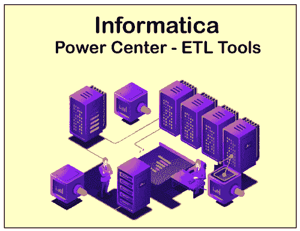
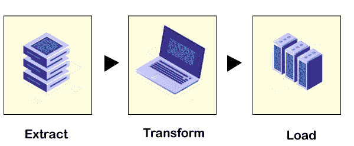

# ETL 运算

> 吴奇珍:t0[https://www . javatppoint . com/informatica-ETL]

Informatica ETL 用于数据提取，它基于数据仓库的概念，即从多个不同的数据库中提取数据。

### 历史

跨国软件公司 Ab Intio 发明了 ETL 工具。这家公司位于马萨诸塞州列克星敦郊外。美国设计了基于图形用户界面的并行处理软件，称为 ETL。

### ETL 工具的实现

### 1.提取

数据是从不同的数据源中提取的。关系数据库、平面文件和 XML、信息管理系统(IMS)或其他数据结构包含在标准数据源格式中。

即时数据验证用于确认从源提取的数据在给定的域中是否具有正确的值。

### 2.改变

为了准备并加载到目标数据源中，我们对提取的数据应用了一组规则和逻辑函数。数据清理意味着将正确的数据传递到目标源。

根据业务需求，我们可以在数据中应用许多转换类型。一些转换类型是基于键、基于列或行、编码和计算值、连接不同的数据源等等。

### 3.负荷

在这个阶段，我们将数据加载到目标数据源中。

所有三个阶段都不会相互等待开始或结束。所有三相并行执行。

### 实时业务中的用途

Informatica 公司为 ETL 提供数据质量、数据屏蔽、数据虚拟化、主数据管理、数据副本等数据集成产品。Informatica ETL 是最常见的数据集成工具，用于连接和获取不同数据源的数据。

为了接近这个软件，下面给出了一些用例，例如:

1.  一个组织正在从现有的软件系统迁移一个新的数据库系统。
2.  要在组织中建立数据仓库，数据需要从生产转移到仓库。
3.  它作为一种数据清理工具，可以纠正、检测数据或从数据库中删除不准确的记录。

### ETL 工具的特点

以下是 ETL 工具的一些基本特性，例如:

**1。并行处理**

通过使用并行处理的概念来实现 ETL。并行处理在同时运行的多个进程上执行。ETL 致力于三种类型的并行性，例如:

*   通过将单个文件拆分成更小的数据文件。
*   管道允许在同一数据上同时运行多个组件。
*   组件是在不同数据上同时运行以完成相同工作的可执行进程。

**2。数据重用、数据重新运行和数据恢复**

每个数据行都有一个 row_id，进程的一部分有一个 run_id，这样就可以通过这些 id 跟踪数据。在创建检查点时完成流程的某些阶段。这些检查点表明需要重新运行查询来完成任务。

**3。可视化 ETL**

权力中心和元数据信使是高级的 ETL 工具。这些工具有助于根据业务需求制作更快、自动化和有效的结构化数据。

作为解决方案，我们可以使用拖放机制来创建数据库和元数据模块。它可以自动配置、连接、提取、传输数据并将其加载到目标系统中。

### ETL 工具的特点

ETL 工具的一些属性如下:

1.  它应该增加数据连接性和可扩展性。
2.  它应该能够连接多个关系数据库。
3.  它应该支持 CSV 扩展数据文件，然后最终用户可以轻松导入这些文件，或者无需任何编码。
4.  它应该有一个用户友好的图形用户界面，以便最终用户可以轻松地将数据与可视化映射器集成在一起。
5.  它应该允许最终用户根据业务需求定制数据模块。

### 为什么需要 ETL？

在创建数据仓库的过程中，将来自不同来源的数据集中在一个地方，以便对其进行模式和见解分析，这是很常见的。如果来自所有这些来源的数据从一开始就有一个兼容的模式，这是可以的，但是这种情况很少发生。

ETL 获取异构数据并使其同构。没有 ETL，分析不同的数据并获得商业智能是不可能的。

### ETL 工具产品和服务

Informatica -ETL 产品和服务用于改善业务运营、减少大数据管理、提供数据的高安全性、在不可预见的条件下进行数据恢复，以及自动化开发和艺术设计可视化数据的过程。ETL 工具产品和服务分为以下几类:

1.  大数据环境下的 ETL
2.  云环境下的 ETL
3.  带 SAS 的 ETL
4.  用 HADOOP 进行 ETL
5.  带元数据的 ETL
6.  作为自助访问的 ETL
7.  移动优化解决方案和更多。

### 为什么 ETL 工具如此流行？

ETL 工具的以下特点使其如此流行，例如:

1.  ETL 工具具有精确且自动化的部署。
2.  它将采用新技术的风险降至最低。
3.  它提供高度安全的数据。
4.  它是自有的。
5.  它包括从数据灾难中恢复。
6.  它提供数据监控和数据维护。
7.  它有一个吸引人的和艺术的视觉数据交付。
8.  它支持集中式和基于云的服务器。
9.  它提供具体的固件数据保护。

### ETL 工具的副作用

组织持续依赖数据集成工具。它是一台机器，只有在收到编程输入后才会工作。

存在系统完全崩溃的风险，这表明数据恢复系统构建得有多好。简单数据的任何滥用都可能在组织中造成巨大损失。

* * *