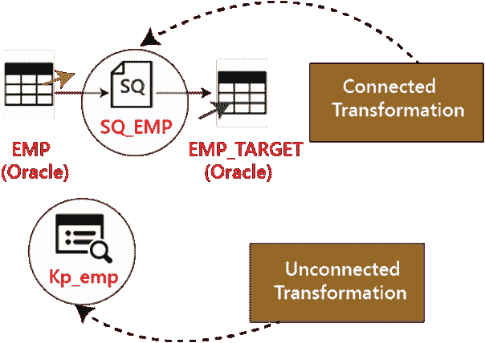

# 信息转换

> 原文：<https://www.javatpoint.com/informatica-transformations>

Informatica Transformations 是存储库对象，可以创建、读取、修改数据或将数据传递给定义的目标结构，如表、文件或任何其他目标。

在 Informatica 中，转换的目的是根据目标系统的要求修改源数据。它还确保了加载到目标中的数据的质量。

转换用于表示一组规则，这些规则定义数据流以及如何将数据加载到目标中。

Informatica 提供多种转换来执行特定的功能。

在转换中，为了传递数据，我们需要将端口连接到它，通过输出端口，它返回输出。

### 变换的分类

转换分为两类-第一类基于连通性，第二类基于几行中的变化。首先，我们将看看基于连接的转换。

1.以下是基于连通性的两种类型的转换，例如:

*   连通变换
*   不相连的变换

在 Informatica 中，映射过程中一个变换与其他变换的连接称为**连接变换**。

例如，Source 表 Stud 的 Source 限定符转换连接到筛选器转换，以筛选某个类的学生。

那些没有链接到任何其他转换的转换被称为**未连接的转换**。

通过在其他转换中调用它们来使用它们的功能。这些转换不是管道的一部分。

当为每个输入行调用转换或预期返回一个值时，连接转换是首选的。

如果只是周期性地或基于某些条件需要它们的功能，那么不相连的转换是有用的。例如，如果纳税值不可用，则计算纳税明细。

1.以下是基于几行中的更改的两种类型的转换，例如:

*   主动转换
*   被动转换

**活动的** **变换**是那些修改数据行的人，以及传递给他们的输入行数。例如，如果一个转换接收 10 个行数作为输入，并返回 15 个行数作为输出，那么它就是一个活动的转换。在活动转换中，数据在行中被修改。

**被动** **变换**不改变输入行数。在被动转换中，输入和输出行数保持不变，数据仅在行级别进行修改。

在被动转换中，我们不能创建新行，也不能删除现有行。

### 信息中的转换列表

*   源限定符转换
*   聚合器转换
*   路由器转换
*   儒瓦内变换
*   秩变换
*   序列发生器变换
*   事务控制转换
*   查找和可重用转换
*   归一化变换
*   转型的性能调整
*   外部转换
*   表达式转换

### 什么是过滤器转换？

筛选转换是一种活动转换，因为它会更改记录的数量。我们可以使用过滤条件根据需求过滤记录。

例如，为了加载 rollno 仅等于 20 的学生记录，我们可以将过滤器转换放在过滤器条件 rollno=20 的映射中。所以只有那些 rollno =20 的记录会被过滤器转换通过，其余的记录会被丢弃。

步骤 1:创建具有源“斯图”和目标“斯图 _ 目标”的映射。

第二步:然后在映射中

1.  选择转换菜单
2.  选择创建选项。

步骤 3:在创建转换窗口中

1.  从列表中选择过滤器转换。
2.  输入转换名称 fltr_rollno_20
3.  选择创建选项

第四步:过滤器转换将被创建，点击创建转换窗口中的完成按钮。

步骤 5:在映射中，

1.  从筛选器转换中拖放所有源限定符列。
2.  并将筛选器转换的列链接到目标表。

步骤 6:双击过滤器转换以打开其属性，并且

1.  选择属性菜单。
2.  点击过滤条件编辑器。

第七步:然后，

1.  输入过滤条件 rollno=20。
2.  点击确定按钮。

步骤 8:再次在编辑转换窗口中，

1.  我们将在属性选项卡中看到过滤条件。
2.  点击确定按钮。

现在保存创建的映射，并在创建会话和工作流后执行。在目标表中，只有 rollno = 20 将从记录中加载。

* * *