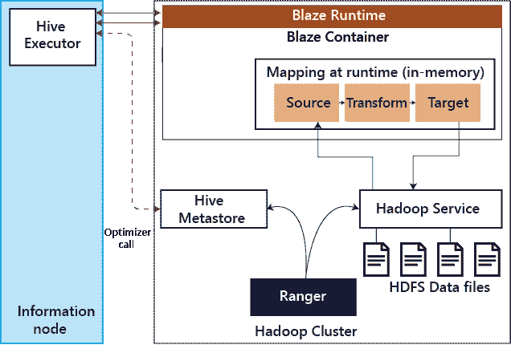
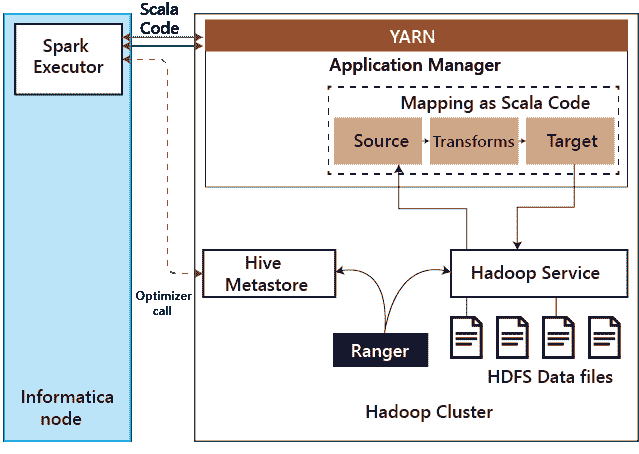
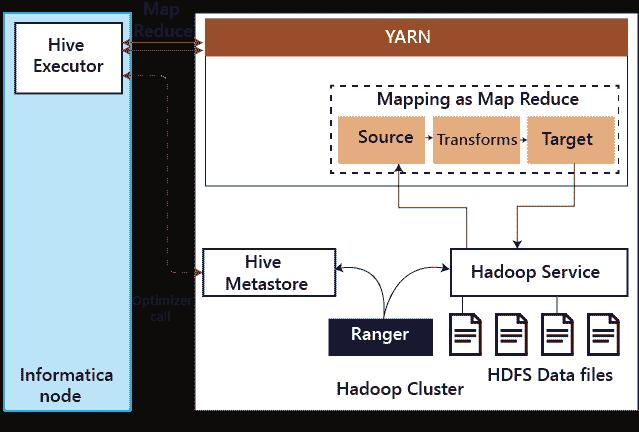
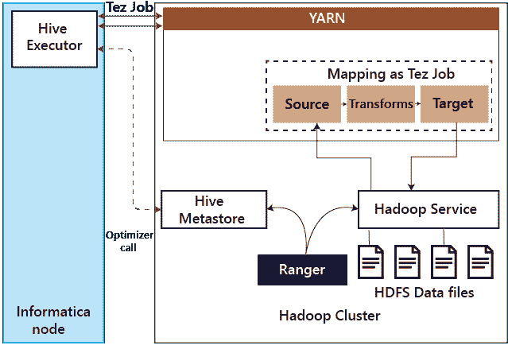

# BDM 计算

> 原文：<https://www.javatpoint.com/informatica-bdm>

Informatica 大数据管理(BDM)产品是一个基于图形用户界面的集成开发工具。组织使用该工具为其大数据平台构建数据质量、数据集成和数据治理流程。

Informatica BDM 拥有内置的智能执行器，支持各种处理引擎，如阿帕奇 Spark、Blaze、Tez 上的阿帕奇 Hive 和 MapReduce 上的[阿帕奇 Hive](https://www.javatpoint.com/hive) 。

Informatica BDM 用于将数据摄取到 Hadoop 集群中，对集群进行数据处理，以及从 Hadoop 集群中提取数据。

在 Blaze 模式下，Informatica 映射由 Blaze TM 处理- Informatica 的本机引擎作为基于纱的应用程序运行。

在[火花模式](https://www.javatpoint.com/apache-spark-tutorial)中，信息映射被转换成 Scala 代码。

在 Hive 和 MapReduce 模式下，Informatica 的映射被转换为 MapReduce 代码，并在 Hadoop 集群中本地执行。

Informatica BDM 在所有相关方面与 Hortonworks 数据平台(HDP) Hadoop 集群无缝集成，包括其默认授权系统。Ranger 可用于对存储在 HDP 集群中的数据和元数据实施基于角色的细粒度授权。

Informatica 的 BDM 与 Ranger 整合在所有执行模式中。Informatica 的 BDM 有一个智能执行器，使组织能够在其现有的安全设置范围内，在一种或多种实现方法上无缝运行其 Informatica 映射。

### 证明

身份验证是可靠地确保用户是自称的用户的过程。Kerberos 是 Hadoop 上被广泛接受的身份验证机制，包括 Hortonworks 数据平台。Kerberos 协议依赖于密钥分发中心(KDC)，这是一种签发允许访问的票证的网络服务。

Informatica BDM 支持基于活动目录和麻省理工学院的密钥分发中心的 Kerberos 身份验证。在 BDM Informatica 中，所有执行模式都支持 Kerberos 身份验证。

### 批准

授权是确定用户是否有权在给定系统上执行某些操作的过程。在 HDP Hadoop 集群中，授权在确保用户只能访问 [Hadoop](https://www.javatpoint.com/hadoop-tutorial) 管理员允许他们访问的数据方面发挥着至关重要的作用。

### 1.火焰纱的应用

在 Informatica Blaze 上执行映射时，优化器首先调用 Hadoop 服务来获取元数据信息，如配置单元表的分区细节。

然后作业被提交给 Blaze 运行时。该图展示了 Blaze 如何与 Hadoop 服务交互，例如 Hive 服务器 2。

当一个 Informatica 映射在 Blaze 模式下执行时，调用 Hive Metastore 来理解表的结构。

然后，Blaze 运行时将优化的映射加载到内存中。然后，该映射与相应的 Hadoop 服务交互，以读取或写入数据。

Hadoop 服务本身与游侠集成在一起，并确保在服务请求之前进行授权。

### 2.火花

Informatica BDM 可以像 Spark 的 Scala 代码一样在 HDP Hadoop 集群上执行映射。下图详细说明了使用 Spark 执行模式时涉及的不同步骤。

Spark 执行器将 Informatica 的映射翻译成 Spark Scala 代码。作为翻译的一部分，如果涉及到 Hive 源或目标，那么 Spark 执行器会调用 Hive metastore 来理解 Hive 表的结构并优化 Scala 代码。

然后，这个 Scala 代码被提交给纱执行。当 Spark 代码访问数据时，相应的 Hadoop 服务依赖 Ranger 进行授权。

### 3.MapReduce 上的配置单元

Informatica BDM 可以在 Hadoop 集群上作为 MapReduce 代码执行映射。下图说明了 MapReduce 模式下 Hive 涉及的步骤。

在 MapReduce 模式下的 Hive 中执行映射时，Informatica 节点上的 Hive 执行器会将 Informatica 映射转换为 MapReduce，并将作业提交给 Hadoop 集群。

如果涉及到 Hive 源或目标，Hive 执行器会调用 Hive 元存储来理解表结构，并相应地优化映射。当 MapReduce 与 Hadoop 服务交互时，如 [HDFS](https://www.javatpoint.com/hdfs) 和 Hive，Hadoop 服务用 Ranger 授权请求。

### 4.Tez 上的蜂巢

Tez 可以通过配置更改在 Informatica BDM 启用，并且对开发的映射是透明的。

因此，运行在 Tez 上的 Hive 上的映射遵循与 MapReduce 上的 Hive 相似的模式。当在 Tez 模式下的 Hive 中执行映射时， [Informatica](https://www.javatpoint.com/informatica) 节点上的 Hive 执行器将 Informatica 映射转换为 Tez 作业，并将其提交给 Hadoop 集群。

如果涉及到 Hive 源或目标，Hive 执行器会调用 Hive 元存储来理解表结构，并相应地优化映射。由于 Tez 作业与 Hadoop 服务(如 HDFS 和 Hive)交互，Hadoop 服务使用 Ranger 授权请求。

* * *