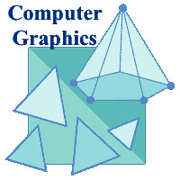
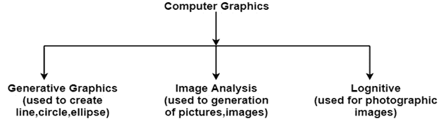

# 计算机图形学教程

> 原文：<https://www.javatpoint.com/computer-graphics-tutorial>

很难在计算机屏幕上显示任何尺寸的图像。这种方法通过使用计算机图形学得到简化。计算机上的图形是通过使用各种算法和技术产生的。本教程通过解释计算机如何处理所有这些内容来描述如何为用户提供丰富的视觉体验。

## 计算机图形学导论

计算机图形学涉及到技术访问。该过程以视觉形式转换和呈现信息。计算机图形学的作用不明显。在今天的生活中，计算机图形现在已经成为用户界面、电视商业电影中的一个常见元素。

计算机图形学是在计算机的帮助下创作图片。计算机图形的最终产品是一张图片，它可能是一张商业图、图纸和工程图。

在计算机图形学中，可以创建用于研究的二维或三维图片。随着时间的推移，许多硬件设备都在开发算法来提高图像生成的速度。它包括模型和对象图像的创建和存储。这些模型适用于工程、数学等各个领域。

今天的计算机图形学与早期的完全不同。这是不可能的。它是一个交互式的用户可以控制各种输入设备的对象结构。

## 计算机图形学的定义:

它是使用计算机在显示设备上创建和操作图片。它包括创建、存储、修改、表示图片的软件技术。

## 为什么使用计算机图形学？

假设一家制鞋公司想展示五年的鞋子销售情况。因为这大量的信息是要储存的。所以需要大量的时间和记忆。这种方法一般人很难理解。在这种情况下，图形是更好的选择。图形工具是图表和图形。使用图形，数据可以用图形的形式来表示。一张图片只需看一眼就能很容易理解。

交互式计算机图形使用计算机用户之间双向通信的概念工作。计算机将从输入设备接收信号，并相应地修改图像。当我们应用命令时，图片会很快改变。

* * *

## 计算机图形学教程索引

* * *

**计算机图形学教程**

*   [计算机图形学教程](computer-graphics-tutorial)
*   [计算机图形学的应用](application-of-computer-graphics)
*   [互动和被动图形](interactive-and-passive-graphics)

**图形系统**

*   [显示处理器](computer-graphics-display-processor)
*   [阴极射线管](computer-graphics-cathode-ray-tube)
*   [随机扫描与光栅扫描](difference-between-random-scan-and-raster-scan-display)
*   [彩色阴极射线管监视器](computer-graphics-color-crt-monitors)
*   [直视储存管](computer-graphics-direct-view-storage-tubes)
*   [平板显示器](computer-graphics-flat-panel-display)

**输入输出设备**

*   [输入设备](computer-graphics-input-devices)
*   [轨迹球](computer-graphics-trackball)
*   [光笔](computer-graphics-light-pen)
*   [图像扫描仪](computer-graphics-image-scanner)
*   [输出设备](computer-graphics-output-devices)
*   [绘图仪](computer-graphics-plotters)

**扫描转换一行**

*   [扫描转换定义](computer-graphics-scan-conversion-definition)
*   [扫描转换点](computer-graphics-scan-converting-a-point)
*   [扫描转换直线](computer-graphics-scan-converting-a-straight-line)
*   [DDA 算法](computer-graphics-dda-algorithm)
*   [布雷森汉线算法](computer-graphics-bresenhams-line-algorithm)

**扫描转换圆**

*   [定义圆](computer-graphics-defining-a-circle)
*   [使用多项式方法定义圆](defining-a-circle-using-polynomial-method)
*   [用极坐标法定义圆](defining-a-circle-using-polar-coordinates)
*   [布雷森汉圆算法](computer-graphics-bresenhams-circle-algorithm)
*   [中点圆算法](computer-graphics-midpoint-circle-algorithm)

**扫描转换椭圆**

*   [扫描转换椭圆](computer-graphics-scan-converting-a-ellipse)
*   [多项式法](computer-graphics-polynomial-method)
*   [触发法](computer-graphics-trignometric-method)
*   [中点椭圆算法](computer-graphics-midpoint-ellipse-algorithm)

**填充区域图元**

*   [边界填充算法](computer-graphics-boundary-filled-algorithm)
*   [洪水填充算法](computer-graphics-flood-fill-algorithm)
*   [扫描线多边形填充算法](computer-graphics-scan-line-polygon-fill-algorithm)

**2D 转换**

*   [改造介绍](computer-graphics-introduction-of-transformations)
*   [翻译](computer-graphics-translation)
*   [缩放](computer-graphics-scaling)
*   [旋转](computer-graphics-rotation)
*   [反射](computer-graphics-reflection)
*   [剪切](computer-graphics-shearing)
*   [矩阵表示](matrix-representation-of-2d-transformation)
*   [齐次坐标](computer-graphics-homogeneous-coordinates)
*   [复合变换](computer-graphics-composite-transformation)
*   [枢轴点旋转](general-pivot-point-rotation-or-rotation-about-fixed-point)

**2D-查看**

*   [窗口](computer-graphics-window)
*   [窗口到视口坐标转换](computer-graphics-window-to-viewport-co-ordinate-transformation)
*   [缩放](computer-graphics-zooming)
*   [平移](computer-graphics-panning)

**剪裁技术**

*   [削波](computer-graphics-clipping)
*   [点裁剪](computer-graphics-point-clipping)
*   [线裁剪](computer-graphics-line-clipping)
*   [中点细分算法](mid-point-subdivision-line-clipping-algorithm)
*   [文本剪辑](computer-graphics-text-clipping)
*   [多边形](computer-graphics-polygon)
*   [萨瑟兰-霍奇曼多边形裁剪](sutherland-hodgeman-polygon-clipping)
*   [魏勒-阿泽顿多边形裁剪](weiler-atherton-polygon-clipping)

**指向&定位**

*   [指向&定位技术](computer-graphics-pointing-and-positioning-techniques)
*   [弹性或橡皮筋技术](computer-graphics-elastic-or-rubber-band-techniques)
*   [拖动](computer-graphics-dragging)

**阴影**

*   [底纹介绍](computer-graphics-introduction-of-shading)
*   [恒定强度阴影](computer-graphics-constant-intensity-shading)
*   [【美食着色】](computer-graphics-gouraud-shading)
*   [声音阴影](computer-graphics-phong-shading)

**动画**

*   [动画](computer-graphics-animation)
*   [动画的应用领域](computer-graphics-application-areas-of-animation)
*   [动画功能](computer-graphics-animation-functions)

**3D 计算机图形学**

*   [三维图形](computer-graphics-3d-graphics)
*   [三维变换](computer-graphics-3d-transformations)
*   [缩放](computer-graphics-3d-scaling)
*   [旋转](computer-graphics-3d-rotation)
*   [绕任意轴旋转](computer-graphics-3d-rotation-about-arbitrary-axis)
*   [逆变换](computer-graphics-3d-inverse-transformations)
*   [反射](computer-graphics-3d-reflection)
*   [剪切](computer-graphics-3d-shearing)

**隐藏表面**

*   [隐藏面移除](computer-graphics-hidden-surface-removal)
*   [背面去除算法](computer-graphics-back-face-removal-algorithm)
*   [Z 缓冲算法](computer-graphics-z-buffer-algorithm)
*   [画家算法](computer-graphics-painter-algorithm)
*   [扫描线算法](computer-graphics-scan-line-algorithm)
*   [细分算法](computer-graphics-area-subdivision-algorithm)
*   [三维建模系统](computer-graphics-3d-modelling-system)

**投影**

*   [投影](computer-graphics-projection)
*   [透视投影](computer-graphics-perspective-projection)
*   [平行投影](computer-graphics-parallel-projection)

**程序**

*   [计算机图形程序](computer-graphics-programs)

* * *

## 先决条件

良好的知识和对 C 编程语言概念的理解是学习计算机图形学概念的必要条件。对基础数学的良好理解使我们能够更好地理解计算机图形学的概念。

## 观众

本教程对有兴趣学习在计算机上使用图形的学生很有帮助。本教程涵盖了图形的基础知识以及通过在计算机中实现图形来开发各种视觉效果。

## 问题

我们保证您不会发现本计算机图形教程的任何问题。但是如果有任何错误，请在联系表格中发布问题。

* * *