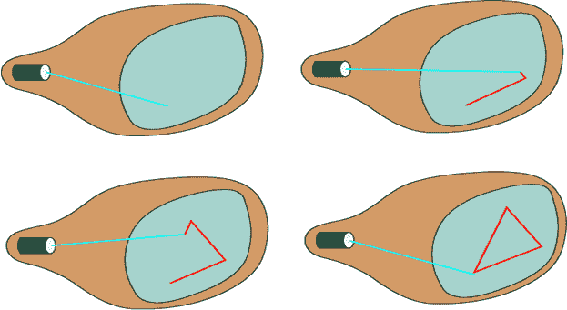
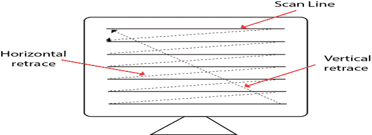

# 随机扫描和光栅扫描显示:

> 原文：<https://www.javatpoint.com/difference-between-random-scan-and-raster-scan-display>

## 随机扫描显示:

随机扫描系统使用像铅笔一样工作的电子束在阴极射线管屏幕上产生线图像。这幅画是由一系列直线段构成的。通过引导光束从屏幕上的一个点移动到下一个点，在屏幕上画出每个线段，其中它的 x & y 坐标定义每个点。画完画。系统循环回到第一行，每秒钟设计图像的所有行 30 到 60 次。流程如图所示:

随机扫描显示器也被称为矢量显示器、笔画显示器或书法显示器。

## 优点:

1.  阴极射线管使电子束只射向屏幕上要画图像的部分。
2.  制作流畅的线条画。
3.  高分辨率

## 缺点:

1.  随机扫描监视器无法显示真实的阴影场景。

## 光栅扫描显示:

光栅扫描显示基于屏幕上称为光栅的矩形框形式的像素强度控制。开启和关闭像素的信息存储在刷新缓冲器或帧缓冲器中。我们家的电视是基于光栅扫描法。光栅扫描系统可以存储每个像素位置的信息，因此适用于物体的真实显示。光栅扫描提供每秒 60 到 80 帧的刷新率。

帧缓冲区也称为光栅或位图。在帧缓冲器中，这些位置被称为像素。光束刷新有两种类型。首先是水平伸缩，其次是垂直伸缩。当光束从左上角开始并到达右下角刻度时，它将再次返回左上角，称为垂直回扫。那么它将再次更水平地从顶部到底部调用，如图 1 所示的水平缩回:

**光栅扫描中光束的扫描或传播类型**

1.  隔行扫描
2.  非隔行扫描

在隔行扫描中，屏幕的每一条水平线都是从上到下跟踪的。由于这种原因，可能会出现物体显示的褪色。这个问题可以通过非隔行扫描来解决。在这种情况下，首先用电子束跟踪或访问奇数行，然后在下一个圆中，定位偶数行。

对于非隔行显示，使用每秒 30 帧的刷新率。但它会闪烁。对于隔行显示，使用每秒 60 帧的刷新率。

### 优点:

1.  逼真的图像
2.  百万种不同的颜色将被生成
3.  阴影场景是可能的。

### 缺点:

1.  低分辨率
2.  昂贵的

## 区分随机和光栅扫描显示:

| 随机扫描 | 光栅扫描 |
| 1.它具有高分辨率 | 1.它的分辨率很低。 |
| 2.它更贵 | 2.它不太贵 |
| 3.如果需要，任何修改都很容易 | 3.改装很难 |
| 4.实心图案很难填充 | 4.实心图案易于填充 |
| 5.刷新率取决于分辨率 | 5.刷新率不取决于图片。 |
| 6.仅显示在某个区域有视图的屏幕。 | 6.扫描整个屏幕。 |
| 7.波束穿透技术就在它下面。 | 7.影子标记技术就属于这种情况。 |
| 8.它不使用隔行扫描方法。 | 8.它使用隔行扫描 |
| 9.它仅限于画线应用 | 9.它适用于逼真的显示。 |

* * *