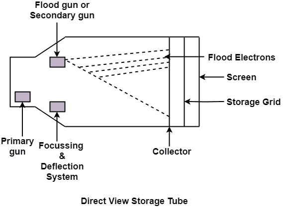

# 直视储存管:

> 原文：<https://www.javatpoint.com/computer-graphics-direct-view-storage-tubes>

DVST 终端也使用随机扫描方法在阴极射线管屏幕上生成图像。术语“存储管”是指屏幕保留投射到其上的图像的能力，从而避免了不断重写图像的需要。

**枪械功能:**DVST 使用两种枪械

1.  **主炮:**用于存储画面图案。
2.  **泛光炮或副炮:**用于维持画面显示。

### 优势:

1.  不需要刷新。
2.  高分辨率
3.  成本非常少

### 缺点:

1.  无法擦除图片的选定部分。
2.  它不适合动态图形应用。
3.  如果图片的一部分要修改，那么就要消耗时间。

* * *