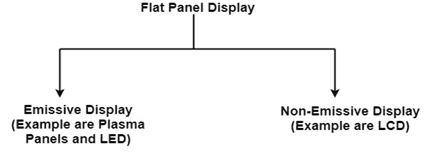
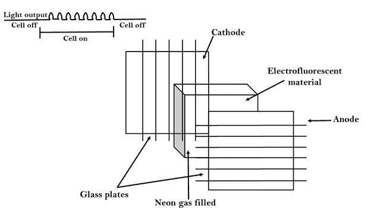
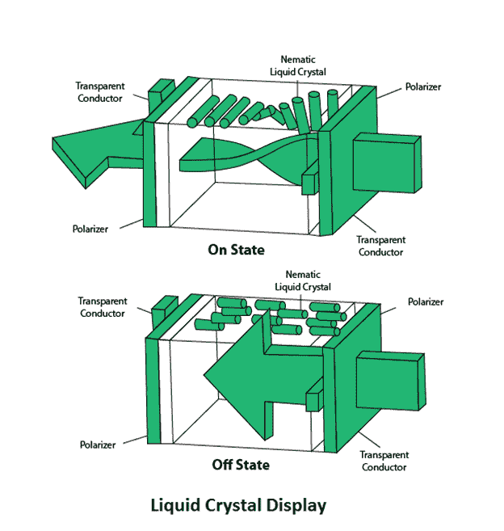
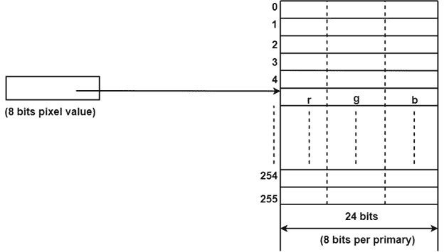

# 平板显示器:

> 原文：<https://www.javatpoint.com/computer-graphics-flat-panel-display>

平板显示器是指一类与阴极射线管相比体积、重量和功耗都有所降低的视频设备。

**例:**小电视显示器、计算器、袖珍游戏机、笔记本电脑、电梯里的一块广告牌。

**1。发射型显示器:**发射型显示器是将电能转化为光的设备。例如等离子面板、薄膜电致发光显示器和发光二极管。

**2。非发射型显示器:**非发射型显示器利用光学效应将太阳光或来自其他光源的光转换成图形图案。例如液晶显示器。

## 等离子面板显示器:

等离子显示器也被称为气体放电显示器。它由一排小灯组成。灯本质上是荧光的。等离子显示屏的主要部件有:

1.  **阴极:**由细线组成。它向气室输送负电压。电压沿负轴释放。
2.  **阳极:**也由线丝组成。它提供正电压。电压沿正轴提供。
3.  **荧光细胞:**它由小气团液体组成，当电压施加到这种液体(氖气)上时，它就会发光。
4.  **玻璃板:**这些板充当电容器。将施加电压，电池将持续发光。

当水平导线和垂直导线之间存在明显的电压差时，气体会变慢。电压水平保持在 90 伏到 120 伏之间。血浆水平不需要刷新。擦除是通过将电压降低到 90 伏来完成的。

每个细胞的血浆都有两种状态，所以细胞被认为是稳定的。等离子体面板中的可显示点由水平和垂直网格交叉而成。等离子面板的分辨率最高可达 512 * 512 像素。

**图为等离子面板显示中的单元状态:**

### 优势:

1.  高分辨率
2.  大屏幕尺寸也是可以的。
3.  减少体积
4.  重量更轻
5.  无闪烁显示器

### 缺点:

1.  分辨率低
2.  阳极和阴极的接线要求复杂。
3.  它的寻址也很复杂。

## 发光二极管:

在发光二极管中，二极管矩阵被组织以形成显示器中的像素位置，并且图像清晰度被存储在刷新缓冲器中。从刷新缓冲器读取数据，并将其转换为施加到二极管的电压电平，以在显示器中产生光图案。

## 液晶显示器:

液晶显示器是通过使来自周围环境或内部光源的偏振光穿过透射光的液晶材料来产生图像的设备。

液晶显示器使用两块玻璃板之间的液晶材料；每块板都是互相成直角的，板之间液体被填满。一块玻璃板由垂直方向排列的多排导体组成。另一个玻璃板由一排沿水平方向排列的导体组成。像素位置由垂直和水平导线的交点决定。这个位置是屏幕的活跃部分。

液晶显示器与温度有关。温度在零到七十摄氏度之间。它是扁平的，只需要很少的动力就能工作。

### 优势:

1.  低功耗。
2.  小尺寸
3.  低成本

### 缺点:

1.  液晶显示器依赖于温度(0-70 摄氏度)
2.  液晶显示器不发光；因此，图像几乎没有对比度。
3.  液晶显示器没有彩色功能。
4.  分辨率不如阴极射线管。

## 查找表:

图像表示本质上是像素颜色的描述。三原色:R(红色)、G(绿色)和 B(蓝色)。每种原色可以呈现出不同的强度，产生不同的颜色。使用直接编码，我们可以为每个像素分配 3 位，每个原色分配一位。3 位表示允许每个原色在两个强度级别之间独立变化:0(关)或 1(开)。因此每个像素可以呈现八种颜色中的一种。

| 位 1:r | 第 2 位:g | 第 3 位:b | 颜色名称 |
| Zero | Zero | Zero | 黑色 |
| Zero | Zero | one | 蓝色 |
| Zero | one | Zero | 格林（姓氏）；绿色的 |
| Zero | one | one | 蓝绿色 |
| one | Zero | Zero | 红色 |
| one | Zero | one | 品红 |
| one | one | Zero | 黄色 |
| one | one | one | 白色的 |

一个被广泛接受的行业标准是每个像素使用 3 个字节，即 24 个字节，每个基色一个字节。顺便说一下，我们允许每种原色有 256 种不同的强度等级。因此，一个像素可以有 256 x 256 x 256 或 1670 万种可能的颜色选择。24 位格式通常被称为实际颜色表示。

查找表方法降低了存储需求。在这种方法中，像素值不直接编码颜色。或者，它们是颜色值表中的地址或索引。特定像素的颜色由像素值引用的表条目中的颜色值决定。图中显示了一个包含 256 个条目的查找表。条目的地址从 0 到 255。每个条目包含一个 24 位 RGB 颜色值。像素值现在是 1 字节。值为 I 的像素的颜色，其中 0

* * *