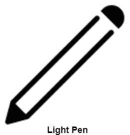
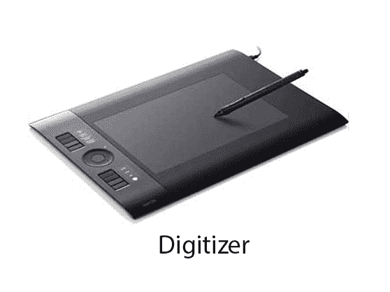

# 光笔

> 原文：<https://www.javatpoint.com/computer-graphics-light-pen>

光笔(类似于钢笔)是一种定点设备，用于选择显示的菜单项或在监视器屏幕上绘制图片。它由放置在小管中的光电池和光学系统组成。当它的尖端在监视器屏幕上移动，并且按下笔按钮时，它的光电池传感元件检测屏幕位置，并向中央处理器发送相应的信号。

### 用途:

1.  通过提供必要的排列，光笔可以用作输入坐标位置。
2.  如果背景颜色或强度，光笔可以用作定位器。
3.  它被用作具有许多图形系统的标准拾取设备。
4.  它可以用作笔画输入设备。
5.  它可以用作评估器

* * *

## 数字化仪:

数字化仪是一种操作员输入设备，它包含一个大而光滑的板(外观类似于机械绘图板)&一个电子跟踪设备，可以在表面上改变以跟随现有的线条。电子跟踪设备包含一个开关，供用户记录所需的 x & y 坐标位置。坐标可以输入到计算机存储器中，或者存储在离线存储介质中，例如磁带。

### 优点:

1.  绘图很容易改变。
2.  它提供了交互式图形的能力。

### 缺点:

1.  昂贵的
2.  仅适用于需要高分辨率图形的应用。

* * *

## 触摸面板:

触摸面板是一种显示屏类型，具有覆盖屏幕的触敏透明面板。当手指或其他物体接触屏幕时，触摸屏记录输入。

当波信号因与屏幕接触而中断时，会记录该位置。触摸屏长期以来一直用于军事应用。

* * *

## 语音系统(语音识别):

语音识别是用于与计算机交互的最新、最复杂的输入技术之一。用户通过对着麦克风说话来输入数据。语音识别最简单的形式是一个人说出一个字的命令。每个命令都是孤立的，单词之间有停顿。

语音识别在一些图形工作站中用作输入设备来接受语音命令。语音系统输入可用于启动图形操作或输入数据。这些系统通过将输入与预定义的单词和短语词典进行匹配来运行。

### 优势:

1.  更高效的设备。
2.  使用方便
3.  可以识别未授权的扬声器

### 缺点:

1.  词汇量非常有限
2.  不同运营商的声音无法区分。

* * *