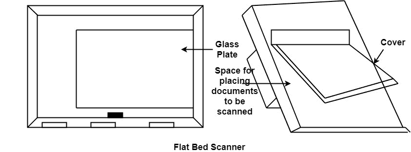
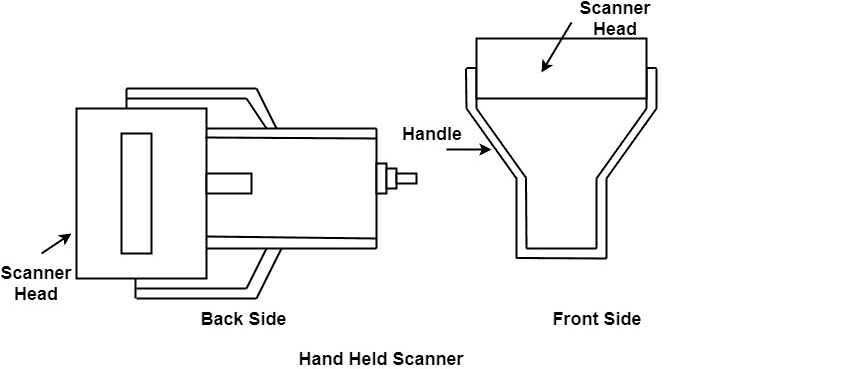

# 图像扫描器

> 原文：<https://www.javatpoint.com/computer-graphics-image-scanner>

它是一个输入设备。数据或文本写在纸上。纸张被送入扫描仪。将纸质书面信息转换为电子格式；这种格式存储在计算机中。输入文档可以包含文本、手写材料、图片等。

通过将文档存储在计算机中，文档在更长的时间内变得安全。该文档将被永久保存以备将来使用。我们可以在需要的时候修改文件。需要时可以打印文档。

扫描可以是黑白的，也可以是彩色的。在存储的图片上，可以应用 2D 或 3D 旋转、缩放和其他操作。

## 图像扫描仪的类型:

**1。平板扫描仪:**像复印机。它的顶部有一个玻璃顶。用盖子进一步盖住玻璃顶部。要扫描的文件保存在玻璃板上。光线从玻璃板下面穿过。灯光从左向右移动。扫描是逐行进行的。重复该过程，直到扫描完整行。在 20-25 秒内，可以扫描 4 英寸* 6 英寸的文档。

**2。手持扫描仪:**它有许多发光二极管，发光二极管排列在小盒子里。它被称为手持式扫描仪，因为它可以放在手中进行扫描。为了进行扫描，扫描仪从文件的顶部向底部移动。当我们在文件上移动它时，它的灯亮着。它在文档上拖得非常慢。如果扫描仪在文档上的拖动不正确，转换将不会正确。

* * *