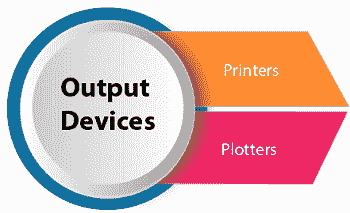
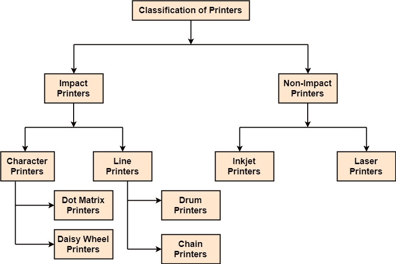
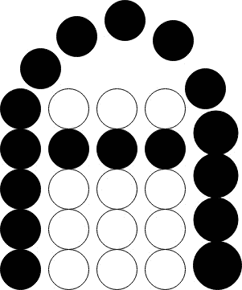
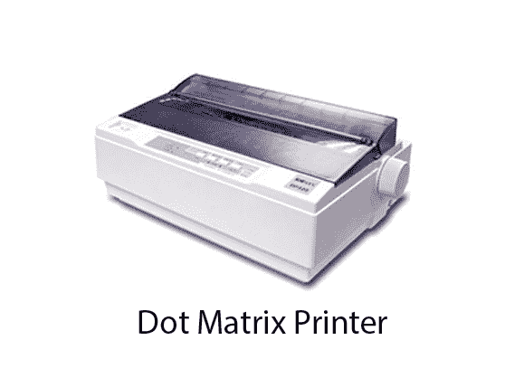
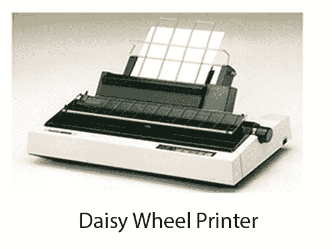
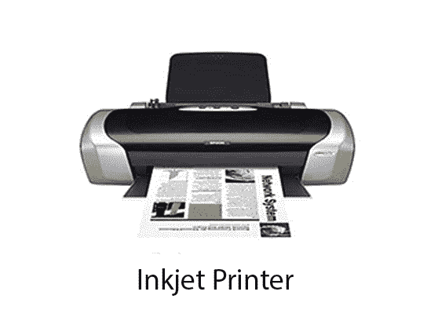
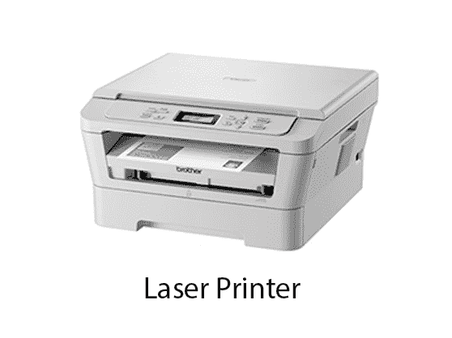

# 输出设备

> 原文：<https://www.javatpoint.com/computer-graphics-output-devices>

它是一种机电设备，接受来自计算机的数据，并将其转换成用户能够理解的形式。

以下是输出设备:

1.  [打印机](#printers)
2.  [绘图仪](computer-graphics-plotters)

## 打印机:

打印机是最重要的输出设备，用于在纸上打印数据。

**打印机类型:**打印机有多种类型，根据各种标准进行分类，如图:

**1。冲击式打印机:**通过击打色带并在纸张上打印字符的打印机称为冲击式打印机。

这些打印机有两种类型:

1.  字符打印机
2.  行式打印机

**2。非击打式打印机:**不击打色带而在纸上打印字符的打印机称为非击打式打印机。因此，这些打印机一次打印一整页，也称为页面打印机。

页面打印机有两种类型:

1.  激光打印机
2.  喷墨打印机

## 点阵打印机:

点阵以点的形式印刷。打印机有一个包含九个针脚的打印头。九个销一个接一个地排列。每个引脚都可以独立激活。一次激活所有或仅相同的针。当不需要的时候不被激活，然后针尖停留在头部。当针工作时，它从打印头出来。在九针打印机中，针排列成 5 * 7 矩阵。

 

### 优势:

1.  点阵打印机将输出打印为点，因此它可以打印任何形状的字符。这允许打印机打印特殊字符、图表、图形等。
2.  点阵打印机属于冲击式打印机的范畴。当撞针碰到墨带时，印刷就完成了。印象印在纸上。通过放置多个副本的碳，可以产生多个副本的输出。
3.  适用于公司发票的打印。

## 菊花轮打印机:

头躺在轮子上，与人物相对应的别针就像雏菊的花瓣，这就是为什么叫雏菊轮打印机。

### 优势:

1.  比 DMPs 更可靠
2.  更好的质量

### 缺点:

1.  比 DMPs 慢

## 滚筒式打印机:

这些是行式打印机，一次打印一行。它由一个鼓组成。滚筒的形状是圆柱形的。鼓是实心的，上面以垂直带的形式压印有字符。这些字符是圆形的。每个乐队都由一些角色组成。鼓上的每一行由 132 个字符组成。因为有 96 行，所以字符总数是(132 * 95) = 12，672。

鼓也包含许多锤子。

## 链式打印机:

这些被称为行式打印机。这些用于一行一行打印。基本上，链由链节组成。每个链接包含一个字符。打印机可以遵循任何字符集样式，即 48、64 或 96 个字符。打印机也由许多锤子组成。

### 优点:

1.  链条或带子如果损坏，可以很容易地更换。
2.  它允许不同形式的打印。
3.  使用这台打印机可以打印不同的脚本。

### 缺点:

1.  它不能打印图表。
2.  它不能打印任何形状的字符。
3.  链式打印机是冲击式打印机，锤子敲击声很大。

## 无冲击打印机:

## 喷墨打印机:

这些打印机使用一种叫做静电墨水的特殊链接。打印头有一个特殊的喷嘴。喷嘴在纸上滴墨。头部包含多达 64 个喷嘴。滴落的墨水被静电板偏转。该板固定在喷嘴外部。偏转的墨水落在纸上。

### 优点:

1.  与点阵相比，它们产生高质量的输出。
2.  使用 64 个打印喷嘴可以产生高质量的输出。
3.  喷墨打印机可以打印各种形状的字符。
4.  喷墨可以打印特殊字符。
5.  这台打印机可以打印图表。

Disadvantages:

1.  喷墨打印机比点阵打印机慢。
2.  喷墨打印机的成本不仅仅是点阵打印机。

## 激光打印机:

这些是非击打式页面打印机。他们使用激光产生形成要打印在页面上的字符所需的点&因此得名激光打印机。

**按照以下步骤生成输出:**

**步骤 1:** 处理单元发送的数据比特作为触发器打开&关闭激光束。

**步骤 2:** 输出装置有一个被清除的滚筒&被赋予正电荷。为了打印一页，从激光器发出的调制激光束在滚筒表面来回扫描&。滚筒上的正电荷仅存储在滚筒表面暴露于激光束的那些部分上，从而在暴露的滚筒表面上产生电荷差异。

**步骤 3:** 感光鼓的激光曝光部分吸引一种称为墨粉的墨粉。

**步骤 4:** 被吸引的墨粉转移到纸张上。

**步骤 5:** 通过加热或加压技术将油墨颗粒永久固定在纸上。

**步骤 6:** 滚筒旋转回到清洁器，在那里橡胶刮刀清除多余的墨水&准备滚筒打印下一页。

* * *