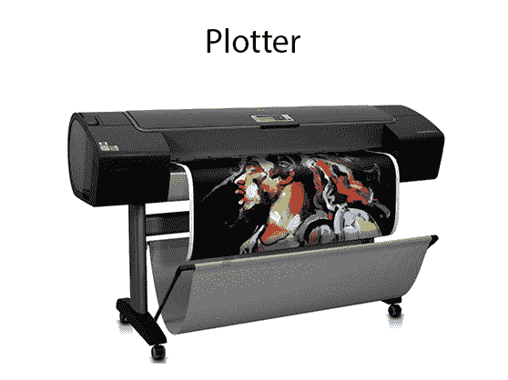
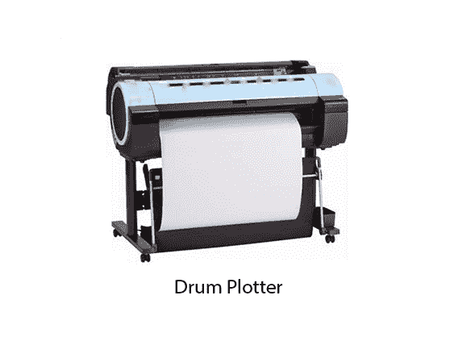
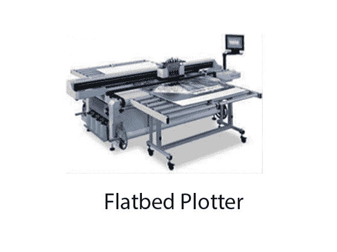

# 绘图机

> 原文：<https://www.javatpoint.com/computer-graphics-plotters>

绘图仪是一种特殊类型的输出设备。它适用于以下应用:

1.  建筑的建筑平面图。
2.  计算机辅助设计应用，如飞机机械部件的设计。
3.  许多工程应用。

### 优势:

1.  它可以在大纸张上产生高质量的输出。
2.  用于提供高精度绘图。
3.  它可以产生各种大小的图形。
4.  产出的速度很快。

## 鼓绘图仪：

它由一个鼓组成。制作图案的纸放在鼓上。滚筒可以双向旋转。绘图仪由一个或多个笔和笔杆组成。支架垂直于滚筒表面安装。钢笔放在支架里，可以左右移动。图形绘制程序控制笔和鼓的运动。

## 平板绘图仪:

它用于绘制复杂的设计和图形、图表。平板绘图仪可以放在桌子上。绘图仪由笔和支架组成。这支笔可以画各种大小的字符。可以有一个或多个笔和握笔机构。每支笔都有不同颜色的墨水。不同的颜色有助于产生多色设计的文件。绘图区域也是可变的。它可以从 A4 到 21'*52 '不等。

它是用来画画的

1.  汽车
2.  船
3.  飞机
4.  鞋和服装设计
5.  道路和公路设计

## 图形软件:

图形软件有两种类型。

**1。通用软件包:**通用软件包中的基本功能包括生成图片组件(直线、多边形、圆形和其他图形)、设置颜色和亮度值、选择视图和应用变换。

通用软件包的例子是 GL(图形库)，GKS，PHIGS，PHIGS+等。

**2。专用包:**这些包是为非程序员设计的，让这些用户可以使用图形包，而不需要知道内部细节。

特殊用途包装的例子是

1.  绘画程序
2.  用于商业目的的包装
3.  用于医疗系统的包装。
4.  计算机辅助设计软件包

* * *