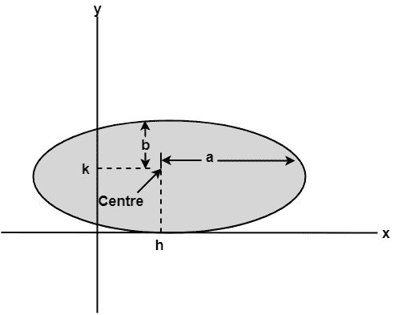
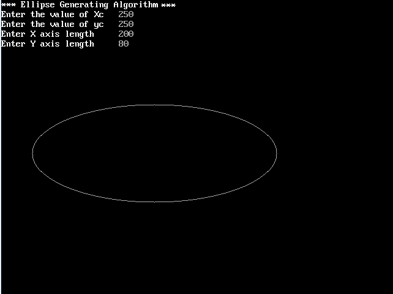

# 扫描转换椭圆:

> 原文：<https://www.javatpoint.com/computer-graphics-scan-converting-a-ellipse>

椭圆也是像圆一样的对称图形，但它是四向对称，而不是八向对称。



### 实现椭圆绘制算法的程序:

```

#include #include <conio.h>#include <graphics.h>#include <math.h>void disp();
float x,y;
intxc,yc;
void main()
{
                intgd=DETECT,gm,a,b;
                float p1,p2;
                clrscr();
                initgraph(&gd,&gm,"c:\\turboc3\\bgi");
                printf("*** Ellipse Generating Algorithm ***\n");
                printf("Enter the value of Xc\t");
                scanf("%d",&xc);
                printf("Enter the value of yc\t");
                scanf("%d",&yc);
                printf("Enter X axis length\t");
                scanf("%d",&a);
                printf("Enter Y axis length\t");
                scanf("%d",&b);
                x=0;y=b;
                disp();
                p1=(b*b)-(a*a*b)+(a*a)/4;
                while((2.0*b*b*x)<=(2.0*a*a*y))
                {
                                x++;
                                if(p1<=0)
                                p1=p1+(2.0*b*b*x)+(b*b);
                                else
		{
                                                y--;
                                                p1=p1+(2.0*b*b*x)+(b*b)-(2.0*a*a*y);
		 }
                               disp();
                               x=-x;
                               disp();
                               x=-x;
                               delay(50);
                 }
                 x=a;
                 y=0;
                 disp();
                 p2=(a*a)+2.0*(b*b*a)+(b*b)/4;
                 while((2.0*b*b*x)>(2.0*a*a*y))
                {
                                y++;
                                if(p2>0)
                                p2=p2+(a*a)-(2.0*a*a*y);
                                else
		{
                                                x--;
                                                p2=p2+(2.0*b*b*x)-(2.0*a*a*y)+(a*a);
		 }
                                disp();
                                y=-y;
                                disp();
                                y=-y;
                                delay(50);   
            }
                getch();
                closegraph();
}
 void disp()
{
              putpixel(xc+x,yc+y,7);
               putpixel(xc-x,yc+y,7);
               putpixel(xc+x,yc-y,7);
          putpixel(xc+x,yc-y,7);
  }</math.h></graphics.h></conio.h> 
```

**输出:**



定义椭圆有两种方法:

1.  定义椭圆的多项式方法
2.  定义椭圆的三角方法

* * *