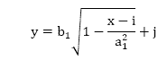
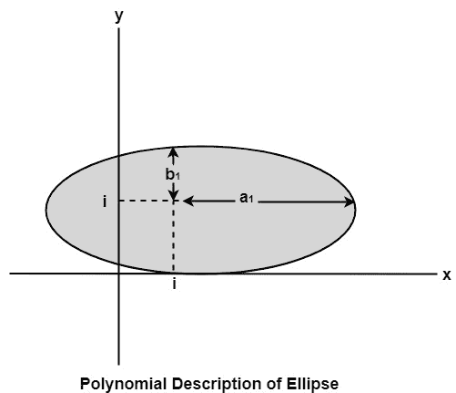
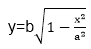
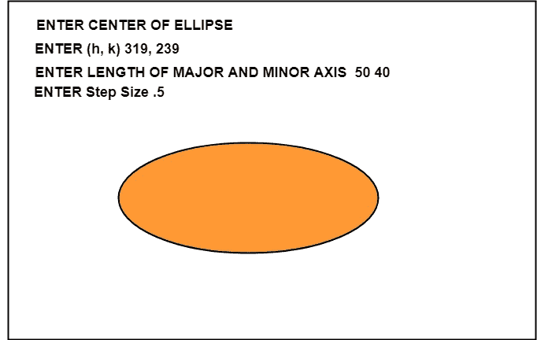

# 多项式方法:

> 原文：<https://www.javatpoint.com/computer-graphics-polynomial-method>

椭圆有长轴和短轴。如果 a <sub>1</sub> 和 b <sub>1</sub> 分别是长轴和短轴。椭圆的中心是(I，j)。x 的值将从 I 增加到 a <sub>1</sub> ，y 的值将使用以下公式计算



## 多项式方法的缺点:

1.  它需要取值的平方。所以需要浮点计算。
2.  为这种计算开发的例程非常复杂和缓慢。



## 算法:

1.设置初始变量:a =主轴长度；b =短轴长度；(h，k) =椭圆中心坐标；x = 0；i =步长；x <sub>结束</sub> = a。

2.测试以确定整个椭圆是否已被扫描转换。如果 x>x <sub>结束</sub>，则停止。

3.计算 y 坐标的值:



4.在当前(x，y)坐标上绘制对称找到的四个点:

绘图 （x + h， y + k） 绘图 （-x + h， -y + k） 绘图 （-y - h， x + k） 绘图 （y + h， -x + k）

5.增量 x；x = x + i。

6.转到步骤 2。

### 使用多项式方法绘制椭圆的程序:

```

#include 
#include <stdlib.h>
#include <math.h>
#include <stdio.h>
#include <conio.h>
#include <iostream.h>

class bresen
{
	float x, y, a, b, r, t, te, xend, h, k, step;
	public:
	void get ();
	void cal ();
};
	void main ()
    {
	bresen b;
	b.get ();
	b.cal ();
	getch ();
   }
	void bresen :: get ()
   {
	cout<>h>>k;
	cout<>a>>b;
	cout<> step;
   }
void bresen ::cal ()
{
	/* request auto detection */
	int gdriver = DETECT,gmode, errorcode;
	int midx, midy, i;
	/* initialize graphics and local variables */
	initgraph (&gdriver, &gmode, " ");
	/* read result of initialization */
	errorcode = graphresult ();
	if (errorcode ! = grOK)    /*an error occurred */
	{
 		printf("Graphics error: %s \n", grapherrormsg (errorcode);
		printf ("Press any key to halt:");
		getch ();
		exit (1); /* terminate with an error code */
	}
	x = 0;
	xend=a;
	whilex (x</iostream.h></conio.h></stdio.h></math.h></stdlib.h>
```

**输出:**



* * *