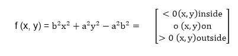
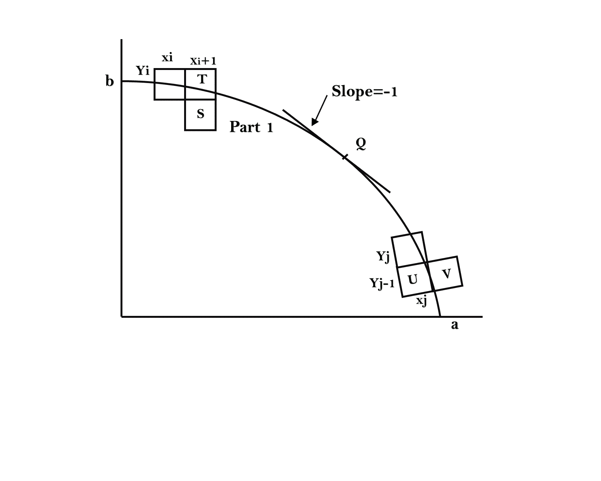
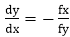
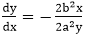
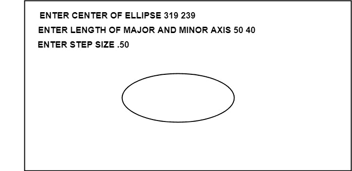

# 中点椭圆算法:

> 原文：<https://www.javatpoint.com/computer-graphics-midpoint-ellipse-algorithm>

这是一种增量方法，用于扫描转换以标准位置原点为中心的椭圆，即长轴和短轴平行于坐标系轴。它与中点圆算法非常相似。由于四向对称性质，我们需要考虑第一象限的整个椭圆曲线。

让我们首先重写椭圆方程，并定义函数 f，该函数可用于确定两个候选像素之间的中点是在椭圆内部还是外部:




现在将椭圆曲线从(0，b)到(a，0)在曲线斜率为-1 的 Q 点分成两部分。

曲线的斜率由 f(x，y) = 0 定义为，其中 fx & fy 是 f(x，y)相对于 x & y 的偏导数。

我们有 fx = 2b <sup>2</sup> x，fy=2a <sup>2</sup> y & 因此我们可以在扫描转换过程中监控斜率值以检测 q。我们的起点是(0，b)

假设进入步骤 I 时最后一个扫描转换像素的坐标为(x <sub>i</sub> ，y <sub>i</sub> )。我们将选择 T (x <sub>i+1</sub> 、y <sub>i</sub> )或 S (x <sub>i+1</sub> 、y <sub>i-1</sub> )作为下一个像素。T 的中点& S 用于定义以下决策参数。

pi = f(x <sub>i+1</sub> )，y<sub>I</sub>-)
pi = b<sup>2</sup>(x<sub>I+1</sub>)<sup>2</sup>+a<sup>2</sup>(y<sub>I</sub>-)<sup>2</sup>-a<sup>2</sup>b<sup>2</sup>

如果 pi<0，中点在曲线内部，我们选择像素 t。

如果 pi>0，中点在曲线外面或曲线上，我们选择像素 s。

下一步的决策参数是:

p <sub>i+1</sub> =f(x <sub>i+1</sub> +1，y<sub>I+1</sub>-)
= b<sup>2</sup>(x<sub>I+1</sub>+1)<sup>2</sup>+a<sup>2</sup>(y<sub>I+1</sub>-)<sup>2</sup>-a<sup>2</sup>

自 x<sub>I+1</sub>Xi+1 以来，我们有
p<sub>I+1</sub>-pi = b<sup>2</sup>[(x<sub>I+1</sub>+1)]T9【2】

如果选择了 T 像素(pi <0), we have y <sub>i+1</sub> =yi。

如果选择的是 S 像素(pi>0)，我们有 y <sub>i+1</sub> =yi-1。因此我们可以表达

p <sub>i+1</sub> 用 pi 和(x <sub>i+1</sub> ，y <sub>i+1 【T5)】表示:p<sub>I+1</sub>= pi+2b<sup>2</sup>x<sub>I+1</sub>+b<sup>2</sup>如果 pi<0 = pi+2b<sup>2</sup>x<sub>I+1</sub>+b<sup>2【T14</sup></sub>

递归表达式的初始值可以通过用(0，b)评估 pi 的原始定义来获得:

P1 =(b<sup>2</sup>+a<sup>2</sup>(b-)<sup>2</sup>-a<sup>2</sup>b<sup>2</sup>T11】= b<sup>2</sup>-a<sup>2</sup>b+a<sup>2</sup>/4

假设像素(x <sub>j</sub> y <sub>j</sub> )在进入步骤 j 时刚刚被扫描转换，下一个像素是 U (x <sub>j</sub> ，y <sub>j</sub> -1)或 V (x <sub>j</sub> +1，y <sub>j</sub> -1)。连接 U & V 的水平线中点用于定义决策参数:

q <sub>j</sub> =f(x <sub>j</sub> + ，y<sub>j</sub>-1)
q<sub>j</sub>= b<sup>2</sup>(x<sub>j</sub>+)<sup>2</sup>+a<sup>2</sup>(y<sub>j</sub>-1)<sup>2</sup>-a<sup>2</sup>

如果 q <sub>j</sub> < 0，中点在曲线内部，我们选择像素 v

如果 q <sub>j</sub> ≥0，中点在曲线外，我们选择像素 U，下一步的决策参数为:

q<sub>j+1</sub>= f(x<sub>j+1</sub>+，y<sub>j+1</sub>-1)
= b<sup>2</sup>(x<sub>j+1</sub>+)<sup>2</sup>+a<sup>2</sup>(y<sub>j+1</sub>-1)<sup>2</sup>-a<sup>2</sup>

自 y<sub>= y<sub>【j】</sub>-1 以来，我们有
【q】<sub>【j+1】</sub>【q】<sub>【j】</sub>= b<sup>[(x
q<sub>j+1</sub>【q】<sub>【j】</sub>+b<sup>2</sup>[(x<sub>j+1</sub>+)<sup>2</sup>-(x)</sup></sub>

如果选择了 V 像素(qj <0), we have x <sub>j+1</sub> =xj。

如果 U 是选择的像素(pi>0)，我们有 x <sub>j+1</sub> =xj。因此我们可以表达

q <sub>j+1</sub> 就 q <sub>j</sub> 和(x <sub>j+1</sub> ，y <sub>j+1</sub> )而言:
q<sub>j+1</sub>= q<sub>j</sub>+2b<sup>2</sup>x<sub>j+1</sub>-2a<sup>2</sup>y<sub>j+1</sub>+a<sup>2</sup>

递归表达式的初始值是使用 qj 的原始定义计算的。为曲线的第一部分选择的最后一个像素(x <sub>k</sub> y <sub>k</sub> )的坐标:

q1 = f(x <sub>k</sub> + ，y<sub>k</sub>-1)= b<sup>2</sup>(x<sub>k</sub>+)<sup>2</sup>-a<sup>2</sup>(y<sub>k</sub>-1)<sup>2</sup>-a<sup>2</sup>b<sup>2</sup>

## 算法:

```
int x=0, y=b; [starting point]
int fx=0, fy=2a2 b [initial partial derivatives]
int p = b2-a2 b+a2/4
while (fx2;
	if (p<0)
	p = p + fx +b<sup>2</sup>;
	else
	{
		y--;
		fy=fy-2a<sup>2</sup>
		p = p + fx +b<sup>2</sup>-fy;
	}
}
Setpixel (x, y);
p=b<sup>2</sup>(x+0.5)<sup>2</sup>+ a<sup>2</sup> (y-1)<sup>2</sup>- a<sup>2</sup> b<sup>2</sup>
while (y>0)
{
	y--;
	fy=fy-2a<sup>2</sup>;
	if (p>=0)
	p=p-fy+a<sup>2</sup>
           else
	{
		x++;
		fx=fx+2b<sup>2</sup>
		p=p+fx-fy+a<sup>2</sup>;
	}
	Setpixel (x,y);
} 
```

### 使用中点椭圆算法绘制椭圆的程序:

```

#include #include <stdlib.h>#include <math.h>#include <stdio.h>#include <conio.h>#include <iostream.h>class bresen
{
	float x,y,a, b,r,p,h,k,p1,p2;
	public:
	void get ();
	void cal ();
};
	void main ()
    {
	bresen b;
	b.get ();
	b.cal ();
	getch ();
   }
	void bresen :: get ()
   {
	cout<>h>>k;
	cout<>a>>b;
  }
void bresen ::cal ()
{
	/* request auto detection */
	int gdriver = DETECT,gmode, errorcode;
	int midx, midy, i;
	/* initialize graphics and local variables */
	initgraph (&gdriver, &gmode, " ");
	/* read result of initialization */
	errorcode = graphresult ();
	if (errorcode ! = grOK)    /*an error occurred */
	{
 		printf("Graphics error: %s \n", grapherrormsg (errorcode);
		printf ("Press any key to halt:");
		getch ();
		exit (1); /* terminate with an error code */
	}
	x=0;
	y=b;
	// REGION 1
	p1 =(b * b)-(a * a * b) + (a * a)/4);
	{
		putpixel (x+h, y+k, RED);
		putpixel (-x+h, -y+k, RED);
		putpixel (x+h, -y+k, RED);
		putpixel (-x+h, y+k, RED);
		if (p1 < 0)
			p1 += ((2 *b * b) *(x+1))-((2 * a * a)*(y-1)) + (b * b);
		else
		{
			p1+= ((2 *b * b) *(x+1))-((2 * a * a)*(y-1))-(b * b);
			y--;		
		}
		x++;
	}
	//REGION 2
	p2 =((b * b)* (x + 0.5))+((a * a)*(y-1) * (y-1))-(a * a *b * b);
	while (y>=0)
	{
		If (p2>0)
		p2=p2-((2 * a * a)* (y-1))+(a *a);
		else
		{
		p2=p2-((2 * a * a)* (y-1))+((2 * b * b)*(x+1))+(a * a);
		x++;
		}
		y--;
		putpixel (x+h, y+k, RED);
		putpixel (-x+h, -y+k, RED);
		putpixel (x+h, -y+k, RED);
		putpixel (-x+h, y+k, RED);
	}
	getch();
}</iostream.h></conio.h></stdio.h></math.h></stdlib.h> 
```

**输出:**



* * *