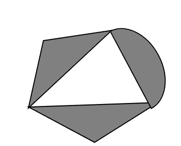
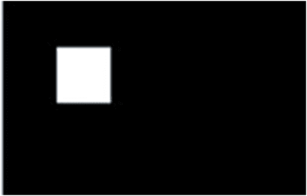

# 洪水填充算法:

> 原文：<https://www.javatpoint.com/computer-graphics-flood-fill-algorithm>

在该方法中，选择区域内的点或种子。这个点叫做种子点。然后使用四个连接的方法或八个连接的方法来填充指定的颜色。

洪水填充算法具有许多类似于边界填充的特征。但是这种方法更适合填充多种颜色的边界。当边界是多种颜色并且内部是用一种颜色填充时，我们使用这个算法。



在填充算法中，我们从一个指定的内部点(x，y)开始，重新分配所有像素值，这些像素值当前被设置为具有所需颜色的给定内部颜色。使用 4 连接或 8 连接的方法，然后我们逐步通过像素位置，直到所有内部点都被重新绘制。

## 缺点:

1.  非常慢的算法
2.  对于大多边形可能会失败
3.  初始像素需要更多关于周围像素的知识。

## 算法:

```

Procedure floodfill (x, y,fill_ color, old_color: integer)
	If (getpixel (x, y)=old_color)
   {
	setpixel (x, y, fill_color);
	fill (x+1, y, fill_color, old_color);
	 fill (x-1, y, fill_color, old_color);
	fill (x, y+1, fill_color, old_color);
	fill (x, y-1, fill_color, old_color);
     }
}

```

### 程序 1:要实现 4 连接洪水填充算法:

```

#include #include <conio.h>#include <graphics.h>#include <dos.h>void flood(int,int,int,int);
void main()
{
	intgd=DETECT,gm;
	initgraph(&gd,&gm,"C:/TURBOC3/bgi");
	rectangle(50,50,250,250);
	flood(55,55,10,0);
	getch();
}
void flood(intx,inty,intfillColor, intdefaultColor)
{
	if(getpixel(x,y)==defaultColor)
	{
		delay(1);
		putpixel(x,y,fillColor);
		flood(x+1,y,fillColor,defaultColor);
		flood(x-1,y,fillColor,defaultColor);
		flood(x,y+1,fillColor,defaultColor);
		flood(x,y-1,fillColor,defaultColor);
	}
}</dos.h></graphics.h></conio.h> 
```

**输出:**


### 程序 2:要实现 8 连接洪水填充算法:

```

#include #include <graphics.h>#include <dos.h>#include <conio.h>void floodfill(intx,inty,intold,intnewcol)
{
                int current;
                current=getpixel(x,y);
                if(current==old)
                {
                                delay(5);
                                putpixel(x,y,newcol);
                                floodfill(x+1,y,old,newcol);
                                floodfill(x-1,y,old,newcol);
                                floodfill(x,y+1,old,newcol);
                                floodfill(x,y-1,old,newcol);
                                floodfill(x+1,y+1,old,newcol);
                                floodfill(x-1,y+1,old,newcol);
                                floodfill(x+1,y-1,old,newcol);
                                floodfill(x-1,y-1,old,newcol);
                }
}
void main()
{
                intgd=DETECT,gm;
                initgraph(&gd,&gm,"C:\\TURBOC3\\BGI");
                rectangle(50,50,150,150);
                floodfill(70,70,0,15);
                getch();
                closegraph();
}</conio.h></dos.h></graphics.h> 
```

**输出:**



* * *