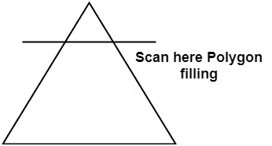
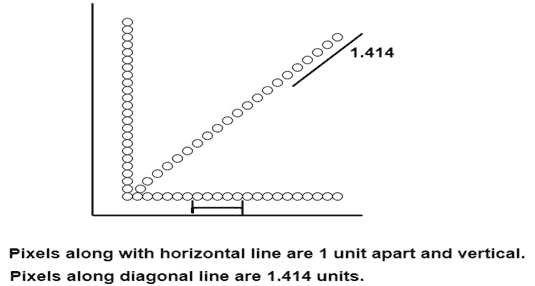

# 扫描线多边形填充算法:

> 原文：<https://www.javatpoint.com/computer-graphics-scan-line-polygon-fill-algorithm>

该算法在扫描线上对多边形的内部点进行划线，这些点根据需要进行开或关。多边形通过给不同的像素着色来填充不同的颜色。

在上图中，多边形和一条线切割多边形如图所示。首先，扫描完成。在显示设备上使用光栅扫描概念进行扫描。光束从屏幕左上角开始扫描，并以右下角为终点。当从左到右和从上到下移动时，算法找到线与多边形的交点。各种交叉点存储在帧缓冲器中。这些点的强度保持很高。使用了相干性的概念。根据这个属性，如果一个像素在多边形内，那么它的下一个像素将在多边形内。

## 扫描转换的副作用:

**1。楼梯或锯齿状:**当扫描转换线或圆时，可以看到类似楼梯的外观。

**2。不等亮度:**处理不同线条亮度的不等外观。与水平线和垂直线相比，斜线显得不那么明亮。

* * *