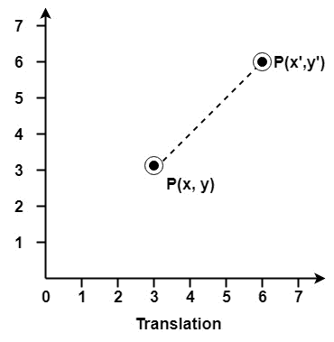
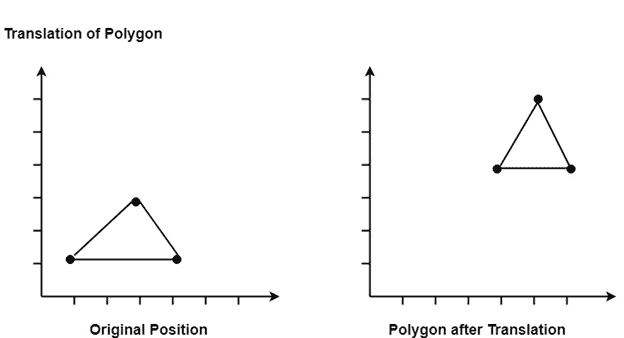
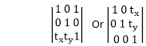

# 翻译

> 原文：<https://www.javatpoint.com/computer-graphics-translation>

物体从一个位置到另一个位置的直线运动叫做平移。这里，对象从一个坐标位置定位到另一个坐标位置。

## 要点翻译:

为了将一个点从坐标位置(x，y)平移到另一个位置(x <sub>1</sub> y <sub>1</sub> ，我们用代数方法将平移距离 T <sub>x</sub> 和 T <sub>y</sub> 加到原始坐标上。

```
    x1=x+Tx
    y1=y+Ty

```

平移对(T <sub>x</sub> ，T <sub>y</sub> )称为平移向量。

平移是物体不变形的运动。每个位置或点的平移量都是相同的。当直线被平移时，它将使用端点来绘制。

对于平移多边形，多边形的每个顶点都被转换到一个新的位置。类似地，曲线对象也会被平移。为了改变圆或椭圆的位置，变换其中心坐标，然后使用新坐标绘制对象。

设 P 是坐标为(x，y)的点。将翻译为(x <sup>1</sup> y <sup>1</sup> )。




## 翻译矩阵:



* * *