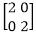
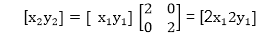
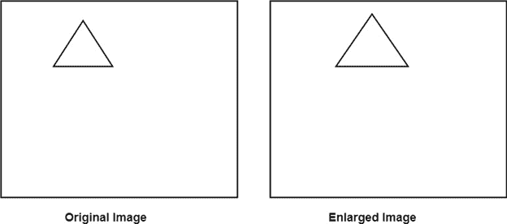
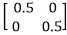
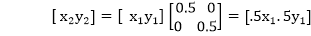
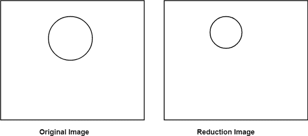
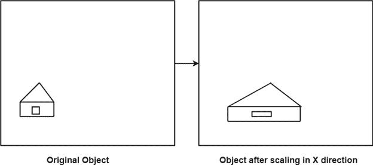
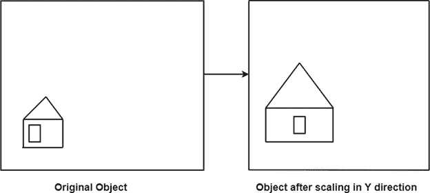
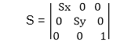
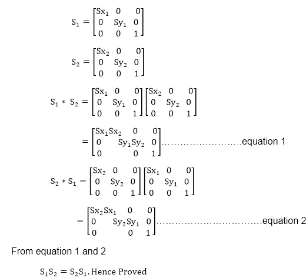

# 缩放:

> 原文：<https://www.javatpoint.com/computer-graphics-scaling>

它用于改变或改变对象的大小。使用比例因子进行更改。有两个比例因子，即 x 方向的 Sxy 方向的 S y 。如果原始位置为 x 和 y，缩放因子为 S x 和 S y ，则缩放后的坐标值为 x 1 和 y 1 。

如果图片要放大到原来的两倍，那么 S x = S y =2。如果 S x 和 S y 不相等，则会发生缩放，但会拉长或扭曲画面。

如果缩放因子小于 1，则对象的大小将会减小。如果缩放因子大于 1，则对象的大小将被放大。

如果 S x 和 S y 相等，也称为均匀缩放。如果不相等，则称为差分缩放。如果缩放因子的值小于 1，将使对象更靠近坐标原点，而大于 1 的值将使坐标位置远离原点。

**放大:如果 T 1 = ，如果(x  1  y 1 )是原始位置，T 1 是平移向量，那么(x  2  y 2 在缩放**后协调

图像将被放大两倍

**减:如果 T 1 = 。如果(x  1  y 1 )是原始位置，T 1 是平移向量，那么(x  2  y 2 是缩放后的坐标**

## 缩放矩阵:

**例:**证明 2D 标度变换是可交换的，即 S1S2= S2S1。

**解:** S 1 和 S 2 是缩放矩阵

* * *