# 旋转:

> 原文：<https://www.javatpoint.com/computer-graphics-rotation>

这是一个改变物体角度的过程。旋转可以是顺时针或逆时针。对于旋转，我们必须指定旋转角度和旋转点。旋转点也称为枢轴点。它是关于旋转哪个对象的打印。

## 旋转类型:

1.  逆时针方向
2.  反时针方向

枢轴点(旋转角度)的正值以逆时针方向旋转对象。

枢轴点的负值(旋转角度)使对象顺时针旋转。

当对象旋转时，对象的每个点都会旋转相同的角度。

**直线:**直线由端点以相同的角度旋转，并在新端点之间重新绘制直线。

**多边形:**通过使用相同的旋转角度移动每个顶点来旋转多边形。

**曲线:**通过重新定位所有点并在新位置绘制曲线来旋转曲线。

**圆:**可以通过指定角度的中心位置得到。

**椭圆:**它的旋转可以通过将椭圆的长轴和短轴旋转所需的角度来获得。

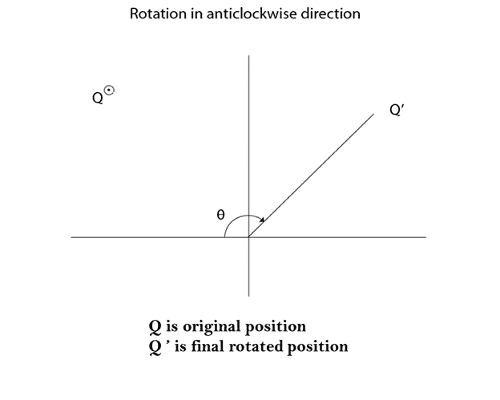
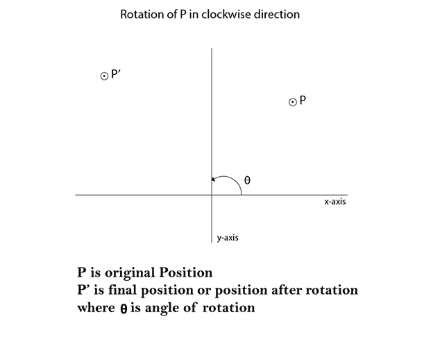

矩阵为顺时针方向旋转。

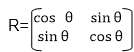

矩阵为逆时针方向旋转。

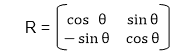

均匀坐标旋转矩阵(顺时针)

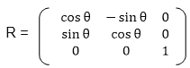

均匀坐标旋转矩阵(逆时针)

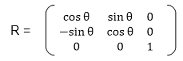

**绕任意点旋转:**如果我们要绕任意点旋转一个物体或点，首先要把我们要旋转的点平移到原点。然后围绕原点旋转点或对象，最后，我们再次将其平移到原始位置。我们得到关于任意点的旋转。

**示例:**要旋转的点(x，y)

(x <sub>c</sub> y <sub>c</sub> 是逆时针旋转的点

**第一步:**将点(x <sub>c</sub> y <sub>c</sub> )平移到原点

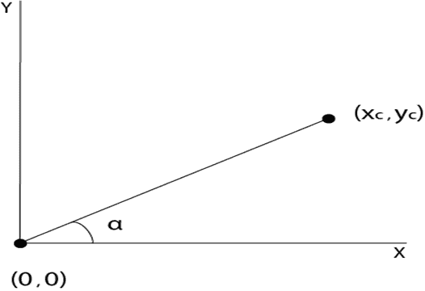

**步骤 2:** 绕原点旋转(x，y)

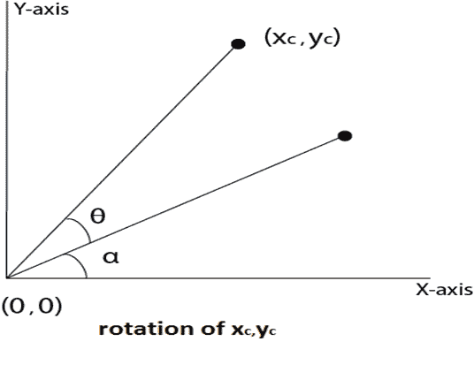

**步骤 3:** 将旋转中心平移回其原始位置

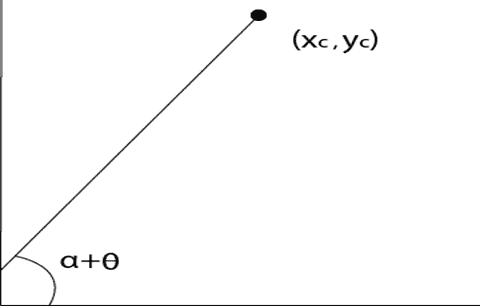
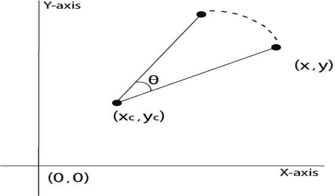

**例 1:** 证明 2D 绕原点的旋转是可交换的，即 R<sub>1</sub>R<sub>2</sub>= R<sub>2</sub>R<sub>1</sub>。

**解:** R <sub>1</sub> 和 R <sub>2</sub> 为旋转矩阵

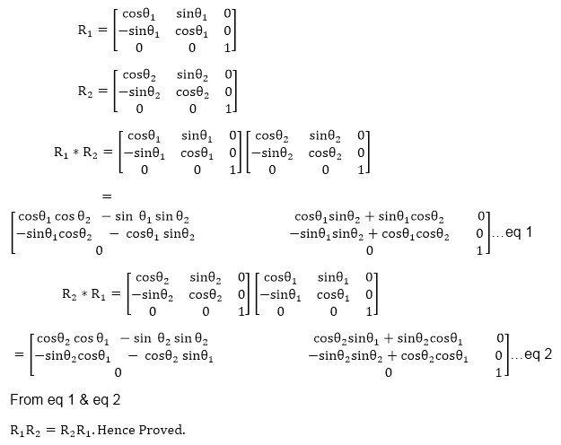

**示例 2:** 将端点为(3，4)和(12，15)的直线 CD 绕原点逆时针旋转 45°。

**解:**点 C (3，4)

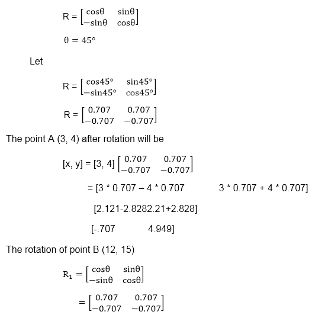
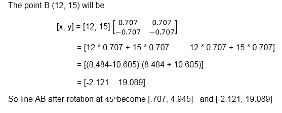
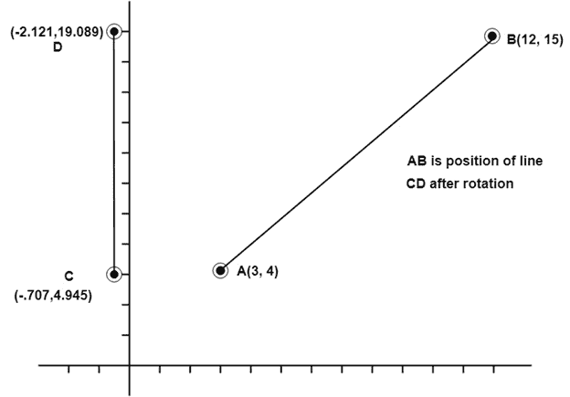

**示例 3:** 将端点为 A (2，5)和 B (6，12)的直线 AB 绕原点顺时针旋转 30°。

**解:**顺时针方向旋转。矩阵是

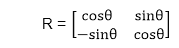

**步骤 1:** 点 A (2，5)的旋转。取 30 度角

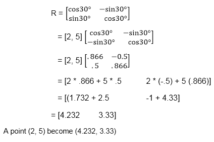

**步骤 2:**B 点的旋转(6，12)

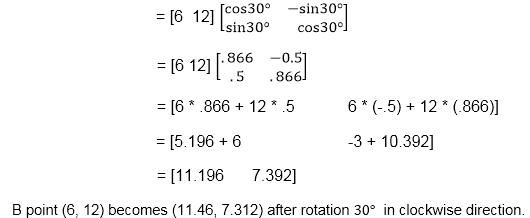
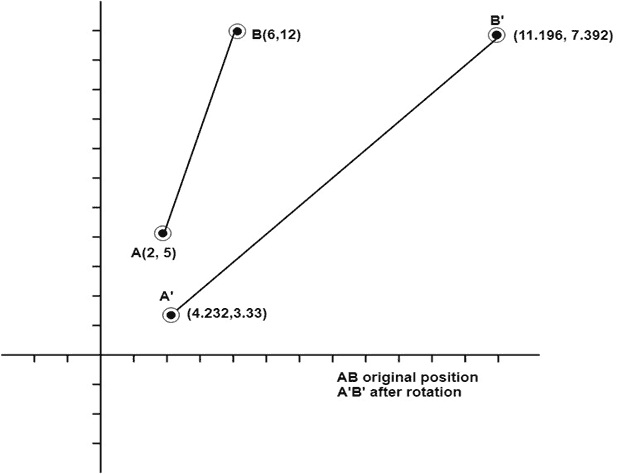

### 旋转线条的程序:

```

#include #include <graphics.h>#include <math.h>int main()
{
	intgd=0,gm,x1,y1,x2,y2;
	double s,c, angle;
	initgraph(&gd, &gm, "C:\\TC\\BGI");
	setcolor(RED);
	printf("Enter coordinates of line: ");
	scanf("%d%d%d%d",&x1,&y1,&x2,&y2);
	cleardevice();
	setbkcolor(WHITE);
	line(x1,y1,x2,y2);
	getch();
	setbkcolor(BLACK);
	printf("Enter rotation angle: ");
	scanf("%lf", &angle);
	setbkcolor(WHITE);
	c = cos(angle *3.14/180);
	s = sin(angle *3.14/180);
	x1 = floor(x1 * c + y1 * s);
	y1 = floor(-x1 * s + y1 * c);
	x2 = floor(x2 * c + y2 * s);
	y2 = floor(-x2 * s + y2 * c);
	cleardevice();
	line(x1, y1 ,x2, y2);
	getch();
	closegraph();
return 0;
}</math.h></graphics.h> 
```

**输出:**

**旋转前**

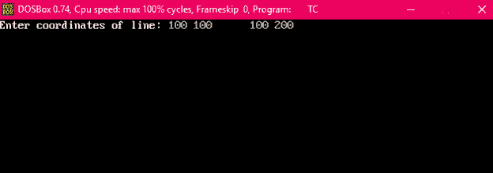
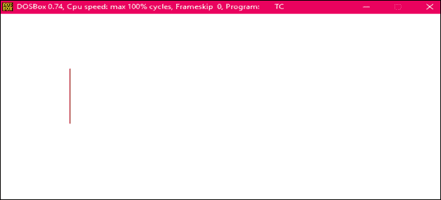
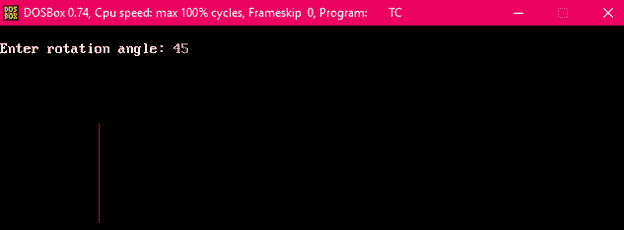

**旋转后**

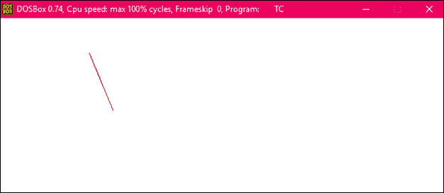

### 旋转三角形的程序:

```

#include #include <graphics.h>#include <math.h>main()
{
	intgd=0,gm,x1,y1,x2,y2,x3,y3;
	double s,c, angle;
	initgraph(&gd, &gm, "C:\\TURBOC3\\BGI");
	setcolor(RED);
	printf("Enter coordinates of triangle: ");
	scanf("%d%d%d%d%d%d",&x1,&y1,&x2,&y2, &x3, &y3);
	setbkcolor(WHITE);
	cleardevice();
	line(x1,y1,x2,y2);
	line(x2,y2, x3,y3);
	line(x3, y3, x1, y1);
	getch();
	setbkcolor(BLACK);
	printf("Enter rotation angle: ");
	scanf("%lf", &angle);
	setbkcolor(WHITE);
	c = cos(angle *M_PI/180);
	s = sin(angle *M_PI/180);
	x1 = floor(x1 * c + y1 * s);
	y1 = floor(-x1 * s + y1 * c);
	x2 = floor(x2 * c + y2 * s);
	y2 = floor(-x2 * s + y2 * c);
	x3 = floor(x3 * c + y3 * s);
	y3 = floor(-x3 * s + y3 * c);
	cleardevice();
	line(x1, y1 ,x2, y2);
	line(x2,y2, x3,y3);
	line(x3, y3, x1, y1);
	getch();
	closegraph();
	return 0;
}</math.h></graphics.h> 
```

**输出:**

**旋转前**

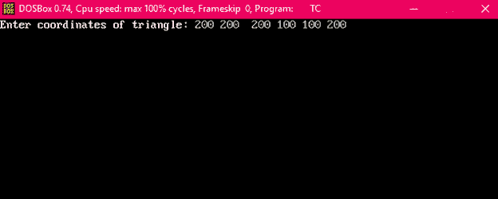
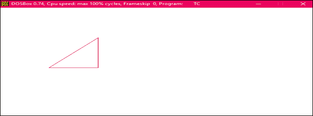
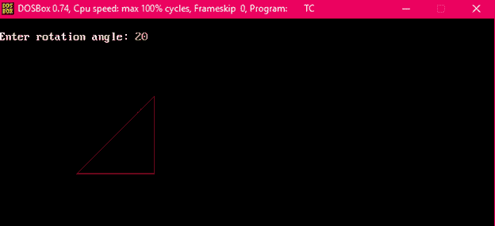

**旋转后**

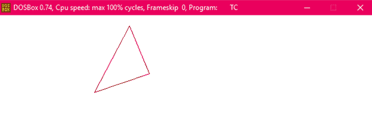

* * *