# 反射:

> 原文：<https://www.javatpoint.com/computer-graphics-reflection>

这是一种产生物体镜像的变换。镜像可以围绕 x 轴或 y 轴。物体旋转了 180 度。

## 反射的类型:

1.  关于 x 轴的反射
2.  关于 y 轴的反射
3.  关于垂直于 xy 平面并穿过原点的轴的反射
4.  关于线 y=x 的反射

**1。关于 x 轴的反射:**借助以下矩阵，物体可以关于 x 轴反射

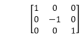

在这个变换中，x 的值将保持不变，而 y 的值将变为负值。下图显示了对象轴的反射。物体将位于 x 轴的另一侧。

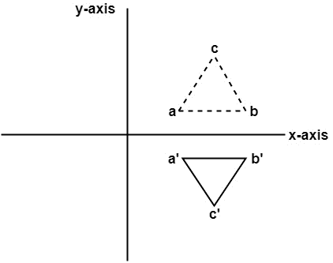

**2。关于 y 轴的反射:**借助下面的变换矩阵，物体可以关于 y 轴反射

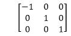

这里，x 的值将反转，而 y 的值将保持不变。物体将位于 y 轴的另一侧。

下图显示了关于 y 轴的反射

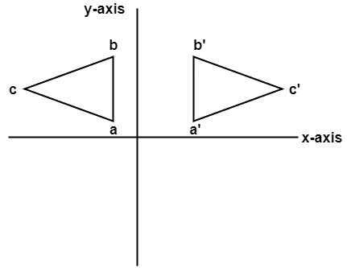

**3。关于垂直于 xy 平面并穿过原点的轴的反射:**
在这个变换的矩阵中给出如下

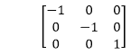
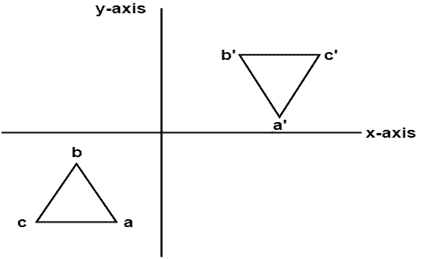

在这个 x 和 y 的值中，两者都将反转。这也被称为关于原点的半转。

**4。关于线 y=x 的反射:**借助于下面的变换矩阵，物体可以关于线 y = x 反射

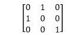
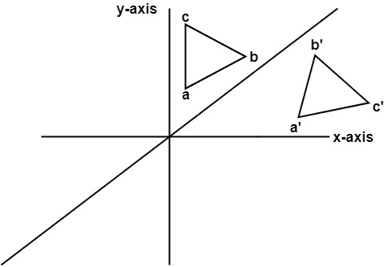

首先，将对象旋转 45°。旋转方向是顺时针方向。之后，关于 x 轴进行反射。最后一步是将 y=x 旋转回其初始位置，即逆时针旋转 45°。

**例:**给出一个三角形 ABC。甲、乙、丙的坐标如下

A (3 4)
B (6 4)
C (4 8)

找到三角形的反射位置，即 x 轴。

**解决方案:**

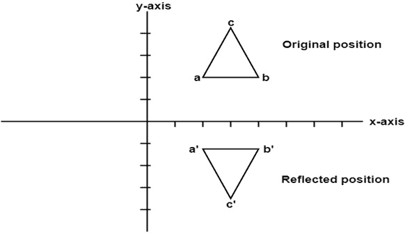
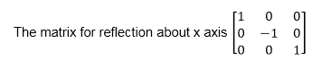

反射后的 a 点坐标

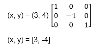

反射后的 b 点坐标

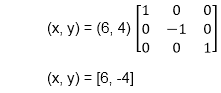

反射后 c 点的坐标

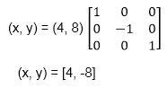

a (3，4)变成 a <sup>1</sup> (3，-4)
b (6，4)变成 b <sup>1</sup> (6，-4)
c (4，8)变成 c <sup>1</sup> (4，-8)

### 对线执行镜像反射的程序:

```

#include <iostream.h>
#include <conio.h>
#include <graphics.h>
#include <math.h>
#include <stdlib.h>
#define pi 3.14
class arc
{
	float x[10],y[10],theta,ref[10][10],ang;
           float p[10][10],p1[10][10],x1[10],y1[10],xm,ym;
	int i,k,j,n;
	public:
	void get();
	void cal ();
	void map ();
	void graph ();
	void plot ();
	void plot1();
};
void arc::get ()
{
	cout<<"\n ENTER ANGLE OF LINE INCLINATION AND Y INTERCEPT";
	cin>> ang >> b;
	cout <<"\n ENTER NO OF VERTICES";
	cin >> n;
	cout <<"\n ENTER";
	for (i=0; i<n; i++)
	{
		cout<<"\n x["<<i<<"] and y["<<i<<"]";
	}
	theta =(ang * pi)/ 180;
	ref [0] [0] = cos (2 * theta);
	ref [0] [1] = sin (2 * theta);
	ref [0] [2] = -b *sin (2 * theta);
	ref [1] [0] = sin (2 * theta);
	ref [1] [1] = -cos (2 * theta);
	ref [1] [2] = b * (cos (2 * theta)+1);
	ref [2] [0]=0;
	ref [2] [1]=0;
	ref [2] [2] = 1;
}
void arc :: cal ()
{
	for (i=0; i < n; i++)
	{
		p[0] [i] = x [i];
		p [1] [i] = y [i];
		p [2] [i] = 1;
	}
	for (i=0; i<3;i++)
	{
		for (j=0; j<n; j++)
		{
			p1 [i] [j]=0;
			for (k=0;k<3; k++)
		}
		p1 [i] [j] + = ref [i] [k] * p [k] [j];
             }
for (i=0; i<n; i++)
   {
	x1 [i]=p1[0] [i];
	y1 [i] = p1 [1] [i];
    }
}
void arc :: map ()
{
	int gd = DETECT,gm;
	initgraph (&gd, &gm, " ");
            int errorcode = graphresult ();
	/* an error occurred */
	if (errorcode ! = grOK)    
	{
 		printf ("Graphics error: %s \n", grapherrormsg (errorcode));
		printf ("Press any key to halt:");
		getch ();
		exit (1); /* terminate with an error code */
	}
}
void arc :: graph ()
{
	xm=getmaxx ()/2;
	ym=getmaxy ()/2;
	line (xm, 0, xmm 2*ym);
}
void arc :: plot 1 ()
{
	for (i=0; i <n-1; i++)
	{
		circle (x1[i]+xm, (-y1[i]+ym), 2);
		line (x1[i]+xm, (-y1[i]+ym), x1[i+1]+xm, (-y1[i+1]+ym));
	}
		line (x1[n-1)+xm, (-y1[n-1]+ym), x1[0]+xm, (-y1[0]+ym));
		getch();
}
void arc :: plot ()
{ 
	for (i=0; i <n-1; i++)
	{
		circle (x1[i]+xm, (-y1[i]+ym, 2);
		line (x1[i]+xm, (-y1[i]+ym), x[i+1]+xm, (-y1[i+1]+ym));
	}
		line (x[n-1]+xm, (-y1[n-1]+ym), x[0]+xm, (-y[0]+ym));
		getch();
}
void main ()
{
	class arc a;
	clrscr();
	a.map();
	a.graph();
	a.get();
	a.cal();
	a.plot();
	a.plot1();
	getch();
}

```

**输出:**

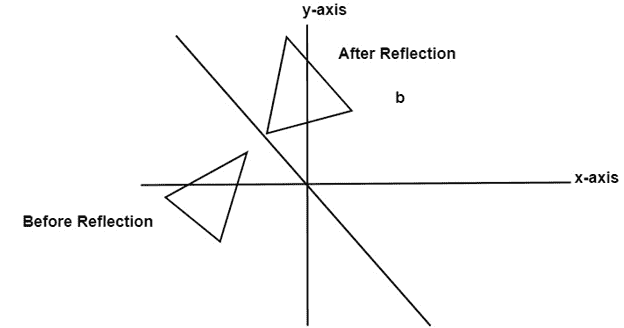

* * *