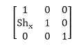
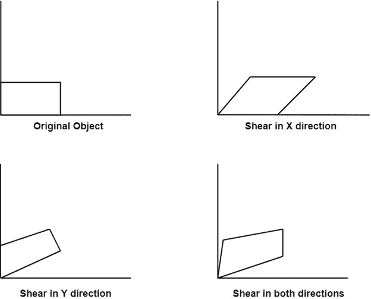
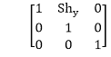
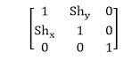

# 剪切:

> 原文：<https://www.javatpoint.com/computer-graphics-shearing>

是变形改变了物体的形状。物体层的滑动发生。剪切可以是一个方向，也可以是两个方向。

**X 方向的剪切:**在这个水平剪切中，层发生滑动。x 方向剪切的均匀矩阵如下所示:

**Y 方向的剪切:**这里的剪切是通过沿垂直或 Y 轴滑动来完成的。

**X-Y 方向剪切:**此处图层将在 X 和 Y 两个方向上滑动。滑动将在水平和垂直方向进行。物体的形状会扭曲。两个方向的剪切矩阵由下式给出:

* * *