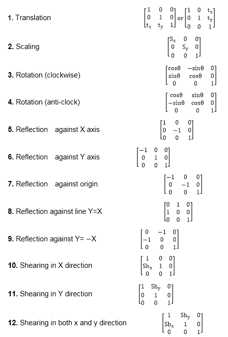

# 齐次坐标

> 原文：<https://www.javatpoint.com/computer-graphics-homogeneous-coordinates>

屏幕上的点、直线或整个图像围绕原点以外的点的旋转是通过首先移动图像直到旋转点占据原点，然后执行旋转，最后将图像移动到其原始位置来实现的。

图像沿直线从一个地方移动到另一个地方的过程称为平移。平移可以通过在每个点上加上或减去图片需要移动的量来完成。

坐标变化引起的点的平移不能用简单的矩阵应用与其他变换相结合。如果我们希望通过平移、旋转再平移来围绕原点以外的点旋转图像，这样的组合是必不可少的。

为了将这三个变换组合成一个变换，使用了齐次坐标。在齐次坐标系中，二维坐标位置(x，y)用三坐标表示。

齐次坐标通常用于设计和施工应用。在这里，我们执行平移、旋转和缩放，以使图片适合适当的位置。

**将坐标表示成齐次坐标系的例子:**对于二维几何变换，我们可以选择齐次参数 h 为任意非零值。为了我们的方便，把它当成一个整体。然后用齐次坐标(x，y，1)表示每个二维位置。

**以下是齐次坐标下的二维变换矩阵:**

* * *